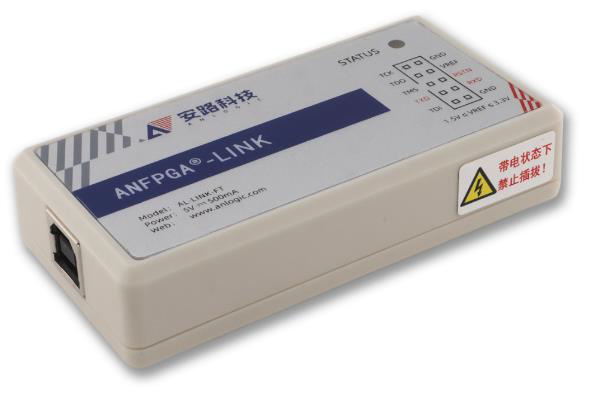
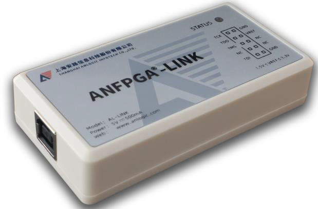
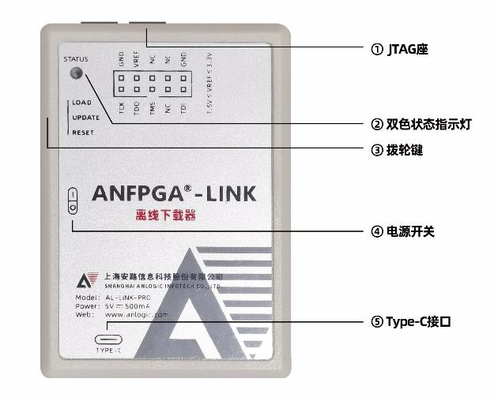
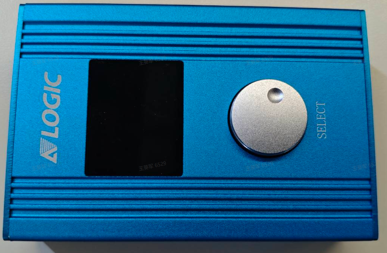
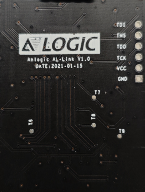
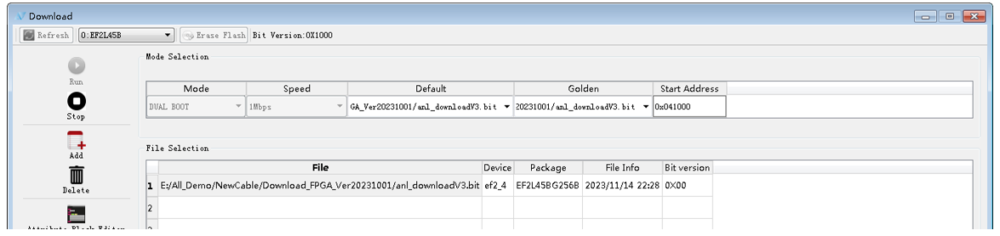

# 安路科技下载器使用说明

- 本说明详细描述了安路科技AL-Link FT、AL-Link、AL-Link Pro等下载器的特性及其固件升级步骤。

## 下载器类型

各类下载器的外观、特性、使用手册详见下表。

类型| 外观| 特性| 使用手册  
---|---|---|---  
AL-Link FT| | AL-Link-FT 又名OneCable,支持安路科技所有器件在线下载及其调试[1]；| [《UG009_OneCable1.0用户使用说明》](../../pic/3_4_anlogic/UG009_2410.pdf) 
AL-Link V3.0| | 支持安路科技所有逻辑器件在线下载及其调试[2]；| [《UG003_AL-LINK使用说明》](../../pic/3_4_anlogic/UG003_2301.pdf)    
AL-Link Pro| | 支持安路科技所有逻辑器件在线下载及其调试[3]；支持EF2/EF3/EF4/SF1/SF2离线烧录[4]； •1端口烧录； •支持在线下载功能； •支持位流、秘钥存储；| [《UG004_AL-LINK-PRO离线下载器使用说明》](../../pic/3_4_anlogic/UG004_2504.pdf)  
多功能下载器| | 支持安路科技所有逻辑器件离线量产烧录[5]。•3端口并发烧录； •支持ATE机台对接； •支持多个烧录文件存储；| [《TN013_多功能下载器使用说明》](../../pic/3_4_anlogic/TN013_2510.pdf)    

  
- 注[1]，FT下载器支持全系列器件，可关注TD版本信息，以了解器件的支持情况；
- 注[2]，对于AL-Link下载器，若条码最后六位，即06XXXX中的高2位，若小于06，建议升级，以获得更好在线下载功能体验；
- 注[3]，对于AL-Link Pro下载器，若条码最后六位，即03XXXX中的高2位，若小于03，建议升级，以获得更好在线下载功能体验；
- 注[4]，对于AL-Link Pro下载器，条码最后六位，即03XXXX中的高2位，若大于等于03，扩展并支持SF1/SF2器件的离线烧录；
- 注[5]，多功能下载器固件，可能随着新功能/特性的增加而更新，若需要更新，请联系我们，以获得最新技术支持；

## AL-Link V3.0固件升级

- 此固件版本升级操作，只针对AL-Link下载器！

- 升级之前，先确认下述条件：

- 设备管理器为Anlogic AL-Link；

- 下载器背面条码最后六位，即06XXXX中的高2位，若小于06，建议升级，以获得更好在线下载功能体验；

TD 版本号大于等于6.0.3；

若TD版本环境大于等于TD 6.0.3，且背面条码最后六位中的最高2位小于06，则下载器必须升级！

条码示意如下：

AL-LINK拆盖后，实物如下，右侧有TDI/TMS/TDO/TCK/VCC/GND，此接口为下载器内部EF2的JTAG端口，通过此端口烧录EF2器件即可。

下载时，请选用Dualboot模式烧录。

升级使用的位流文件： 
[V4_20231124.zip](../../pic/3_4_anlogic/V4_20231124.zip)

##  AL-Link Pro固件升级

- 针对AL3主控器件的AL-Link Pro下载器，
- 可通过升级下述位流文件(版本要求：TD 5.6.5 SP4及其以下版本)，
- 提升在线功能的体验。
- 升级使用的位流文件：
- [AL3A10BG256C7_CONFIG.zip](../../pic/3_4_anlogic/AL3A10BG256C7_CONFIG.zip)

  

### 技术支持
- 安路科技官网: https://www.anlogic.com
- 技术支持邮箱: folsie.zhao@wtmec.com

---

**版本信息:**

| 版本 | 日期 | 说明 |
|------|------|------|
| 1.0 | 2026.03.28 | 初版 |

**免责声明:**

本文档仅供参考，实际设计时请以安路科技官方发布的最新数据手册和设计指南为准。
