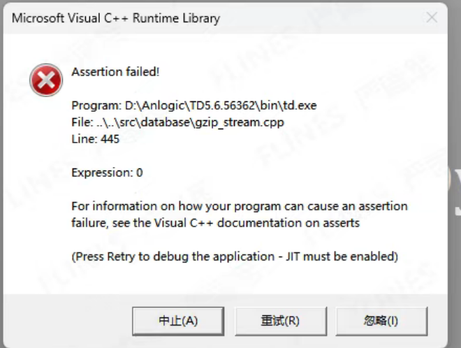
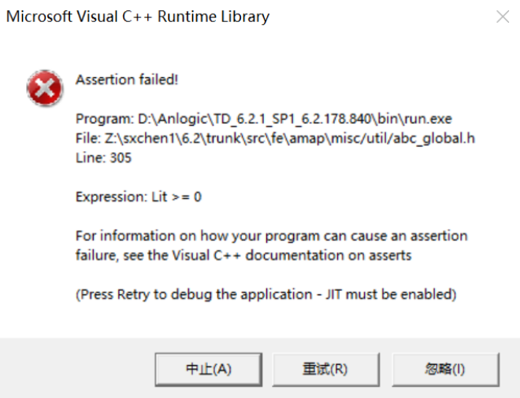

## TD

### Assertion_error

#### xxxxxxxxxxxxxx

- 编译好的工程文件，第二天打开报错

- 解决方案：
  - 新建一个工程对比，

#### xxxxxxxxxxxxxx

- 

 
## FD

####

####
####
####
####
####
####
####
####
####
####
####
####

<!-- TOC -->

- [TD](#td)
  - [Assertion\_error](#assertion_error)
    - [xxxxxxxxxxxxxx](#xxxxxxxxxxxxxx)
    - [xxxxxxxxxxxxxx](#xxxxxxxxxxxxxx-1)
- [FD](#fd)
    - 
    - 
    - 
    - 
    - 
    - 
    - 
    - 
    - 
    - 
    - 
    - 
    - 
  - [技术支持](#技术支持)

<!-- /TOC -->

### 技术支持
- 安路科技官网: https://www.anlogic.com
- 技术支持邮箱: folsie.zhao@wtmec.com

---

**版本信息:**

| 版本 | 日期 | 说明 |
|------|------|------|
| 1.0 | 2026.01.21 | 初版  基于选校表2509设计 |

**免责声明:**

本文档仅供参考，实际设计时请以安路科技官方发布的最新数据手册和设计指南为准。
