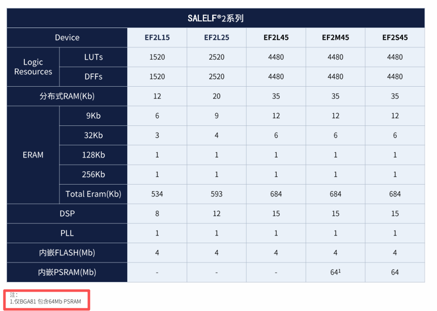
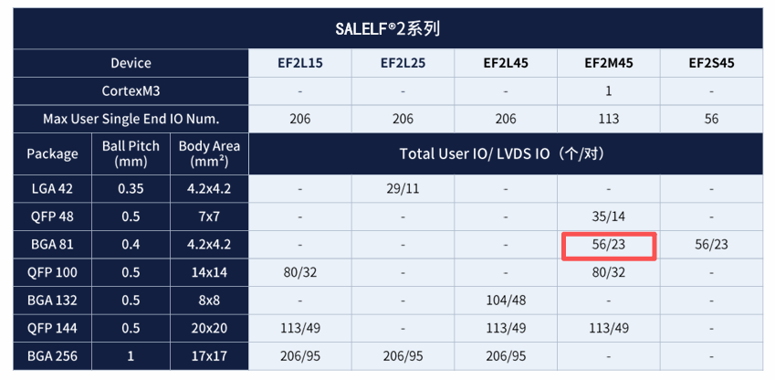

<!-- TOC -->

- [SALELF2硬件设计指导](#salelf2%E7%A1%AC%E4%BB%B6%E8%AE%BE%E8%AE%A1%E6%8C%87%E5%AF%BC)
    - [一.序言](#%E4%B8%80%E5%BA%8F%E8%A8%80)
    - [二.文档参考](#%E4%BA%8C%E6%96%87%E6%A1%A3%E5%8F%82%E8%80%83)
    - [三.EF2系列器件分类](#%E4%B8%89ef2%E7%B3%BB%E5%88%97%E5%99%A8%E4%BB%B6%E5%88%86%E7%B1%BB)
        - [EF2L系列（逻辑器件）](#ef2l%E7%B3%BB%E5%88%97%E9%80%BB%E8%BE%91%E5%99%A8%E4%BB%B6)
        - [EF2M系列（带MCU器件）](#ef2m%E7%B3%BB%E5%88%97%E5%B8%A6mcu%E5%99%A8%E4%BB%B6)
        - [EF2S系列（带PSRAM器件）](#ef2s%E7%B3%BB%E5%88%97%E5%B8%A6psram%E5%99%A8%E4%BB%B6)
    - [四.EF2系列选型参考](#%E5%9B%9Bef2%E7%B3%BB%E5%88%97%E9%80%89%E5%9E%8B%E5%8F%82%E8%80%83)
    - [五.电源设计](#%E4%BA%94%E7%94%B5%E6%BA%90%E8%AE%BE%E8%AE%A1)
        - [VCCIO电源设计](#vccio%E7%94%B5%E6%BA%90%E8%AE%BE%E8%AE%A1)
        - [VCCAUX电源设计](#vccaux%E7%94%B5%E6%BA%90%E8%AE%BE%E8%AE%A1)
        - [ADC电源设计](#adc%E7%94%B5%E6%BA%90%E8%AE%BE%E8%AE%A1)
        - [GND设计](#gnd%E8%AE%BE%E8%AE%A1)
        - [电源电压范围要求](#%E7%94%B5%E6%BA%90%E7%94%B5%E5%8E%8B%E8%8C%83%E5%9B%B4%E8%A6%81%E6%B1%82)
        - [电源上电时序要求](#%E7%94%B5%E6%BA%90%E4%B8%8A%E7%94%B5%E6%97%B6%E5%BA%8F%E8%A6%81%E6%B1%82)
        - [电源退耦电容配置](#%E7%94%B5%E6%BA%90%E9%80%80%E8%80%A6%E7%94%B5%E5%AE%B9%E9%85%8D%E7%BD%AE)
    - [六.IO设计](#%E5%85%ADio%E8%AE%BE%E8%AE%A1)
        - [配置相关IO--JTAG](#%E9%85%8D%E7%BD%AE%E7%9B%B8%E5%85%B3io--jtag)
        - [配置相关IO--Flash配置](#%E9%85%8D%E7%BD%AE%E7%9B%B8%E5%85%B3io--flash%E9%85%8D%E7%BD%AE)
        - [配置相关IO--指示信号](#%E9%85%8D%E7%BD%AE%E7%9B%B8%E5%85%B3io--%E6%8C%87%E7%A4%BA%E4%BF%A1%E5%8F%B7)
        - [配置IO在上电阶段的状态](#%E9%85%8D%E7%BD%AEio%E5%9C%A8%E4%B8%8A%E7%94%B5%E9%98%B6%E6%AE%B5%E7%9A%84%E7%8A%B6%E6%80%81)
        - [单端IO电气特性](#%E5%8D%95%E7%AB%AFio%E7%94%B5%E6%B0%94%E7%89%B9%E6%80%A7)
        - [单端IO电压标准](#%E5%8D%95%E7%AB%AFio%E7%94%B5%E5%8E%8B%E6%A0%87%E5%87%86)
        - [单端IO输入兼容性](#%E5%8D%95%E7%AB%AFio%E8%BE%93%E5%85%A5%E5%85%BC%E5%AE%B9%E6%80%A7)
        - [热插拔特性](#%E7%83%AD%E6%8F%92%E6%8B%94%E7%89%B9%E6%80%A7)
        - [V兼容输入设计](#v%E5%85%BC%E5%AE%B9%E8%BE%93%E5%85%A5%E8%AE%BE%E8%AE%A1)
        - [输入信号过冲/下冲限制](#%E8%BE%93%E5%85%A5%E4%BF%A1%E5%8F%B7%E8%BF%87%E5%86%B2%E4%B8%8B%E5%86%B2%E9%99%90%E5%88%B6)
        - [差分IO设计指导](#%E5%B7%AE%E5%88%86io%E8%AE%BE%E8%AE%A1%E6%8C%87%E5%AF%BC)
            - [LVDS33 LVDS25接口设计](#lvds33-lvds25%E6%8E%A5%E5%8F%A3%E8%AE%BE%E8%AE%A1)
            - [LVPECL接口设计](#lvpecl%E6%8E%A5%E5%8F%A3%E8%AE%BE%E8%AE%A1)
        - [时钟IO设计](#%E6%97%B6%E9%92%9Fio%E8%AE%BE%E8%AE%A1)
            - [全局时钟输入](#%E5%85%A8%E5%B1%80%E6%97%B6%E9%92%9F%E8%BE%93%E5%85%A5)
            - [PLL专用管脚](#pll%E4%B8%93%E7%94%A8%E7%AE%A1%E8%84%9A)
            - [时钟信号质量要求](#%E6%97%B6%E9%92%9F%E4%BF%A1%E5%8F%B7%E8%B4%A8%E9%87%8F%E8%A6%81%E6%B1%82)
            - [各封装时钟引脚映射](#%E5%90%84%E5%B0%81%E8%A3%85%E6%97%B6%E9%92%9F%E5%BC%95%E8%84%9A%E6%98%A0%E5%B0%84)
        - [SSO同时开关输出限制](#sso%E5%90%8C%E6%97%B6%E5%BC%80%E5%85%B3%E8%BE%93%E5%87%BA%E9%99%90%E5%88%B6)
        - [DDRx2支持](#ddrx2%E6%94%AF%E6%8C%81)
    - [七.PCB设计指导](#%E4%B8%83pcb%E8%AE%BE%E8%AE%A1%E6%8C%87%E5%AF%BC)
        - [去耦电容布局](#%E5%8E%BB%E8%80%A6%E7%94%B5%E5%AE%B9%E5%B8%83%E5%B1%80)
        - [电源平面设计](#%E7%94%B5%E6%BA%90%E5%B9%B3%E9%9D%A2%E8%AE%BE%E8%AE%A1)
        - [走线处理方式](#%E8%B5%B0%E7%BA%BF%E5%A4%84%E7%90%86%E6%96%B9%E5%BC%8F)
        - [过孔设计](#%E8%BF%87%E5%AD%94%E8%AE%BE%E8%AE%A1)
    - [八.设计检查清单](#%E5%85%AB%E8%AE%BE%E8%AE%A1%E6%A3%80%E6%9F%A5%E6%B8%85%E5%8D%95)
        - [电源设计检查](#%E7%94%B5%E6%BA%90%E8%AE%BE%E8%AE%A1%E6%A3%80%E6%9F%A5)
        - [IO设计检查](#io%E8%AE%BE%E8%AE%A1%E6%A3%80%E6%9F%A5)
        - [配置设计检查](#%E9%85%8D%E7%BD%AE%E8%AE%BE%E8%AE%A1%E6%A3%80%E6%9F%A5)
        - [时钟资源检查](#%E6%97%B6%E9%92%9F%E8%B5%84%E6%BA%90%E6%A3%80%E6%9F%A5)
        - [PCB设计检查](#pcb%E8%AE%BE%E8%AE%A1%E6%A3%80%E6%9F%A5)
        - [其他检查](#%E5%85%B6%E4%BB%96%E6%A3%80%E6%9F%A5)
    - [九.快速导航](#%E4%B9%9D%E5%BF%AB%E9%80%9F%E5%AF%BC%E8%88%AA)

<!-- /TOC -->

# SALELF2硬件设计指导

## 一.序言

EF2系列FPGA硬件设计涉及多个数据手册和设计指南，为了方便开发人员快速查阅和理解硬件设计要点，本文档整合了安路科技官方发布的相关资料，包括：

- EF2L15/25/45数据手册(DS400)
- EF2S45/EF2M45数据手册(DS402)
- EF2系列FPGA硬件设计指南(UG402)
- 各封装设计检查清单

本文档按照电源设计、IO设计、PCB设计、检查清单等章节组织，涵盖了硬件设计的核心要点，旨在为硬件工程师提供便捷的设计参考。

**注意事项:**

- EF2系列器件根据功能类型分为三个系列：
  - **EF2L系列**: 纯逻辑器件（EF2L15、EF2L25、EF2L45）
  - **EF2M系列**: 带MCU的逻辑器件（EF2M45）
  - **EF2S系列**: 合封PSRAM器件（EF2S45、EF2M45VG81）

- 不同封装的电源连接方式存在差异，设计时需根据具体封装型号核对相应要求

- EF2系列只有一个PLL，设计时需注意

- 涉及ADC使用、SSO限制、热插拔等具体功能时，需根据选择的封装型号查阅对应章节

## 二.文档参考


**引脚映射表:**

- 根据不同封装型号，对应的引脚映射文件请查阅:
  - [EF2L15LG100B_PINLIST](../../pinlist/EF2/EF2L15LG100B_PINLIST.xlsx)
  - [EF2L25AG42B_PINLIST](../../pinlist/EF2/EF2L25AG42B_PINLIST.xlsx)
  - [EF2L45BG256B_PINLIST](../../pinlist/EF2/EF2L45BG256B_PINLIST.xlsx)
  - [EF2L45LG144B_PINLIST](../../pinlist/EF2/EF2L45LG144B_PINLIST.xlsx)
  - [EF2L45UG132B_PINLIST](../../pinlist/EF2/EF2L45UG132B_PINLIST.xlsx)
  - [EF2M45LG48B_PINLIST](../../pinlist/EF2/EF2M45LG48B_PINLIST.xlsx)
  - [EF2M45VG81C_PINLIST](../../pinlist/EF2/EF2M45VG81C_PINLIST.xlsx)
  - [EF2S45VG81C_PINLIST](../../pinlist/EF2/EF2S45VG81C_PINLIST.xlsx)

## 三.EF2系列器件分类

EF2系列FPGA器件按照功能类型可分为三个主要系列，每个系列的设计特性存在差异：

### EF2L系列（逻辑器件）

- **器件型号**: EF2L15、EF2L25、EF2L45
- **封装类型**: LG100、AG42、BG256、LG144、UG132
- **主要特性**:
  - 纯逻辑FPGA器件
  - 内置4Mb SPI Flash
  - IO Banks数量: 0-5（BG256封装）
  - IOBB支持5V直接输入（需OverDriven）
  - IOBE需外部串联电阻兼容5V输入
  - 内嵌ADC模块（8通道，1MHz采样率）
  - 支持LVDS、LVPECL等差分接口


  
### EF2M系列（带MCU器件）

- **器件型号**: EF2M45
- **封装类型**: LG48、VG81、LG100、LG144
- **主要特性**:
  - 集成ARM Cortex-M3 MCU内核
  - 内置4Mb SPI Flash
  - 内嵌64Mb PSRAM（VG81封装）
  - 逻辑资源与EF2L45相同
  - 支持MCU与FPGA协同设计
  - 其他IO特性与EF2L系列相同

### EF2S系列（带PSRAM器件）

- **器件型号**: EF2S45VG81C、EF2M45VG81C(仅此一颗带MCU和PSRAM)
- **封装类型**: VG81
- **主要特性**:
  - 采用3D合封技术，内嵌两片4Mx8bits的PSRAM
  - PSRAM最高200MHz工作频率
  - 最大读写带宽400MB/s
  - BANK0/BANK2只支持1.8V单端与差分电平
  - BANK0/BANK2电源在芯片内部与PSRAM/FLASH电源相连
  - 其他特性与EF2L45相同
  
  


## 四.EF2系列选型参考

   - 

   - 

**选型建议:**

1. **逻辑资源需求**: 根据设计所需的LUT、触发器、ERAM等资源选择合适的器件
   - EF2L15: 1520 LUTs
   - EF2L25: 2520 LUTs
   - EF2L45/EF2M45/EF2S45: 4480 LUTs

2. **IO数量需求**: 根据外设接口数量选择IO充足的封装
   - BG256: 206 IO
   - LG144: 113 IO
   - UG132: 104 IO
   - LG100: 80 IO
   - LG48: 35 IO
   - VG81: 56 IO
   - AG42: 29 IO

3. **特殊功能需求**:
   - 需要MCU功能时，选择EF2M系列
   - 需要大容量PSRAM时，选择EF2S系列
   - 需要高速接口（LVDS、LVPECL等）时，选择支持的IO Bank
   - 需要ADC功能时，确保预留ADC相关引脚
   - 需要热插拔功能时，注意避开ADC复用引脚

4. **封装类型**: 根据PCB布局和空间限制选择合适的封装
   - BGA封装（BG256、UG132、VG81）：适合高密度设计
   - LQFP封装（LG144、LG100、LG48）：适合手工焊接和低成本方案
   - XWFN/LGA封装（AG42）：适合超小尺寸应用

5. **成本考虑**: 在满足需求的前提下，选择成本最优的方案

## 五.电源设计

### VCCIO电源设计

VCCIO为IO Bank供电电压，不同封装和Bank的连接方式存在差异，需特别注意。

**不同封装的VCCIO连接要求:**

| 封装类型 |VCCAUX | Bank0 | Bank1 | Bank2 | Bank3 | Bank4 | Bank5 |
|---------|-------|-------|-------|-------|-------|-------|-------|
| BG256 | 	>=2.5V 			|>=1.5V POR 	| >=2.5V FLASH | >=1.2V | >=1.2V | >=1.2V | >=1.2V |
| LG144 | 	>=2.5V 			|>=1.2V 		| >=1.2V | >=2.5V FLASH | >=1.5V POR | - | - |
| UG132 | 	>=2.5V 			|>=1.5V POR 	| >=2.5V FLASH | >=1.2V | >=1.2V | >=1.2V | >=1.2V |
| LG100 | 	>=2.5V 			|>=1.2V 		| >=1.2V | >=2.5V FLASH | >=1.5V POR | - | - |
| LG48 	| 	>=2.5V			|>=1.2V 		| >=1.2V | >=2.5V FLASH | >=1.5V POR | - | - |
| VG81 	| 	>=2.5V			|=1.8V PSRAM 	| >=1.2V | =1.8V PSRAM | >=1.5V POR | - | - |
| AG42 	| 	>=2.5V			|=VCCAUX 	 	| >=1.2V | >=1.2V |=VCCAUX  | - | - |


**电压范围:**

| VCCIO标准 | 最小值 | 典型值 | 最大值 | 单位 |
|----------|-------|-------|-------|------|
| 3.3V | 3.135 | 3.3 | 3.465 | V |
| 2.5V | 2.375 | 2.5 | 2.625 | V |
| 1.8V | 1.71 | 1.8 | 1.89 | V |
| 1.5V | 1.425 | 1.5 | 1.575 | V |
| 1.2V | 1.14 | 1.2 | 1.26 | V |

**设计要点:**

1. **VCCAUX供电**: 内核电压由VCCAUX经过内部的LDO分压提供，必须接>=2.5V

2. **VCCIO POR要求**: POR上电检测的VCCIO必须供电（BG256: Bank0/Bank1, LG144: Bank2/Bank3, UG132: Bank0/Bank1, LG100: Bank2/Bank3, LG48: Bank2/Bank3, VG81: Bank3）

3. **JTAG下载要求**: POR检测的VCCIO如果使用JTAG下载，需要和下载器供电电压保持一致

4. **不使用的Bank**: 不使用的VCCIO Bank也需要供电，避免漏电流风险

5. **LVDS接口要求**: 使用LVDS的BANK供电电压应>=2.5V（VG81封装Bank0/Bank2固定1.8V）

6. **Flash电源**: BG256封装Bank1、LG144封装Bank2、LG100封装Bank2、LG48封装Bank2连接内部Flash电源，必须>=2.5V

### VCCAUX电源设计

VCCAUX为芯片辅助电源，给内部逻辑供电，是芯片正常工作的关键电源。

**电压范围:**

| 参数 | 最小值 | 典型值 | 最大值 | 单位 |
|-----|-------|-------|-------|------|
| VCCAUX | 2.375 | 2.5/3.3 | 3.63 | V |
| 纹波峰峰值 | - | - | 100 | mV |

**设计要点:**

1. **必须供电**: VCCAUX是POR上电检测电源，必须连接

2. **电压要求**: >= 2.5V（推荐2.5V或3.3V）

3. **内核电压**: 内核电压由VCCAUX经过内部的LDO分压提供

4. **ADC电源**: EF2L45LG144和EF2M45LG100封装中，ADC_VDDA/ADC_VDDD在芯片内部与VCCAUX固定连接

### ADC电源设计

EF2系列部分器件内嵌ADC模块，需要额外的ADC供电。

**ADC电源连接方式:**

| 封装类型 | ADC_VDDA | ADC_VDDD | ADC_VREF | 备注 |
|---------|----------|----------|----------|------|
| BG256 | 接最高电压(建议3.3V) | 接最高电压(建议3.3V) | <= ADC_VDDA | ADC_VDDD与VCCAUX内部连接 |
| LG144 | = VCCAUX | = VCCAUX | <= VCCAUX | 内部固定连接 |
| UG132 | 无ADC | 无ADC | 无 | 无ADC |
| LG100 | 接最高电压(建议3.3V) | 接最高电压(建议3.3V) | <= ADC_VDDA | ADC_VDDD与VCCIO2内部连接 |
| VG81 | 接最高电压(建议3.3V) | 接最高电压(建议3.3V) | <= ADC_VDDA | ADC_VDDD与VCCIO2内部连接 |
| LG48 | = VCCIO2 | = VCCIO2 | <= VCCIO2 | 内部固定连接 |
| AG42 | 无ADC | 无ADC | 无 | 无ADC |

**设计要点:**

1. **电压同源**: ADC_VDDA与ADC_VDDD要求同电压

2. **参考电压**: ADC模块内部无参考源，需要外部加参考源
   - 优先使用稳压源
   - 次选电阻分压的方式

3. **VREF限制**: 无论是否使用ADC，ADC_VREF不得大于ADC_VDDA

4. **最高电压**: ADC_VDDA/ADC_VDDD建议接芯片最高供电电压

5. **不使用ADC**: ADC_VREF可作为普通IO使用

### GND设计

**设计要点:**

1. **接地引脚数量充足**: 确保所有GND引脚都良好接地

2. **接地完整性**: 保证接地网络的低阻抗连接

3. **接地回流路径**: 为高速信号提供最短的接地回流路径

### 电源电压范围要求

**基本操作条件:**

| Symbol | 参数 | 最小 | 典型 | 最大 | 单位 |
|--------|------|------|------|------|------|
| VCCAUX | 辅助电源 | 2.375 | 2.5/3.3 | 3.63 | V |
| VCCIO | I/O供电电压@3.3V | 3.135 | 3.3 | 3.465 | V |
| VCCIO | I/O供电电压@2.5V | 2.375 | 2.5 | 2.625 | V |
| VCCIO | I/O供电电压@1.8V | 1.71 | 1.8 | 1.89 | V |
| VCCIO | I/O供电电压@1.5V | 1.425 | 1.5 | 1.575 | V |
| VCCIO | I/O供电电压@1.2V | 1.14 | 1.2 | 1.26 | V |
| VI | 直流输入电压-IOBE | -0.5 | - | 3.6 | V |
| VI | 直流输入电压-IOBB | -0.3 | - | 5.5 | V |
| VO | 输出电压 | 0 | - | VCCIO | V |
| TRAMP | 电源缓变率 | 0.05 | - | 100 | V/ms |

**最大绝对额定值:**

| Symbol | 参数 | 最小 | 最大 | 单位 |
|--------|------|------|------|------|
| VCCAUX | 辅助电源 | -0.5 | 3.75 | V |
| VCCIO | I/O驱动供电电压 | -0.5 | 3.75 | V |
| VI | 直流输入电压-IOBE | -0.5 | 3.75 | V |
| VI | 直流输入电压-IOBB | -0.5 | 6.00 | V |
| VESDHBM | 人体模型静电放电电压 | - | ±1500 | V |
| VESDCDM | 机器模型静电放电电压 | - | ±500 | V |
| TSTG | 存储温度 | -65 | 150 | ℃ |
| TJ | 结点温度 | -40 | 125 | ℃ |

### 电源上电时序要求

**上电时序:**

EF2系列器件**无上电时序要求**，各电源可以任意顺序上电。

**下电时序:**

大部分场景无下电时序要求，只有一种特殊情况:

**例外情况:**
- 如果外围电路对于下电时IO状态有要求
- 且外部有不会断电的上拉电阻
- 此情况则要求VCCAUX不早于VCCIO下电
- 如果无法保证电源要求，则需要在断电前将IO设为三态输出，且在ADC约束设置里关闭该IO的二极管和上下拉电阻

**注意:** 无论上下电时序如何都不会影响FPGA本身的寿命。

**上电复位电压阈值:**

| Symbol | 参数 | 最小 | 典型 | 最大 | 单位 |
|--------|------|------|------|------|------|
| VCCAUX_PORUP | VCCAUX上电检测阈值 | 2.05 | 2.1 | 2.15 | V |
| Vccio | Vccio上电检测 | 0.95 | 1.0 | 1.05 | V |
| VCCAUX_PORDN | VCCAUX掉电检测阈值 | - | - | 1.85 | V |
| VSRAM_PORDN | SRAM电源掉电检测阈值 | - | - | 0.8 | V |

**时序参数:**
- TPOR最大不超过10ms
- TPROG同TPOR
- TCCLK约6.4us
- 电源缓变率(TRAMP): 0.05 - 100 V/ms

**上电过程:**
1. 电源上电过程中(PhaseRAMP)，所有IO处于三态
2. 上电完成后，芯片开始配置
3. 配置完成后，进入用户模式

**特殊上电现象:**

当VCCAUX早于某些VCCIO（如VCCIO1、VCCIO2）上电时，该VCCIO及其BANK IO上会出现约650mV的电压。

**解决方案:**
- 建议VCCIO1/VCCIO2和VCCAUX同步上电
- 或者VCCIO1/VCCIO2先上电，VCCAUX后上电
- 下电顺序与上电顺序相反

### 电源退耦电容配置

为确保电源质量，需要为每个电源域放置一定数量和容量的退耦电容。

**退耦电容选择建议:**

1. **材质选择**: 优先选择X7R、X5R材质，具有较好的温度稳定性
2. **ESR要求**: 优先选择ESR小的电容，以优化PDN(电源分配网络)
3. **布局要求**:
   - 小容量电容(0.1uF, 0.47uF)靠近管脚放置
   - 大容量电容(4.7uF)可排布在BGA外围
   - 电解电容建议放在开关电源芯片附近
4. **BGA芯片下方**:
   - 尽量保证每个电源pin放置1个去耦电容
   - 小容量电容优先

**电容数量参考:**

根据各封装的电源引脚数量，建议每个VCCIO和VCCAUX引脚附近放置至少1个0.1uF电容，并在芯片周围放置适量的大容量电容(如4.7uF)。

## 六.IO设计

### 配置相关IO--JTAG

JTAG接口用于芯片配置、边界扫描和调试。

**JTAG引脚定义:**


| 引脚名称 | 方向 | 描述 | 上下拉标准 | EF2L45BG256B | EF2L45LG144B | EF2L15LG100B | EF2L45UG132B | EF2M45LG48B | EF2M45VG81C | EF2L25AG42B | EF2S45VG81C |
| :--- | :--- | :--- | :--- | :--- | :--- | :--- | :--- | :--- | :--- | :--- | :--- |
| **TCK** | 输入 | 时钟引脚，上升沿有效 | 4.7K下拉到GND | A7 | 131 | 91 | B6 | 12 | D8 | 9 | D8 |
| **TMS** | 输入 | 状态机控制引脚，高电平有效 | 4.7K上拉到VCCIO | B8 | 130 | 90 | A6 | 11 | D7 | 8 | D7 |
| **TDI** | 输入 | 数据输入引脚，高电平有效 | 4.7K上拉到VCCIO | A6 | 136 | 94 | B4 | 13 | C6 | 10 | C6 |
| **TDO** | 输出 | 数据输出引脚，高电平有效 | 4.7K上拉到VCCIO | C6 | 137 | 95 | A4 | 14 | C9 | 11 | C9 |
| **JTAGEN** | 输入 | JTAG使能信号，高电平有效 | 4.7K上拉到VCCIO | C10 | 120 | 82 | B9 | 5 | F6 | - | F6 |


**设计要点:**

1. **电阻配置**:
   - TCK通过4.7K欧姆电阻下拉到GND
   - TDI、TDO、TMS、JTAGEN通过4.7K欧姆电阻上拉到VCCIO

2. **保证确定电平**: 浮空状态容易引入干扰，必须通过上下拉电阻保证确定电平

3. **IO复用**: JTAG引脚可作为普通IO使用
   - 当TDI、TDO、TMS、TCK配置为专用IO时，JTAGEN需要配置为用户IO
   - JTAGEN=1可以将TDI、TDO、TMS、TCK强制切换为JTAG IO

4. **电压匹配**: JTAG下载时，POR检测的VCCIO需要和下载器供电电压保持一致

### 配置相关IO--Flash配置

EF2系列支持内置Flash配置，可通过以下引脚进行数据加载。

**配置模式:**

| 配置模式 | 说明 | 数据位宽 |
|---------|------|---------|
| SS (Slave Serial) | 从动串行配置 | 1位 |
| SP (Slave Parallel) | 从动并行配置 | 8位 |
| MP (Master Parallel) | 主动并行配置 | 8位 |
| MSPI X1/X2/X4 | 内部SPI Flash配置 | 1/2/4位 |
| JTAG | JTAG配置 | 1位 |

**配置引脚定义:**

| 配置引脚名 | SS | SP | MP | MSPI X1 | MSPI X2 | MSPI X4 | JTAG |
|-----------|----|----|----|---------|---------|---------|------|
| PROGRAMN | 复用IO | - | - | - | - | - | - |
| INITN | 复用IO | - | - | - | - | - | - |
| DONE | 复用IO | - | - | - | - | - | - |
| SCLK | 复用IO | SCLK | - | - | - | - | - |
| CSN | - | CSN | - | - | - | - | - |
| TCK | - | - | - | - | - | - | TCK |
| TMS | - | - | - | - | - | - | TMS |
| TDI | - | - | - | - | - | - | TDI |
| TDO | - | - | - | - | - | - | TDO |
| JTAGEN | - | - | - | - | - | - | JTAGEN |
| D[7:2] | - | D[7:2] | D[7:2] | - | - | - | - |
| D[1] | - | D[1] | D[1] | - | - | - | - |
| D[0]/DIN | DIN | D[0] | D[0] | - | - | - | - |

**设计要点:**

1. **引脚预留**: 根据实际使用的配置模式，预留相应的配置引脚

2. **persist_bit设置**: 要求将GenerateBitstream/Control Option/persist_bit设置为1
   - 1: 仍然由加载模块模块控制，可以通过JTAG在线升级
   - 0: 由用户逻辑控制，可以由用户逻辑控制读写，不能通过JTAG使用bg_mode升级
   - 否则Flash不能擦除，导致版本不能升级

3. **白片升级**: 只能通过JTAG的方式，因为只有JTAG支持刷新Flash

4. **配置回读**: 只能通过JTAG接口，有配置回读需求的必须预留JTAG口，SS和SP不支持配置回读

### 配置相关IO--指示信号

配置指示信号用于指示FPGA的配置状态。

**配置指示引脚:**

| 引脚名称 | 方向 | 描述 |
|----------|------|------|
| PROGRAMN | 输入 | 全局复位输入，低有效 |
| INITN | 输出 | FPGA准备好配置时输出高，源端开路 |
| DONE | 输出 | 配置完成后输出高，源端开路 |

**设计要点:**

1. **外部上拉**: PROGRAMN、INITN、DONE这些配置指示引脚要求通过电阻上拉到VCCIO

2. **信号复用**: 这些引脚的复用可能会导致重新加载等问题
   - **不建议复用为输入管脚**
   - 可以复用为输出管脚使用

3. **配置逻辑**:
   - PROGRAMN: 拉低触发FPGA重新配置
   - INITN: 输出高表示FPGA准备好配置，输出低表示配置错误
   - DONE: 输出高表示配置成功完成

4. **加载延时**: 安路器件，加载完成后需要延时30~508ms（与加载配置有关）再判断是否加载成功

5. **JTAG级联**: 通过JTAG级联升级Flash时，只能位于JTAG链的前三级

### 配置IO在上电阶段的状态

FPGA在上电后，配置IO的状态取决于HSWAPEN设置。

**非配置相关IO状态:**

1. **上电完成后，程序加载前**: 非配置相关IO处于三态
2. **加载过程中**: 普通IO的状态受HSWAPEN脚控制可以为弱上拉或者三态
3. **进入用户模式后**:
   - 用户使用的IO脚状态受代码控制
   - 未使用的管脚为弱上拉状态

**配置相关IO状态:**

| Pin | HSWAPEN=0 (enable) | HSWAPEN=1 (disable) | 配置成功后 |
|-----|---------------------|---------------------|-----------|
| PROGRAMN | Pull-up to Vccio | Pull-up to Vccio | 软件 ProgPin设置 |
| INITN | Pull-up to Vccio | Pull-up to Vccio | 软件 InitPin设置 |
| DONE | Pull-up to Vccio | Pull-up to Vccio | 软件 DonePin设置 |
| SCLK | Pull-up to Vccio | Pull-up to Vccio | User I/O |
| CSN | Pull-down to Gnd | Pull-down to Gnd | User I/O |
| TMS TCK TDO TDI JTAGEN | Pull-up to Vccio | Pull-up to Vccio | 软件 JtagPin设置 |
| D[7:2] | Pull-up to Vccio | Pull-up to Vccio | User I/O |
| D[1] | Pull-up to Vccio | Pull-up to Vccio | User I/O |
| D[0]/DIN | Pull-up to Vccio | Pull-up to Vccio | User I/O |
| Others | Pull-up to Vccio | High-Z | User I/O |

**特殊IO状态:**

部分封装的特定引脚在配置前和加载过程中，都处于弱上拉状态，不可控制:

- **EF2L15/25/45BG256**: E16, F15, F12, J11, L12, G12, F14, G13, H13, J12, J15, K16, K13, K12, C16, D15 (共16个脚)

- **EF2L15/25/45LG144**: 73, 74, 75, 76, 77, 78, 83, 84, 94, 95, 96, 97, 98 (共13个脚)

- **EF2L15/M45LG100**: 51, 52, 57, 58, 59, 60, 61, 67, 68, 69, 70, 71 (共12个脚)

- **EF2M45LG48**: 34, 36, 37, 38, 39, 40, 41, 42, 43, 44, 45, 46, 47 (共13个脚)

- **EF2L25XG42/AG42**: 38 (共1个脚)

- **EF2L45UG132**: – (无相关引脚)


**设计建议:**

- IO在上电后加载前，会有一段不可控的上拉状态
- 建议控制电源、中断、复位等上电过程电平敏感的IO，外部接上拉、下拉电阻，维持确定电平
- 不推荐将一对差分IO的P端和N端分别用作单端IO时，一个IO输入和另一个IO输出的时钟信号

### 单端IO电气特性

**直流电气特性:**

| Symbol | 参数 | 条件 | 最小 | 典型 | 最大 | 单位 |
|--------|------|------|------|------|------|------|
| I_IL, I_IH | 输入漏电电流 | 0 ≤ VI ≤ VCCIO - 0.5V | -15 | — | 15 | uA |
| I_IH | 输入漏电电流 | VCCIO - 0.5V ≤ VI ≤ VIH_MAX | — | — | 150 | uA |
| I_PU | I/O 弱上拉电流 | — | 35 | — | 250 | uA |
| I_PD | I/O 弱下拉电流 | — | 35 | — | 250 | uA |

**IO类型:**

- **IOBB (基础型)**: 电流不可调，支持5V直接输入（需OverDriven）
- **IOBE (增强型)**: 电流可调，需要外部串联电阻兼容5V输入

**驱动能力:**

IOBE的电流可调范围与对应bank的VCCIO电压相关，请参考datasheet直流特性表格。

### 单端IO电压标准

**输出电压标准:**

| 标准 | V_IL (V) | V_IH (V) | V_OL 最大 (V) | V_OH 最小 (V) | I_OL (mA) | I_OH (mA) |
|------|----------|----------|--------------|--------------|-----------|-----------|
| LVTTL33 | -0.3 | 0.8 | 2.0 | 0.4 | 4 | -4 |
| LVCMOS33 | -0.3 | 0.8 | 2.0 | 0.4 | 8 | -8 |
| | | | | | 12 | -12 |
| LVCMOS25 | -0.3 | 0.7 | 1.7 | 0.4 | 4 | -4 |
| | | | | | 8 | -8 |
| | | | | | 12 | -12 |
| LVCMOS18 | -0.3 | 0.35 × VCCIO | 0.65 × VCCIO | 0.4 | 4 | -4 |
| | | | | | 8 | -8 |
| LVCMOS15 | -0.3 | 0.35 × VCCIO | 0.65 × VCCIO | 0.4 | 4 | -4 |
| | | | | | 8 | -8 |
| LVCMOS12 | -0.3 | 0.35 × VCCIO | 0.65 × VCCIO | 0.4 | 4 | -4 |

### 单端IO输入兼容性

**输入标准与VCCIO兼容性:**

| 输入标准 | VCCIO (典型值) |
|----------|---------------|
| | 3.3V | 2.5V | 1.8V | 1.5V | 1.2V |
| LVTTL33 | ✓ | ✓ | ✓ | ✓ | ✓ |
| LVCMOS33 | ✓ | ✓ | ✓ | ✓ | ✓ |
| LVCMOS25 | ✓¹ | ✓ | ✓ | ✓ | ✓ |
| LVCMOS18 | | ✓¹ | ✓ | ✓ | ✓ |
| LVCMOS15 | | | ✓¹ | ✓ | ✓ |
| LVCMOS12 | | | | ✓¹ | ✓ |

**说明:**

1. **驱动能力限制**: VCCIO电压低于IO标准要求的电压时，驱动能力不足

2. **禁止过压**: 新开发单板禁止使用IO电平超过VCCIO情况（比如3.3V信号送到1.8Vbank），避免芯片长期可靠性受损

3. **已有单板**: 如果已有单板存在Vpad与VCCIO不相等的情况，请参考文档TN410进行相应的软件设置

### 热插拔特性

**热插拔规格:**

| Symbol | 参数 | 最大 | 单位 |
|--------|------|------|------|
| IIOPIN(DC) | DC电流，每个I/O | 1 | mA |
| IIOPIN(AC) | AC电流，每个I/O | 8 | mA |

**器件支持情况:**

| 器件系列 | 支持情况 | 不支持热插拔的引脚 |
|----------|---------|------------------|
| EF2L45LG144B | 部分引脚不支持 | ADC复用引脚不支持，特定引脚列表见Checklist |
| EF2M45系列 | 部分引脚不支持 | ADC复用引脚不支持 |
| 其他封装 | 支持热插拔 | ADC复用引脚不支持 |

**设计要点:**

1. **ADC复用引脚**: ADC复用引脚不支持热插拔，有热插拔需求时需要避开这些引脚

2. **ADC引脚标识**: ADC复用管脚指的是引脚列表中标识为"ADC_CHx"或"ADC_VREF"的引脚

3. **信号上升时间**: 热插拔信号要求上升时间≥10ns

4. **IP Generate中ADC**: ADC表示的是ADC0，ADCT生成为ADC1

5. **ADC使用**: 用于ADC检测时，只需要在逻辑例化ADC Core时，ENABLE对应通道即可
   - 如果逻辑中不例化ADC Core，或例化了ADC Core但DISABLE了部分通道，DISABLE的通道可以用作普通IO

### V兼容输入设计

**器件支持情况:**

| 器件IO类型 | 支持方式 | 设计要求 |
|-----------|---------|---------|
| IOBB | OverDriven | 在OverDriven打开情况下支持5V直接输入 |
| IOBE | 外部电阻+PCI Clamp | 需要外部串联电阻，同时IO Constraints中打开内部的钳位二极管（PCI Clamp = ON）|

**设计要点:**

1. **长期可靠性**: 5V兼容设计需要考虑长期可靠性，如果评估不满足禁止使用IO过压

2. **外部电阻**: IOBE需要外部串联电阻才可以兼容5V输入

3. **软件配置**: 在IO Constraints中打开PCI Clamp = ON

4. **电压限制**: 设计完成后，应确认电路板PAD上的电压不超过3.75V

5. **接入时机**: 5V信号不能在进入用户模式前接入，否则要外接二极管

6. **PCI CLAMP设置**:
   - 如果FPGA完全掉电，但与FPGA相连的部分IO仍有供电的情况下，电流会通过该IO的PCI CLAMP流到VCCIO
   - 建议在TD软件中将IO的PCI CLAMP设置为关闭
   - 最新软件版本将会把全系列器件的默认PCI CLAMP设置为关闭
   - 但在输入5V信号的场景需要按照手册指导打开PCI CLAMP

### 输入信号过冲/下冲限制

信号在跳变过程中可能会产生过冲或下冲。

**过冲/下冲限制:**

- 允许脉宽小于20ns的-2V到VIHMAX+2V输入过冲和下冲，不影响器件使用寿命
- 信号转换过程中，输入信号过冲/下冲可能超过最大绝对额定值，但必须同时满足:
  - 电流小于100mA
  - 脉冲宽度小于20ns

**设计要点:**

1. **信号完整性**: 确保信号边沿单调，避免过冲和下冲

2. **周期限制**: UI的周期(T)不超过20us

3. **阻抗匹配**: 通过阻抗匹配和端接来减少信号反射

4. **下过冲检查**: 对于一对真差分引脚，如果差分的一端为输入，且外接上拉或者内部弱上拉，需要排查差分的另一端是否存在下过冲，过冲不得低于-0.3V

### 差分IO设计指导

#### LVDS33 LVDS25接口设计

**基本特性:**

| 参数 | 描述 | 测试条件 | 最小 | 典型 | 最大 | 单位 |
|------|------|---------|------|------|------|------|
| V_ID | 输入差分摆幅 | \|V_IP - V_IN\|, RT = 100Ω | 150 | 350 | — | mV |
| V_ICM | 输入共模电压 | VCCIO=2.5V | 0.05 | — | 2.35 | V |
| | | VCCIO=3.3V | 0.6 | — | 3.15 | V |
| RT | 片内端接差分电阻 | — | 80 | 100 | 120 | Ω |
| V_OO | 标准差分输出摆幅 | \|V_OP - V_ON\|, RT = 100Ω | 150 | 250 | — | mV |
| ΔV_OO | 差分输出摆幅变化 | — | — | — | 50 | mV |
| V_OCM | 输出共模电压 | (V_OP + V_ON)/2, RT = 100Ω | 0.6 | — | 1.4 | V |
| ΔV_OCM | 输出共模电压偏差 | — | — | — | 50 | mV |

**器件支持情况:**

| 器件系列 | 内部100Ω电阻支持情况 |
|----------|---------------------|
| EF2L45BG256 | BANK0/2的所有引脚内部带有100Ω差分输入电阻 |
| 其他封装 | 具体支持情况请参考数据手册 |

**设计要点:**

1. **True LVDS**: 只有具有真差分标识的管脚对可以作为真差分对使用，支持True LVDS输出

2. **Emulated LVDS**: True LVDS与Emulated LVDS均可作为LVDS25标准输入

3. **最大输入频率**: 400 MHz (800 Mbps)

4. **差分摆幅限制**: 当差分输入摆幅（Vp-Vn）大于500mV时，不能使用芯片内部100Ω电阻

**直流耦合电路:**

- 接收端PAD上的差分摆幅大于500mV时，只能使用片外100Ω差分匹配电阻
- 如果发送器内部没有100Ω匹配电阻，需要在板子上外接100Ω匹配电阻

**True LVDS输出:**

- 直接输出LVDS标准电平，无需外部匹配电阻

**Emulated LVDS输出:**

- 需要外接3R电阻网络对输出电压摆幅进行衰减以满足LVDS标准
- 可以通过改变电阻网络值来降低功耗或改善噪声容限

**Emulated LVDS推荐电阻值:**

| RS (Ω) | RP (Ω) | LVDSE25 (mV) | LVDSE33 (mV) |
|--------|--------|---------------|---------------|
| 300 | 118 | 195 | 256 |
| 210 | 127 | 270 | 355 |
| 150 | 140 | 365 | 483 |
| 115 | 160 | 460 | 610 |

**布线要求:**

- 注意差分等长和阻抗匹配
- 差分阻抗推荐为100Ω

#### LVPECL接口设计

**基本特性:**

| 参数 | 描述 | 测试条件 | 最小 | 典型 | 最大 | 单位 |
|------|------|---------|------|------|------|------|
| V_ID | 输入差分摆幅 | \|V_IP - V_IN\|, VCCIO=3.3V | 100 | — | 1600 | mV |
| V_ICM | 输入共模电压 | VCCIO=3.3V | 0.3 | — | 2.9 | V |

**设计要点:**

1. **输入支持**: EF2系列IOBE和IOBB管脚支持LVPECL33输入

2. **电平转换**:
   - 如果对端器件是2.5V，可以直接输入
   - 如果对端器件是3.3V，共模电压要往下拉到2V，建议使用外接匹配电阻网络，不要使用内部电阻

3. **输出限制**: IOBE管脚不支持True LVPECL33输出，只支持LVPECL33_E输出；IOBB管脚不支持LVPECL33输出，只支持LVPECL33_E输出

4. **端接电阻**: LVPECL接收不能使用芯片内部100Ω电阻

**LVPECL输入推荐电路:**

**直流耦合:**
- 直接连接，注意电平转换

**交流耦合:**
- 使用电容进行交流耦合
- 推荐电容值: 0.1μF

**布线要求:**

- 注意差分等长和阻抗匹配
- 差分阻抗推荐为100Ω

### 时钟IO设计

#### 全局时钟输入

**基本特性:**

1. **全局时钟网络**: GCLKIO为全局时钟引脚，可直接上全局时钟网络

2. **数量限制**: 最多只有16个可以上全局时钟网络

3. **差分时钟**: 差分信号如需上全局时钟网络，要求p/n端都接，并在软件物理约束中设置为LVDS25/LVDS33

**设计要点:**

1. **优先使用**: 建议走全局时钟专用管脚(GCLKIO)，以获得最佳时钟性能

2. **不推荐从普通IO上全局**: 如果从普通IO上全局时钟会导致版本延迟不固定，有使用请自行评估影响

3. **全局时钟管脚**: 全局时钟管脚(GCLK)进来的信号自动上全局网络，不需要BUFG

#### PLL专用管脚

**基本特性:**

1. **PLL专用**: GPLL2IP/N和GPLL2_OUTP/N为锁相环专用管脚

2. **普通IO**: 如果不用作差分使用，可以用作普通IO，P和N端可以单独作为普通IO使用

3. **PLL直接连接**: PLL专用引脚可以直接上PLL，但不能直接上全局时钟网络

**设计要点:**

1. **PLL输入**: GPLL2IP/N用作PLL参考时钟输入

2. **PLL输出**: GPLL2_OUTP/N用作PLL输出时钟

3. **差分使用**: 如果是差分信号，则P和N都接；如果不需要差分可以作为普通IO使用

#### 时钟信号质量要求

**设计要点:**

1. **信号质量**:
   - 加载相关的时钟信号（包括JTAG加载的TCK，从串、从并加载的SCLK等）
   - 要求这些信号边沿单调无回沟
   - 从20%~80%小于10ns
   - 建议在时钟源端串接一个33欧电阻，用于调整阻抗匹配，提高信号质量

2. **时钟源**: 选择高质量的时钟源，避免时钟抖动和噪声

3. **阻抗匹配**: 时钟走线应做好阻抗匹配，减少反射

#### 各封装时钟引脚映射

- 待更新


### SSO同时开关输出限制

**SSO计算方法:**

每对VCCIO/GND支持的特定驱动能力和压摆率的数量的倒数定义为权重。

**SSO缓解措施:**

1. **BANK电源隔离**: 通过良好的PCB设计降低SSO带来的电源噪声

2. **退耦电容**: 电源IO配置退耦电容等方法可以降低SSO带来的电源噪声

3. **输出分散**: 输出IO选择时请尽量把大驱动能力的输出在同一个Bank中分散排布

**注意:** EF2系列器件IO需要满足SSO要求，详见"安路EF2 FPGA SSO限制规则说明"（TR402文档）

### DDRx2支持

**器件支持情况:**

| 器件系列 | 支持情况 |
|----------|---------|
| EF2L45BG256 | BANK0/2的所有引脚支持DDRx2 |
| EF2L系列其他封装 | IOBB不支持DDRx2，有使用需求时应避开这些管脚 |
| EF2M/EF2S系列 | IOBB不支持DDRx2，有使用需求时应避开这些管脚 |

**设计建议:**

1. 在使用DDRx2功能时，请仔细核对引脚是否支持

2. 避开IOBB引脚，选择支持DDRx2的引脚进行设计

3. DDRx2功能用于高速DDR接口设计，需仔细约束时序


## 七.PCB设计指导

### 去耦电容布局

**BGA芯片电源pin下方:**

1. 尽量保证每个pin放置1个去耦电容

2. 小容量的电容靠近管脚放置

3. 对于较大容值或大封装电容，允许排布在BGA芯片外围

4. 电解电容建议放在开关电源芯片附近

**电容选择:**

1. 优先选择ESR小的电容，以优化PDN

2. 电容材质推荐优先选择X7R、X5R

### 电源平面设计

**走线宽度和过孔:**

1. 对于1oz铜箔，常温应用场景下，按照1mm(40mil)线宽承载1A电流

2. 高温应用场景需降额处理

3. 过孔孔径与承载电流关系:

```
Imax = D × 0.08 (mA)
```

其中D为孔径，单位mil。

**电源平面布局:**

1. 电源平面应该从电源芯片位置平铺到负载

2. 中间减少换层

3. 避免不合理的电源平面换层

**VIPPO工艺:**

1. pad直接打孔到底层，不需要扇出操作

2. 电容焊盘放置在过孔上，避免走线连接

**电容与内层平面连接:**

1. 电容管脚与电源层之间的过孔数量越多，去耦效果越好

2. 在电容管脚与过孔之间的走线存在电感，会弱化去耦效果

3. 走线越长，电感越大，会使信号回路等效阻抗变大

### 走线处理方式

**单端走线方式:**

1. 对于从BGA ball之间单端引出的情况，走线需要尽量短

2. BGA空间紧张，可以做neck处理，选择更细的引出线

**差分走线方式:**

1. 对于从BGA ball之间差分引出的情况，需要考虑PN skew

2. 引出方式应在离开BGA区域后就保持PN match

3. BGA空间紧张，可以做neck处理，选择更细的引出线

4. 差分链路的耦合电容端接电阻摆放位置要求不允许走线存在stub

5. 焊盘应当串入走线，避免走线分叉

### 过孔设计

**过孔分类:**

1. **电源类过孔**: GND过孔、VCC过孔

2. **信号类过孔**: 普通IO换层孔

3. **普通过孔**: 其他用途

**GND过孔:**

1. 主要用于BGA区域的过孔

2. 布线层放antipad，不放置焊盘

3. 直接在过孔类型里添加，后期设计中在保证避让空间足够的情况下，有更多布线区域

4. 可用于BGA下方GND、VCC等

**信号类过孔:**

1. plane层放置antipad，非引线层也放antipad

2. 只在需要走线的层放焊盘

3. 减轻后期摘焊盘任务量

4. 可以降低焊盘带来的电容，优化过孔性能

5. 给电源平面留有更多的电流路径，优化电源性能

## 八.设计检查清单

### 电源设计检查

- [ ] VCCAUX电压是否在2.375V-3.63V范围内，纹波峰峰值应小于100mV
- [ ] 各VCCIO电压是否符合选用的电平标准
- [ ] VCCIO电压是否正确配置：BG256 Bank0>=1.5V POR, Bank1>=2.5V FLASH; LG144 Bank2>=2.5V FLASH, Bank3>=1.5V POR; UG132 Bank0>=1.5V POR, Bank1>=2.5V FLASH; LG100 Bank2>=2.5V FLASH, Bank3>=1.5V POR; LG48 Bank2>=2.5V FLASH, Bank3>=1.5V POR; VG81 Bank0=Bank2=1.8V PSRAM, Bank3>=1.5V POR; AG42 Bank0=Bank3=VCCAUX, Bank1>=2.5V FLASH
- [ ] POR上电检测的VCCIO是否>=1.5V（BG256 Bank0，LG144 Bank3，UG132 Bank0，LG100 Bank3，LG48 Bank3，VG81 Bank3，AG42 Bank0/Bank3）
- [ ] Flash电源VCCIO是否>=2.5V（BG256 Bank1，LG144 Bank2，UG132 Bank1，LG100 Bank2，LG48 Bank2，AG42 Bank1）
- [ ] 所有VCCIO bank是否都已供电（不使用时也需供电，避免漏电流风险）
- [ ] AG42封装的Bank0/Bank3是否接与VCCAUX相同电压
- [ ] VG81封装的BANK0/BANK2是否接1.8V（内部与PSRAM/FLASH相连）
- [ ] ADC_VDDA与ADC_VDDD是否同电压
- [ ] ADC_VREF是否<= ADC_VDDA（或<= VCCAUX）
- [ ] 如果使用LVDS，相应bank的供电电压是否>=2.5V（VG81 Bank0/Bank2固定1.8V）
- [ ] 去耦电容数量和容量是否符合要求
- [ ] 去耦电容布局是否合理（靠近管脚）
- [ ] 电源平面是否连续，减少换层
- [ ] 电源走线宽度是否满足电流需求
- [ ] VIPPO工艺是否正确应用
- [ ] 注意VCCAUX早于VCCIO上电时的约650mV电压现象，已采取相应措施
- [ ] 是否确认所选封装的VCCIO bank数量和供电要求
- [ ] EF2M45VG81C和EF2S45VG81C的Bank0/Bank2是否固定为1.8V
- [ ] EF2L25AG42B封装是否使用了正确的电源连接方式（Bank0/Bank3=VCCAUX，Bank1>=2.5V，Bank2>=1.2V）

### IO设计检查

- [ ] JTAG引脚（TCK、TMS、TDI、TDO、JTAGEN）是否有正确的4.7K上下拉电阻
- [ ] Flash配置引脚是否有正确预留
- [ ] 配置信号（PROGRAMN、INITN、DONE）是否有正确的4.7K上拉电阻
- [ ] PROGRAMN、INITN、DONE是否没有复用为输入管脚（可作为输出管脚）
- [ ] persist_bit是否设置为1（否则Flash不能擦除，导致版本不能升级）
- [ ] 信号阻抗是否符合要求（单端50Ω，差分100Ω）
- [ ] 差分对是否等长
- [ ] 差分阻抗是否符合要求
- [ ] SSO限制是否满足要求（详见TR402文档）
- [ ] 热插拔需求是否避开ADC复用引脚
- [ ] 5V兼容设计是否符合要求（IOBB使用OverDriven，IOBE使用外部电阻+PCI Clamp）
- [ ] 电路板PAD上的电压是否不超过3.75V
- [ ] 新开发单板是否没有使用IO电平超过VCCIO情况
- [ ] PCI CLAMP设置是否正确（通常关闭，5V输入场景打开）
- [ ] LVDS接口设计是否符合要求
- [ ] LVPECL接口设计是否符合要求
- [ ] 时钟信号是否使用全局时钟管脚
- [ ] 时钟信号边沿是否单调无回沟（20%~80%小于10ns）
- [ ] 时钟源端是否串接33欧电阻
- [ ] DDRx2引脚是否选择正确（避开IOBB引脚）
- [ ] 控制电源、中断、复位等上电过程电平敏感的IO是否外部接上拉、下拉电阻
- [ ] 加载完成后是否延时30~508ms再判断是否加载成功
- [ ] 白片升级是否只通过JTAG方式
- [ ] JTAG级联升级Flash时是否位于JTAG链的前三级
- [ ] 配置回读需求是否预留JTAG口
- [ ] 当差分输入摆幅（Vp-Vn）大于500mV时，是否没有使用芯片内部100Ω电阻
- [ ] 应用ADC功能时是否参考TN405文档的注意事项
- [ ] IO端口是否没有直接接地或者VCCIO（如有连接应用，需要串接电阻）
- [ ] EF2M45VG81C和EF2S45VG81C的BANK0/BANK2是否只使用了1.8V单端与差分电平
- [ ] AG42封装的JTAG引脚是否正确连接（TCK: Pin9, TMS: Pin8, TDI: Pin10, TDO: Pin11）

### 配置设计检查

- [ ] Attribute Option设置HSWAPEN控制位是否正确（enable=弱上拉，disable=高阻）
- [ ] 是否没有同时选中Device Chain->Mode->SVF for SPI、Option->Verify、Option->bg_mode（否则会导致SVF烧写后器件不能正常启动）
- [ ] 白片初次加载是否没有勾选Verify操作（白片状态+bg_mode模式，内置Flash只能写不能读）
- [ ] JTAG操作是否避免了特定序列（shift-dr并shift至少32bit 1，然后执行tlreset）

### 时钟资源检查

- [ ] 是否确认只需要一个PLL（ELF2只有一个PLL）
- [ ] 内嵌的OSC是否只做内部加载时钟用，单板应用中没有使用（频率精度±30%）
- [ ] DPCLKIO是否当作普通管脚使用，没有直接作为全局时钟使用（软件暂不支持）
- [ ] PLL参考时钟输入是否使用GCLKIO_T[3:0]和GCLKIO_R[3:0]
- [ ] 上电后是否对PLL进行复位，且复位信号宽度>100us
- [ ] 不超过4个输出相对相位稳定时，是否优选C0、C1、C5、C6
- [ ] 差分信号如需上全局时钟网络，是否p/n端都接上，约束设置为LVDS25/LVDS33
- [ ] PLL专用输入管脚是否只直接进PLL，没有直接进全局时钟网络
- [ ] 使用BUFG的场景是否正确（内部RST信号上全局、内部逻辑产生的信号上全局）

### PCB设计检查

- [ ] 走线间距是否满足3W规则
- [ ] 同组信号是否使用相同传输线类型
- [ ] 信号回路是否最短
- [ ] 有阻抗控制的走线是否避开了不连续覆铜
- [ ] 差分链路的电容和电阻摆放是否有stub
- [ ] 过孔设计是否合理（电源过孔、信号过孔分离）
- [ ] 电容与电源层的过孔数量是否充足
- [ ] 是否考虑了热设计要求
- [ ] 电源平面换层是否合理
- [ ] BGA下方走线是否满足neck要求

### 其他检查

- [ ] 在硬件投板前是否完成pinmap验证（在TD软件内完成pinmap工程跑通）
- [ ] 逻辑芯片不支持SEU，关键电路是否预留DFX或者冗余设计
- [ ] 应用RAM时是否注意：对同一地址的同时读写操作会造成数据的读写冲突
- [ ] 工程中是否不存在latch
- [ ] 异步时钟域，信号边沿判断是否打两拍再判断
- [ ] 软件4.6.x中initial语句与reg a = 0对寄存器赋初值的问题是否已处理
- [ ] 工程中是否有约束的信号是否都进行了管脚分配（避免单板上出现非预期的输出管脚）
- [ ] 新项目新板子是否请FAE协助检视
- [ ] 旧项目变更是否采用增量方法进行原理图检视
- [ ] 在贴片前，是否结合PCB设计要求、SMT工艺要求、IPC-7525和IPC-7095协议规范中的钢网设计要求进行综合考量
- [ ] 注意EOS规避和器件保护措施：
  - [ ] 避免外接设备（如夹具、外接风扇）的过压注入
  - [ ] 避免测试设备的过压注入
  - [ ] 避免焊接设备的介入问题
  - [ ] 避免不合适的热插拔
  - [ ] 避免超过耐压范围的故障注入
- [ ] 是否确认所选封装的完整名称和型号（8个封装：BG256、LG144、UG132、LG100、LG48、VG81(EF2M45)、VG81(EF2S45)、AG42）
- [ ] EF2M45和EF2S45的VG81封装是否正确区分，使用对应的器件型号
- [ ] AG42封装（EF2L25AG42B）的特殊电源需求是否已正确配置

---

## 九.快速导航

[🏠 返回首页](https://www.cldmt.com) | [🔙 返回上级](../Anlogic.md)

---

**文档版本:**

- 创建日期: 2025.01.01
- 更新日期: 2025.01.01
- 版本: v1.0

**修订记录:**

- v1.0 (2025.01.01): 初始版本，参考EF3系列硬件设计指导格式完善EF2系列文档

**免责声明:**

本文档整合了安路科技官方发布的相关资料，仅供参考。实际设计时，请以官方最新发布的数据手册和设计指南为准。
