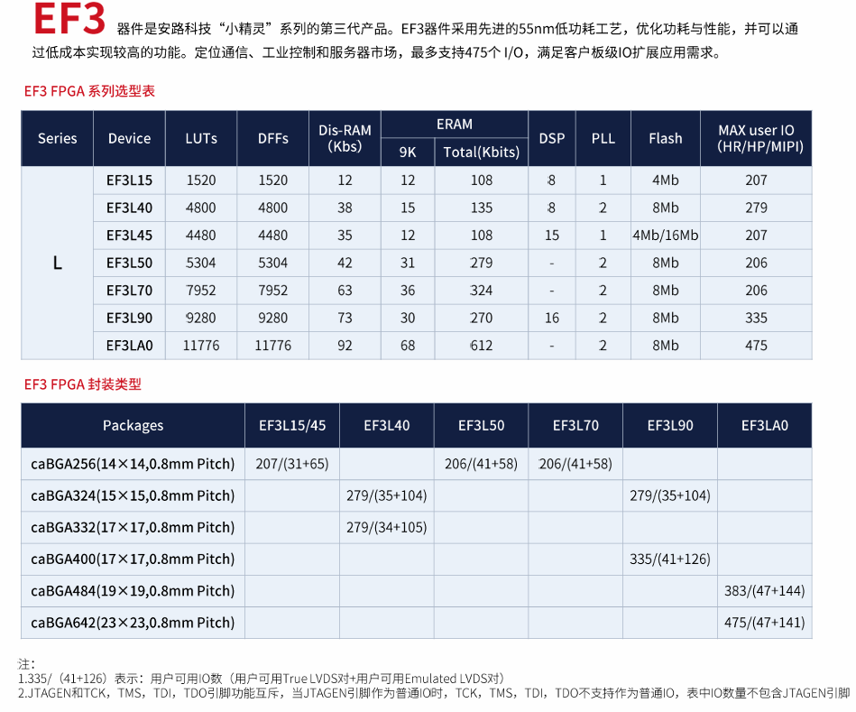
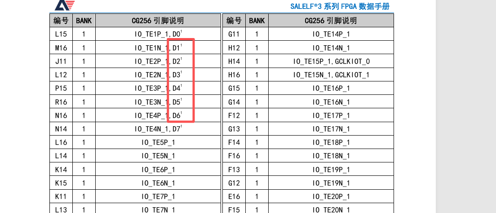

---
<!-- TOC -->

- [SALELF3硬件设计指导](#salelf3%E7%A1%AC%E4%BB%B6%E8%AE%BE%E8%AE%A1%E6%8C%87%E5%AF%BC)
    - [一.序言](#%E4%B8%80%E5%BA%8F%E8%A8%80)
    - [二.文档参考](#%E4%BA%8C%E6%96%87%E6%A1%A3%E5%8F%82%E8%80%83)
    - [三.EF3系列器件分类](#%E4%B8%89ef3%E7%B3%BB%E5%88%97%E5%99%A8%E4%BB%B6%E5%88%86%E7%B1%BB)
        - [小规模系列](#%E5%B0%8F%E8%A7%84%E6%A8%A1%E7%B3%BB%E5%88%97)
        - [中规模系列](#%E4%B8%AD%E8%A7%84%E6%A8%A1%E7%B3%BB%E5%88%97)
        - [大规模系列](#%E5%A4%A7%E8%A7%84%E6%A8%A1%E7%B3%BB%E5%88%97)
    - [四.EF3系列选型参考](#%E5%9B%9Bef3%E7%B3%BB%E5%88%97%E9%80%89%E5%9E%8B%E5%8F%82%E8%80%83)
    - [电源设计](#%E7%94%B5%E6%BA%90%E8%AE%BE%E8%AE%A1)
        - [五.VCCIO电源设计](#%E4%BA%94vccio%E7%94%B5%E6%BA%90%E8%AE%BE%E8%AE%A1)
        - [VCCAUX电源设计](#vccaux%E7%94%B5%E6%BA%90%E8%AE%BE%E8%AE%A1)
        - [GND设计](#gnd%E8%AE%BE%E8%AE%A1)
        - [电源电压范围要求](#%E7%94%B5%E6%BA%90%E7%94%B5%E5%8E%8B%E8%8C%83%E5%9B%B4%E8%A6%81%E6%B1%82)
        - [电源上电时序要求](#%E7%94%B5%E6%BA%90%E4%B8%8A%E7%94%B5%E6%97%B6%E5%BA%8F%E8%A6%81%E6%B1%82)
        - [电源退耦电容配置](#%E7%94%B5%E6%BA%90%E9%80%80%E8%80%A6%E7%94%B5%E5%AE%B9%E9%85%8D%E7%BD%AE)
    - [六.IO设计](#%E5%85%ADio%E8%AE%BE%E8%AE%A1)
        - [配置相关IO--JTAG](#%E9%85%8D%E7%BD%AE%E7%9B%B8%E5%85%B3io--jtag)
        - [配置相关IO--Flash配置](#%E9%85%8D%E7%BD%AE%E7%9B%B8%E5%85%B3io--flash%E9%85%8D%E7%BD%AE)
        - [配置相关IO--指示信号](#%E9%85%8D%E7%BD%AE%E7%9B%B8%E5%85%B3io--%E6%8C%87%E7%A4%BA%E4%BF%A1%E5%8F%B7)
        - [配置IO在上电阶段的状态](#%E9%85%8D%E7%BD%AEio%E5%9C%A8%E4%B8%8A%E7%94%B5%E9%98%B6%E6%AE%B5%E7%9A%84%E7%8A%B6%E6%80%81)
            - [EF3L15&EF3L25&EF3L45](#ef3l15ef3l25ef3l45)
            - [EF3L40和EF3L90](#ef3l40%E5%92%8Cef3l90)
            - [EF3LA0、EF3L70和EF3L50](#ef3la0ef3l70%E5%92%8Cef3l50)
            - [StateHold IO功能](#statehold-io%E5%8A%9F%E8%83%BD)
        - [单端IO电气特性](#%E5%8D%95%E7%AB%AFio%E7%94%B5%E6%B0%94%E7%89%B9%E6%80%A7)
        - [单端IO电压标准](#%E5%8D%95%E7%AB%AFio%E7%94%B5%E5%8E%8B%E6%A0%87%E5%87%86)
        - [单端IO输入兼容性](#%E5%8D%95%E7%AB%AFio%E8%BE%93%E5%85%A5%E5%85%BC%E5%AE%B9%E6%80%A7)
        - [热插拔特性](#%E7%83%AD%E6%8F%92%E6%8B%94%E7%89%B9%E6%80%A7)
        - [V兼容输入设计](#v%E5%85%BC%E5%AE%B9%E8%BE%93%E5%85%A5%E8%AE%BE%E8%AE%A1)
        - [输入信号过冲/下冲限制](#%E8%BE%93%E5%85%A5%E4%BF%A1%E5%8F%B7%E8%BF%87%E5%86%B2%E4%B8%8B%E5%86%B2%E9%99%90%E5%88%B6)
        - [V电平输入配置](#v%E7%94%B5%E5%B9%B3%E8%BE%93%E5%85%A5%E9%85%8D%E7%BD%AE)
        - [差分IO设计指导](#%E5%B7%AE%E5%88%86io%E8%AE%BE%E8%AE%A1%E6%8C%87%E5%AF%BC)
            - [LVDS33 LVDS25接口设计](#lvds33-lvds25%E6%8E%A5%E5%8F%A3%E8%AE%BE%E8%AE%A1)
            - [LVDS18接口设计](#lvds18%E6%8E%A5%E5%8F%A3%E8%AE%BE%E8%AE%A1)
            - [LVPECL接口设计](#lvpecl%E6%8E%A5%E5%8F%A3%E8%AE%BE%E8%AE%A1)
        - [时钟IO设计](#%E6%97%B6%E9%92%9Fio%E8%AE%BE%E8%AE%A1)
            - [全局时钟输入](#%E5%85%A8%E5%B1%80%E6%97%B6%E9%92%9F%E8%BE%93%E5%85%A5)
            - [PLL专用管脚](#pll%E4%B8%93%E7%94%A8%E7%AE%A1%E8%84%9A)
            - [时钟信号质量要求](#%E6%97%B6%E9%92%9F%E4%BF%A1%E5%8F%B7%E8%B4%A8%E9%87%8F%E8%A6%81%E6%B1%82)
            - [各封装时钟引脚映射](#%E5%90%84%E5%B0%81%E8%A3%85%E6%97%B6%E9%92%9F%E5%BC%95%E8%84%9A%E6%98%A0%E5%B0%84)
        - [SSO同时开关输出限制](#sso%E5%90%8C%E6%97%B6%E5%BC%80%E5%85%B3%E8%BE%93%E5%87%BA%E9%99%90%E5%88%B6)
            - [SSO概念](#sso%E6%A6%82%E5%BF%B5)
            - [SSO计算方法](#sso%E8%AE%A1%E7%AE%97%E6%96%B9%E6%B3%95)
            - [EF3L40 BANK0 SSO限制示例](#ef3l40-bank0-sso%E9%99%90%E5%88%B6%E7%A4%BA%E4%BE%8B)
            - [SSO缓解措施](#sso%E7%BC%93%E8%A7%A3%E6%8E%AA%E6%96%BD)
        - [DDRx2支持](#ddrx2%E6%94%AF%E6%8C%81)
            - [器件支持情况](#%E5%99%A8%E4%BB%B6%E6%94%AF%E6%8C%81%E6%83%85%E5%86%B5)
            - [设计建议](#%E8%AE%BE%E8%AE%A1%E5%BB%BA%E8%AE%AE)
    - [七.封装热参数](#%E4%B8%83%E5%B0%81%E8%A3%85%E7%83%AD%E5%8F%82%E6%95%B0)
        - [封装热阻参数](#%E5%B0%81%E8%A3%85%E7%83%AD%E9%98%BB%E5%8F%82%E6%95%B0)
        - [热设计要点](#%E7%83%AD%E8%AE%BE%E8%AE%A1%E8%A6%81%E7%82%B9)
    - [八.PCB设计指导](#%E5%85%ABpcb%E8%AE%BE%E8%AE%A1%E6%8C%87%E5%AF%BC)
        - [去耦电容布局](#%E5%8E%BB%E8%80%A6%E7%94%B5%E5%AE%B9%E5%B8%83%E5%B1%80)
        - [电源平面设计](#%E7%94%B5%E6%BA%90%E5%B9%B3%E9%9D%A2%E8%AE%BE%E8%AE%A1)
        - [走线处理方式](#%E8%B5%B0%E7%BA%BF%E5%A4%84%E7%90%86%E6%96%B9%E5%BC%8F)
        - [过孔设计](#%E8%BF%87%E5%AD%94%E8%AE%BE%E8%AE%A1)
    - [九.设计检查清单](#%E4%B9%9D%E8%AE%BE%E8%AE%A1%E6%A3%80%E6%9F%A5%E6%B8%85%E5%8D%95)
        - [电源设计检查](#%E7%94%B5%E6%BA%90%E8%AE%BE%E8%AE%A1%E6%A3%80%E6%9F%A5)
        - [IO设计检查](#io%E8%AE%BE%E8%AE%A1%E6%A3%80%E6%9F%A5)
        - [PCB设计检查](#pcb%E8%AE%BE%E8%AE%A1%E6%A3%80%E6%9F%A5)
    - [十.快速导航](#%E5%8D%81%E5%BF%AB%E9%80%9F%E5%AF%BC%E8%88%AA)

<!-- /TOC -->

# SALELF3硬件设计指导

## 一.序言

EF3系列FPGA硬件设计涉及多个数据手册和设计指南，为了方便开发人员快速查阅和理解硬件设计要点，本文档整合了安路科技官方发布的相关资料，包括:

- EF3L15/25/45数据手册(DS500)
- EF3L40/50/90/LA0数据手册(DS600)
- EF3L15CG256硬件设计指南(UG501)
- EF3L40&90硬件设计指南(UG602)
- EF3系列FPGA硬件设计指南(UG603)

本文档按照电源设计、IO设计、PCB设计、检查清单等章节组织，涵盖了硬件设计的核心要点，旨在为硬件工程师提供便捷的设计参考。

**注意事项:**

- EF3系列器件根据封装和资源不同，分为三个规模:
  - **小规模系列**: EF3L15、EF3L25、EF3L45 (设计要求相似)
  - **中规模系列**: EF3L40、EF3L90 (设计要求相似)
  - **大规模系列**: EF3L50、EF3L70、EF3LA0 (设计要求相似)

- EF3L25已经停产。

- 不同系列的某些IO特性(如热插拔、5V兼容、DDRx2支持等)存在差异,设计时需根据具体器件型号核对相应要求。

- 涉及封装热参数、退耦电容数量、SSO限制等具体数值时,需根据选择的封装型号查阅对应章节。

## 二.文档参考

| 文档名称 | 文档编号 | 适用器件 | 说明 |
|---------|---------|---------|------|
| ELF3L15&ELF3L25&EF3L45数据手册 | DS500_2512.pdf | EF3L15, EF3L25, EF3L45 | 小规模器件电气特性 |
| ELF3L40&ELF3L50&EF3L90&EF3LA0数据手册 | DS600_2512.pdf | EF3L40, EF3L50, EF3L90, EF3LA0 | 中大规模器件电气特性 |
| EF3L15CG256硬件设计指南 | UG501_2401.pdf | EF3L15CG256 | 小规模器件详细设计指导 |
| EF3L40&90硬件设计指南 | UG602_2210.pdf | EF3L40, EF3L90 | 中规模器件详细设计指导 |
| EF3系列FPGA硬件设计指南 | UG603_2406.pdf | 全系列 | 通用设计指导(含PCB设计) |

**引脚映射表:**

- 根据不同封装型号,对应的引脚映射文件请查阅:
  - [EF3L15CG256B_PINLIST](../../pdf/EF3/EF3L15CG256B_PINLIST.xlsx)
  
  - [EF3L40CG324B_PINLIST ](../../pdf/EF3/EF3L40CG324_PINLIST.xlsx)
  - [EF3L40CG332B_PINLIST](../../pdf/EF3/EF3L40CG332B_PINLIST.xlsx)

  - [EF3L45CG256B_PINLIST](../../pdf/EF3/EF3L45CG256B_PINLIST.xlsx)


  - [EF3L50CG256BH_PINLIST](../../pdf/EF3/EF3L50CG256BH_PINLIST.xlsx)
  - [EF3L50CG256B_PINLIST](../../pdf/EF3/EF3L50CG256B_PINLIST.xlsx)
  - [EF3L70CG256B_PINLIST](../../pdf/EF3/EF3L70CG256B_PINLIST.xlsx)
  
  - [EF3L90CG324B_PINLIST](../../pdf/EF3/EF3L90CG324B_PINLIST.xlsx)
  - [EF3L90CG400B_PINLIST](../../pdf/EF3/EF3L90CG400B_PINLIST.xlsx)
  
  - [EF3LA0CG484B_PINLIST](../../pdf/EF3/EF3LA0CG484B_PINLIST.xlsx)
  - [EF3LA0CG642B_PINLIST](../../pdf/EF3/EF3LA0CG642B_PINLIST.xlsx)


 
## 三.EF3系列器件分类

EF3系列FPGA器件按照封装和逻辑资源可分为三个主要规模,每个规模的设计特性相似:

### 小规模系列
- **器件型号**: EF3L15, EF3L25, EF3L45
- **封装类型**: CG256
- **主要特性**:
  - 逻辑资源较少,适合简单逻辑设计
  - IO Banks数量: 0-5
  - 部分引脚不支持热插拔
  - IOBB支持5V直接输入(需OverDriven)
  - IOBE需外部串联电阻兼容5V输入

### 中规模系列
- **器件型号**: EF3L40, EF3L90
- **封装类型**: CG324, CG332, CG400
- **主要特性**:
  - 逻辑资源中等,适合中等规模逻辑设计
  - IO Banks数量: 0-5
  - EF3L40所有引脚支持热插拔
  - EF3L90部分引脚不支持热插拔
  - 所有IO需要外部串联电阻兼容5V输入
  - BANK0/2支持内部100Ω差分电阻

### 大规模系列
- **器件型号**: EF3L50, EF3L70, EF3LA0
- **封装类型**: CG256, CG484, CG642
- **主要特性**:
  - 逻辑资源丰富,适合复杂逻辑设计
  - IO Banks数量: 0-7 (仅EF3LA0CG642B)
  - 所有引脚支持热插拔
  - 所有IO需要外部串联电阻兼容5V输入
  - 支持LVDS18接口(推荐)
  - 部分器件支持StateHold IO功能

## 四.EF3系列选型参考



**选型建议:**

1. **逻辑资源需求**: 根据设计所需的LUT、触发器、BRAM等资源选择合适的器件
2. **IO数量需求**: 根据外设接口数量选择IO充足的封装
3. **特殊功能需求**:
   - 需要高速接口(DDR、LVDS等)时,选择支持的IO Bank
   - 需要热插拔功能时,注意选择支持热插拔的引脚
   - 需要5V兼容输入时,确认器件支持并正确设计
4. **封装类型**: 根据PCB布局和空间限制选择合适的封装
5. **成本考虑**: 在满足需求的前提下,选择成本最优的方案

## 电源设计

### 五.VCCIO电源设计

VCCIO为IO Bank供电电压,不同Bank可以配置不同的电压等级,以支持不同的IO标准。

**电压范围:**

| VCCIO标准 | 最小值 | 典型值 | 最大值 | 单位 |
|----------|-------|-------|-------|------|
| 3.3V | 3.135 | 3.3 | 3.465 | V |
| 2.5V | 2.375 | 2.5 | 2.625 | V |
| 1.8V | 1.71 | 1.8 | 1.89 | V |
| 1.5V | 1.425 | 1.5 | 1.575 | V |
| 1.2V | 1.14 | 1.2 | 1.26 | V |

**设计要点:**

1. **VCCIO0特殊要求**: 
   - VCCIO0 ≥ 1.5V (POR上电检测必须供电)
   - 如果使用JTAG下载,需要和下载器供电电压保持一致

2. **其他VCCIO Bank**:
   - 最小值 ≥ 1.2V
   - 建议所有VCCIO Bank都供电,避免潜在漏电流风险
   - 不使用的Bank也应供电,保持IO在已知状态

3. **LVDS接口要求**:
   - EF3L40和EF3L90: 使用LVDS的BANK供电电压应≥2.5V
   - EF3LA0、EF3L70和EF3L50: 使用LVDS的BANK供电电压应≥1.8V

4. **电源引脚数量** (以EF3L90CG400B为例):
   - VCCIO共有20个,分布在BANK0-BANK5
   - 具体位号请参考对应的PINLIST文档

### VCCAUX电源设计

VCCAUX为芯片辅助电源,给内部逻辑供电,是芯片正常工作的关键电源。

**电压范围:**

| 参数 | 最小值 | 典型值 | 最大值 | 单位 |
|-----|-------|-------|-------|------|
| VCCAUX | 2.375 | 2.5/3.3 | 3.63 | V |

**设计要点:**

1. **必须供电**: VCCAUX是POR上电检测电源,必须连接
2. **电压要求**: ≥ 2.5V (推荐2.5V或3.3V)
3. **接最高电压**: VCCAUX应接芯片最高IO电压,以保证兼容性
4. **特殊引脚限制**:
   - EF3L90CG400的Y2脚作为输入时,不得接入高于VCCAUX的电平
   - EF3L15CG256的G12、F15引脚电平不得高于VCCAUX

5. **电源引脚数量** (以EF3L90CG400B为例):
   - VCCAUX共有10个
   - 具体位号请参考对应的PINLIST文档

### GND设计

**设计要点:**

1. **接地引脚数量充足**: 确保所有GND引脚都良好接地
2. **接地完整性**: 保证接地网络的低阻抗连接
3. **接地回流路径**: 为高速信号提供最短的接地回流路径

**电源引脚数量汇总** (以EF3L90CG400B为例):
- GND: 33个
- 具体位号请参考对应的PINLIST文档

### 电源电压范围要求

**基本操作条件:**

| Symbol | 参数 | 最小 | 典型 | 最大 | 单位 |
|--------|------|------|------|------|------|
| VCCAUX | 辅助电源 | 2.375 | 2.5/3.3 | 3.63 | V |
| VCCIO | I/O供电电压@3.3V | 3.135 | 3.3 | 3.465 | V |
| VCCIO | I/O供电电压@2.5V | 2.375 | 2.5 | 2.625 | V |
| VCCIO | I/O供电电压@1.8V | 1.71 | 1.8 | 1.89 | V |
| VCCIO | I/O供电电压@1.5V | 1.425 | 1.5 | 1.575 | V |
| VCCIO | I/O供电电压@1.2V | 1.14 | 1.2 | 1.26 | V |
| VI | 直流输入电压-增强型IO | -0.3 | — | VCCIO+0.3 | V |
| VO | 输出电压 | 0 | — | VCCIO | V |

**最大绝对额定值:**

| Symbol | 参数 | 最小 | 最大 | 单位 |
|--------|------|------|------|------|
| VCCAUX | 辅助电源 | -0.5 | 3.75 | V |
| VCCIO | I/O驱动供电电压 | -0.5 | 3.75 | V |
| VI | 直流输入电压-增强型IOBE | -0.5 | 3.75 | V |
| TJ | 结点温度 | -40 | 125 | ℃ |

### 电源上电时序要求

**上电时序:**

EF3系列器件**无上电时序要求**,各电源可以任意顺序上电。

**下电时序:**

大部分场景无下电时序要求,只有一种特殊情况:

**例外情况:**
- 如果外围电路对于下电时IO状态有要求
- 且外部有不会断电的上拉电阻
- 此情况则要求VCCAUX不早于VCCIO下电

**上电复位电压阈值:**

| Symbol | 参数 | 最小 | 典型 | 最大 | 单位 |
|--------|------|------|------|------|------|
| VCCAUX_PORUP | VCCAUX上电检测阈值 | 1.5 | 1.55 | 1.6 | V |
| Vccio | Vccio上电检测 | 0.95 | 1.0 | 1.05 | V |
| VCCAUX_PORDN | VCCAUX掉电检测阈值 | — | — | 1.5 | V |

**时序参数:**
- TPOR最大不超过35ms
- TPROG同TPOR
- TCCLK约6.4us
- 电源缓变率(TRAMP): 0.05 - 100 V/ms

**上电过程:**
1. 电源上电过程中(PhaseRAMP),所有IO处于三态
2. 上电完成后,芯片开始配置
3. 配置完成后,进入用户模式

### 电源退耦电容配置

为确保电源质量,需要为每个电源域放置一定数量和容量的退耦电容。

**退耦电容数量表** (参考UG603):

| 封装 | VCCAUX | | VCCIO | |
|------|--------|---|--------|---|
| | 4.7uF | 0.47uF | 4.7uF | 0.1uF |
| EF3L40CG324 | 1 | 9 | 1 | 17 |
| EF3L40CG332 | 1 | 7 | 1 | 16 |
| EF3L50CG256 | 1 | 7 | 1 | 15 |
| EF3L70CG256 | 1 | 7 | 1 | 15 |
| EF3L90CG324 | 1 | 9 | 1 | 17 |
| EF3L90CG400 | 1 | 9 | 1 | 19 |
| EF3LA0CG484 | 1 | 11 | 2 | 34 |
| EF3LA0CG642 | 2 | 18 | 2 | 55 |

**电容选型建议:**

1. **材质选择**: 优先选择X7R、X5R材质,具有较好的温度稳定性
2. **ESR要求**: 优先选择ESR小的电容,以优化PDN(电源分配网络)
3. **布局要求**:
   - 小容量电容(0.1uF, 0.47uF)靠近管脚放置
   - 大容量电容(4.7uF)可排布在BGA外围
   - 电解电容建议放在开关电源芯片附近
4. **BGA芯片下方**:
   - 尽量保证每个电源pin放置1个去耦电容
   - 小容量电容优先

## 六.IO设计

### 配置相关IO--JTAG

JTAG接口用于芯片配置、边界扫描和调试。

**JTAG引脚定义:**

| 引脚名称 | 方向 | 描述 | 上下拉标准 | EF3L15CG256B<br>(BGA256) | EF3L40CG324<br>(aBGA324) | EF3L40CG332B<br>(BGA332) | EF3L50CG256B<br>(BGA256) | EF3L90CG400B<br>(BGA400) | EF3LA0CG484B<br>(BGA484) | EF3LA0CG642B<br>(BGA642) |
|----------|------|------|------------|--------------------------|--------------------------|--------------------------|--------------------------|--------------------------|--------------------------|-------------------------|
| TCK | 输入 | 时钟引脚,上升沿有效 | 4.7K下拉到GND | A7 | C7 | A8 | A7 | C9 | D10 | F10 |
| TMS | 输入 | 状态机控制引脚,高电平有效 | 4.7K上拉到VCCIO | B8 | C8 | C9 | B8 | D9 | C10 | G10 |
| TDI | 输入 | 数据输入引脚,高电平有效 | 4.7K上拉到VCCIO | A6 | C6 | B7 | A6 | C7 | E9 | B9 |
| TDO | 输出 | 数据输出引脚,高电平有效 | 4.7K上拉到VCCIO | C6 | D7 | C7 | C6 | E8 | E8 | C9 |
| JTAGEN | 输入 | JTAG使能信号,高电平有效 | 4.7K上拉到VCCIO | C10 | D11 | C13 | C10 | C13 | E14 | D18 |

**设计要点:**

1. **电阻配置**: 
   - TCK通过4.7K欧姆电阻下拉到GND
   - TDI、TDO、TMS、JTAGEN通过4.7K欧姆电阻上拉到VCCIO

2. **TDO处理**: TDO可以悬空或上拉到VCCIO

3. **IO复用**: JTAG引脚可作为普通IO使用时,只能做输出,且必须保留4.7K上下拉电阻

4. **电压匹配**: JTAG下载时,VCCIO0需要和下载器供电电压保持一致

### 配置相关IO--Flash配置

EF3系列支持内置Flash配置,可通过以下引脚进行数据加载。

**Flash配置引脚定义:**

| 引脚名称 | 描述 | 上下拉标准 | EF3L15CG256B | EF3L40CG324 | EF3L40CG332B | EF3L50CG256B | EF3L90CG400B | EF3LA0CG484B | EF3LA0CG642B |
|----------|------|------------|--------------|-------------|--------------|--------------|--------------|--------------|-------------|
| SCLK | 串行时钟 | 4.7K上拉到VCCIO | R12 | P17 | M16 | P6 | P18 | T9 | Y9 |
| CSN | 片选信号,低电平有效 | 4.7K上拉到VCCIO | F13 | L15 | W20 | R12 | M15 | AB21 | AC21 |
| D0 | 数据引脚0 | 4.7K上拉到VCCIO | G2 | M14 | P16 | L15 | N15 | U22 | Y24 |
| D1 | 数据引脚1 | 4.7K上拉到VCCIO | G3 | N16 | R16 | M16 | N14 | U21 | AA24 |
| D2 | 数据引脚2 | 4.7K上拉到VCCIO | K3 | L14 | P19 | J11 | N16 | V22 | Y23 |
| D3 | 数据引脚3 | 4.7K上拉到VCCIO | K2 | N17 | P18 | L12 | R19 | W22 | Y22 |
| D4 | 数据引脚4 | 4.7K上拉到VCCIO | L2 | L17 | N20 | P15 | P20 | U19 | Y21 |
| D5 | 数据引脚5 | 4.7K上拉到VCCIO | M1 | M16 | N19 | R16 | P19 | U18 | W21 |
| D6 | 数据引脚6 | 4.7K上拉到VCCIO | R9 | K14 | M19 | N16 | M17 | Y22 | AB23 |
| D7 | 数据引脚7 | 4.7K上拉到VCCIO | - | J18 | M18 | N14 | N20 | W21 | AB24 |
| SI | 串行数据输入 | 4.7K上拉到VCCIO | - | - | - | P13 | - | AA21 | AC22 |
| SO | 串行数据输出 | 4.7K上拉到VCCIO | - | - | - | T6 | - | U9 | AA9 |
| CSON | 片选信号,低电平有效 | 4.7K上拉到VCCIO | - | L18 | L18 | - | M20 | - | E14 |
| DOUT | 数据输出 | 4.7K上拉到VCCIO | - | L18 | L18 | - | M20 | - | E14 |

**配置模式:**

EF3系列支持以下配置模式:

| 配置模式 | 说明 | 数据位宽 |
|---------|------|---------|
| SS (Slave Serial) | 从动串行配置 | 1位 |
| SP (Slave Parallel) | 从动并行配置 | 8位 |
| MP (Master Parallel) | 主动并行配置 | 8位 |
| MSPI X1/X2/X4 | 内部SPI Flash配置 | 1/2/4位 |
| JTAG | JTAG配置 | 1位 |

**设计要点:**

1. **引脚预留**: 根据实际使用的配置模式,预留相应的配置引脚

2. **上拉电阻**: 所有配置引脚都需要4.7K上拉到VCCIO

3. **JTAG模式**: 只有JTAG模式支持内置Flash的刷新与配置回读

4. **配置方式**: 配置方式通过软件界面设置,下载位流时自动写入到内置Flash

### 配置相关IO--指示信号

配置指示信号用于指示FPGA的配置状态。

**配置指示引脚定义:**

| 引脚名称 | 方向 | 描述 | 上下拉标准 | EF3L15CG256B | EF3L40CG324 | EF3L40CG332B | EF3L50CG256B | EF3L90CG400B | EF3LA0CG484B | EF3LA0CG642B |
|----------|------|------|------------|--------------|-------------|--------------|--------------|--------------|--------------|--------------|
| PROGRAMN | 输入 | 全局复位输入,低有效 | 4.7K上拉到VCCIO | B10 | D12 | A14 | B10 | D13 | E15 | E17 |
| DONE | 输出 | 配置完成后输出高,源端开路;用户模式可复用为USER I/O | 4.7K上拉到VCCIO | C13 | E14 | B17 | C13 | A19 | E17 | F19 |
| INITN | 输出 | FPGA准备好配置时输出高,源端开路;用户模式可复用为USER I/O | 4.7K上拉到VCCIO | A13 | C16 | A17 | A13 | C17 | F16 | G19 |

**设计要点:**

1. **内部弱上拉**: DONE/INITN是带内部弱上拉的开漏输出,但为避免外部电源不稳造成芯片循环重启,**要求通过外部电阻上拉到VCCIO**

2. **信号复用**: PROGRAMN、INITN、DONE、JTAGEN这些配置指示引脚的复用可能会导致重新加载等问题
   - **不建议复用为输入管脚**
   - 可以复用为输出管脚使用

3. **配置逻辑**:
   - PROGRAMN: 拉低触发FPGA重新配置
   - INITN: 输出高表示FPGA准备好配置,输出低表示配置错误
   - DONE: 输出高表示配置成功完成

### 配置IO在上电阶段的状态

FPGA在上电后,配置IO的状态取决于器件类型和配置参数。

#### EF3L15&EF3L25&EF3L45

**非配置相关IO状态:**

1. **上电完成后,feature寄存器加载前**: 非配置相关IO处于三态
2. **加载过程中**: 普通IO的状态受HSWAPEN控制,可以为弱上拉或者三态
3. **进入用户模式后**: 
   - 用户使用的IO脚状态受代码控制
   - 未使用的管脚为弱上拉状态

**配置相关IO状态:**

| Pin | 配置成功前 HSWAPEN=0 (enable) | 配置成功前 HSWAPEN=1 (disable) | 配置成功后 |
|-----|-------------------------------|-------------------------------|-----------|
| PROGRAMN | Pull-up to Vccio | Pull-up to Vccio | 软件 ProgPin 设置 |
| INITN | Pull-up to Vccio | Pull-up to Vccio | 软件 InitPin 设置 |
| DONE | Pull-up to Vccio | Pull-up to Vccio | 软件 DonePin 设置 |
| SCLK | Pull-up to Vccio | Pull-up to Vccio | User I/O |
| CSN | Pull-down to Gnd | Pull-down to Gnd | User I/O |
| TMS TCK TDO TDI JTAGEN | Pull-up to Vccio | Pull-up to Vccio | 软件 JtagPin 设置 |
| D[7:2] | Pull-up to Vccio | Pull-up to Vccio | User I/O |
| D[1] | Pull-up to Vccio | Pull-up to Vccio | User I/O |
| D[0]/DIN | Pull-up to Vccio | Pull-up to Vccio | User I/O |
| CSON/DOUT | Pull-up to Vccio | Pull-up to Vccio | User I/O |
| Others¹ | Pull-up to Vccio | High-Z | User I/O |

**特殊IO状态:**

EF3L15&EF3L25&EF3L45系列的16个引脚在配置前和加载过程中,都处于弱上拉状态,不可控制:

- EF3L15&EF3L25&EF3L45: E16, F15, F12, J11, L12, G12, F14, G13, H13, J12, J15, K16, K13, K12, C16, D15

**EF3L15和EF3L45的额外限制:**

EF3L15CG256、EF3L45CG256、EF3L45CG256BH的以下引脚在配置成功前的IO状态一直为Pull-up to Vccio(无论HSWAPEN=0或HSWAPEN=1):

- K15, K14, H15, G16, J13, H11, G14, G15

#### EF3L40和EF3L90

**非配置相关IO状态:**

1. **上电完成后,feature寄存器加载前**: 非配置相关IO处于弱上拉
2. **加载过程中**: 普通IO的状态受HSWAPEN控制,可以为弱上拉或者三态
3. **进入用户模式后**: 
   - 用户使用的IO脚状态受代码控制
   - 未使用的管脚为弱上拉状态

**配置相关IO状态:**

| Pin | 配置成功前 HSWAPEN=0 (enable) | 配置成功前 HSWAPEN=1 (disable) | 配置成功后 |
|-----|-------------------------------|-------------------------------|-----------|
| PROGRAMN | Pull-up to Vccio | Pull-up to Vccio | 软件 ProgPin 设置 |
| INITN | Pull-up to Vccio | Pull-up to Vccio | 软件 InitPin 设置 |
| DONE | Pull-up to Vccio | Pull-up to Vccio | 软件 DonePin 设置 |
| SCLK | Pull-up to Vccio | Pull-up to Vccio | User I/O |
| CSN | Pull-down to Gnd | Pull-down to Gnd | User I/O |
| TMS TCK TDO TDI JTAGEN | Pull-up to Vccio | Pull-up to Vccio | 软件 JtagPin 设置 |
| D[7:2] | Pull-up to Vccio | Pull-up to Vccio | User I/O |
| D[1] | Pull-up to Vccio | Pull-up to Vccio | User I/O |
| D[0]/DIN | Pull-up to Vccio | Pull-up to Vccio | User I/O |
| CSON/DOUT | Pull-up to Vccio | Pull-up to Vccio | User I/O |

#### EF3LA0、EF3L70和EF3L50

**非配置相关IO状态:**

EF3LA0、EF3L70和EF3L50器件在上电完成后的状态取决于VERSION寄存器值:

| 器件 | VERSION | 上电完成后,feature寄存器加载前 | 不断电重加载,feature寄存器加载前 |
|------|---------|-------------------------------|-------------------------------|
| EF3L40, EF3L90 | - | 弱上拉 | 弱上拉 |
| EF3L50CG256B, EF3L70CG256B, EF3LA0CG484B, EF3LA0CG642B | 3'b000 | 三态 | 保持重加载前 feature 设置 |
| EF3L50CG256B, EF3L70CG256B, EF3LA0CG484B, EF3LA0CG642B | 3'b010 | 弱下拉 | 保持重加载前 feature 设置 |
| EF3L50CG256BE, EF3L70CG324BE, EF3LA0CG484BE | 3'b000 | 弱下拉 | 保持重加载前 feature 设置 |

**说明:**

1. EF3LA0,EF3L50,EF3L70器件的VERSION可通过EF3_LOGIC_DEVICE_VERSION_V2原语进行查询
2. EF3器件重加载包括调用DUAL BOOT,MULTI BOOT功能,及不断电情况下进行复位操作

**配置相关IO状态:**

| Pin | 配置成功前 HSWAPEN=0 (enable) | 配置成功前 HSWAPEN=1 (disable) | 配置成功后 |
|-----|-------------------------------|-------------------------------|-----------|
| PROGRAMN | Pull-up to Vccio | Pull-up to Vccio | 软件 ProgPin 设置 |
| INITN | Pull-up to Vccio | Pull-up to Vccio | 软件 InitPin 设置 |
| DONE | Pull-up to Vccio | Pull-up to Vccio | 软件 DonePin 设置 |
| SCLK | Pull-up to Vccio | Pull-up to Vccio | 软件 SspiPin 设置 |
| CSN | Pull-down to Gnd | Pull-down to Gnd | 软件 SspiPin 设置 |
| TMS TCK TDO TDI JTAGEN | Pull-up to Vccio | Pull-up to Vccio | 软件 JtagPin 设置 |
| D[7:0]¹ | Pull-down to Gnd | Pull-down to Gnd | User I/O |
| CSON/DOUT¹ | Pull-down to Gnd | High-Z | User I/O |
| Others(User IO) | Pull-down to Gnd | High-Z | User I/O |

**说明:** EF3LA0、EF3L70和EF3L50器件的D[7:0]和CSON/DOUT为内部测试相关引脚

#### StateHold IO功能

StateHold功能用于维持在线升级时IO状态保持不变。

**器件支持情况:**

| 器件型号 | StateHold 功能 |
|----------|---------------|
| EF3L40, EF3L90 | 不支持 |
| EF3L50CG256B, EF3L70CG256B, EF3LA0CG484B, EF3LA0CG642B | 部分 IO 不支持 |
| EF3L50CG256BE, EF3L70CG324BE, EF3LA0CG484BE | 所有 IO 均支持 StateHold IO 功能 |

**设计要点:**

1. **功能作用**: 维持在线升级时IO状态保持不变

2. **不可StateHold的IO**: 
   - 在手册文档"引脚和封装"章节中,每个封装都会标明不可StateHold的IO
   - 设计时需避开这些引脚,或确认不影响系统功能



### 单端IO电气特性

**直流电气特性:**

| Symbol | 参数 | 条件 | 最小 | 典型 | 最大 | 单位 |
|--------|------|------|------|------|------|------|
| I_IL, I_IH | 输入漏电电流 | 0 ≤ VI ≤ VCCIO - 0.5V | -15 | — | 15 | uA |
| I_IH | 输入漏电电流 | VCCIO - 0.5V ≤ VI ≤ VIH_MAX | — | — | 150 | uA |
| V_HYST | 施密特触发器输入迟滞电压 | VCCIO = 3.3V | — | 350 | — | mV |
| | | VCCIO = 2.5V | — | 260 | — | mV |
| | | VCCIO = 1.8V | — | 130 | — | mV |
| | | VCCIO = 1.5V | — | 70 | — | mV |
| I_PU | I/O 弱上拉电流 | — | 35 | — | 250 | uA |
| I_PD | I/O 弱下拉电流 | — | 35 | — | 250 | uA |
| I_BHLS | 总线保持 0 维持电流 | — | 40 | — | — | uA |
| I_BHHS | 总线保持 1 维持电流 | — | 40 | — | — | uA |
| I_BHLO | 总线保持 0 改写电流 | 0 ≤ Vi ≤ VCCIO | — | — | 350 | uA |
| I_BHHO | 总线保持 1 改写电流 | 0 ≤ Vi ≤ VCCIO | — | — | 350 | uA |
| V_BHT | 总线保持触发电平 | — | VIL_max | — | VIH_min | V |

### 单端IO电压标准

**输出电压标准:**

| 标准 | V_IL (V) | V_IH (V) | V_OL 最大 (V) | V_OH 最小 (V) | I_OL (mA) | I_OH (mA) |
|------|----------|----------|--------------|--------------|-----------|-----------|
| LVTTL33 | -0.3 | 0.8 | 2.0 | 0.4 | 4 | -4 |
| LVCMOS33 | -0.3 | 0.8 | 2.0 | 0.4 | 8 | -8 |
| | | | | | 12 | -12 |
| | | | | | 16 | -16 |
| | | | | | 20 | -20 |
| LVCMOS25 | -0.3 | 0.7 | 1.7 | 0.4 | 4 | -4 |
| | | | | | 8 | -8 |
| | | | | | 12 | -12 |
| | | | | | 16 | -16 |
| LVCMOS18 | -0.3 | 0.35 × VCCIO | 0.65 × VCCIO | 0.4 | 4 | -4 |
| | | | | | 8 | -8 |
| | | | | | 10 | -10 |
| LVCMOS15 | -0.3 | 0.35 × VCCIO | 0.65 × VCCIO | 0.4 | 4 | -4 |
| | | | | | 8 | -8 |
| LVCMOS12 | -0.3 | 0.35 × VCCIO | 0.65 × VCCIO | 0.4 | 4 | -4 |
| PCI33 | -0.3 | 0.3 × VCCIO | 0.5 × VCCIO | 0.1 × VCCIO | 0.9 × VCCIO | 1.5 | -0.5 |

### 单端IO输入兼容性

**输入标准与VCCIO兼容性:**

| 输入标准 | VCCIO / VCCIO0 (典型值) |
|----------|------------------------|
| | 3.3V | 2.5V | 1.8V | 1.5V | 1.2V |
| LVTTL33 | ✓ | ✓² | ✓² | ✓² | ✓² |
| LVCMOS33 | ✓ | ✓² | ✓² | ✓² | ✓³ |
| LVCMOS25 | ✓¹ | ✓ | ✓² | ✓² | ✓² |
| LVCMOS18 | | ✓¹ | ✓ | ✓² | ✓² |
| LVCMOS15 | | | ✓¹ | ✓ | ✓² |
| LVCMOS12 | | | | ✓¹ | ✓ |

**说明:**

1. **驱动能力限制**: VCCIO电压低于IO标准要求的电压时,驱动能力不足,IO处于逻辑高电平时会导致更高的直流电流
2. **PCI Clamp限制**: 不能打开PCI-clamp和OverDriven,否则会产生漏电流

### 热插拔特性

**热插拔规格:**

| Symbol | 参数 | 最大 | 单位 |
|--------|------|------|------|
| IIOPIN(DC) | DC电流,每个I/O | 1 | mA |
| IIOPIN(AC) | AC电流,每个I/O | 8 | mA |

**器件支持情况:**

| 器件系列 | 支持情况 | 不支持热插拔的引脚 |
|----------|---------|------------------|
| EF3L40 | 所有引脚均支持 | - |
| EF3L50 | 所有引脚均支持 | - |
| EF3LA0 | 所有引脚均支持 | - |
| EF3L15&EF3L25&EF3L45 | 部分引脚不支持 | F8, D9, F7, E8, C9, A9, A8, C8, F14, G13, J12, H13, E16, F12, D15, G12, F15 |
| EF3L90CG400 | 部分引脚不支持 | Y2, U4, U5, T5, R5, R7, P7, W3, Y3 |

**设计要点:**

1. **信号上升时间**: 热插拔信号要求上升时间≥10ns
2. **电流限制**: 
   - DC电流: 每个I/O最大1mA
   - AC电流: 每个I/O最大8mA
3. **引脚选择**: 有热插拔需求时,应避开不支持热插拔的引脚

### 5V兼容输入设计

**器件支持情况:**

| 器件 | 支持方式 | 设计要求 |
|------|---------|---------|
| EF3L15CG256 IOBB | OverDriven | 在OverDriven打开情况下支持5V直接输入 |
| EF3L15CG256 IOBE | 外部电阻+PCI Clamp | 需要外部串联电阻,同时IO Constraints中打开内部钳位二极管 |
| EF3L90&EF3L40 | 外部电阻+PCI Clamp | 不能直接接收5V输入,需要外部串联电阻,同时IO Constraints中打开PCI Clamp = ON |
| EF3L50/EF3L70/EF3LA0 | 外部电阻+PCI Clamp | 需要外部串联电阻,同时IO Constraints中打开PCI Clamp = ON |

**设计要点:**

1. **外部电阻**: 所有不直接支持5V输入的IO都需要外部串联电阻
2. **软件配置**: 在IO Constraints中打开PCI Clamp = ON
3. **电压限制**: 
   - 设计完成后,应确认电路板PAD上的电压不超过3.75V
   - 5V信号不能在进入用户模式前接入,否则要外接二极管
4. **耐压限制**: 
   - EF3L90CG400的Y2引脚不得接入大于芯片供电电压(VCCAUX)的电平信号
   - EF3L15CG256的G12、F15引脚电平不得高于VCCAUX

**PCI箝位二极管电流特性:**

| VD (V) | Imax |
|--------|------|
| 0.0 | 0.92 μA |
| 0.1 | 9.2 μA |
| 0.2 | 20 μA |
| 0.3 | 30.4 μA |
| 0.4 | 43.3 μA |
| 0.5 | 76.5 μA |
| 0.6 | 0.15 mA |
| 0.7 | 0.36 mA |
| 0.8 | 2.85 mA |
| 0.9 | 9.42 mA |

### 输入信号过冲/下冲限制

信号在跳变过程中可能会产生过冲或下冲,为保证10年使用寿命,允许的最大过冲、下冲占比如下:

**10年使用寿命下允许的最大过冲、下冲占比:**

| VI AC Input Voltage | 占高电平时间的百分比 |
|---------------------|---------------------|
| -0.3V | 100% |
| -0.4V | 100% |
| -0.5V | 86% |
| -0.6V | 49% |
| -0.7V | 28% |
| -0.8V | 16% |
| -0.9V | 9.23% |
| -1.0V | 5.27% |
| -1.1V | 3% |
| VCCIO+0.4 | 100% |
| VCCIO+0.5 | 86% |
| VCCIO+0.6 | 49% |
| VCCIO+0.7 | 28% |
| VCCIO+0.8 | 16% |
| VCCIO+0.9 | 9.23% |
| VCCIO+1.0 | 5.27% |
| VCCIO+1.1 | 3% |

**设计要点:**

1. **信号完整性**: 确保信号边沿单调,避免过冲和下冲
2. **周期限制**: UI的周期(T)不超过20us
3. **阻抗匹配**: 通过阻抗匹配和端接来减少信号反射

### V电平输入配置

**应用场景:**

EF3器件IO支持在3.3V或者2.5V VCCIO BANK输入1.0V/1.8V电平。

**硬件前置条件:**

1. **外置Vref参考电平输入**:
   - 1.0V高电平时,参考电平为0.5V
   - 1.8V高电平时,参考电平为0.9V

**限制说明:**

1. 输入的参考电平只对该bank有效
2. 任何一个bank都可以设置参考电平
3. 可以同时设置两个参考电平
4. Vref电平不可超过bank电压的一半
5. 激励信号应该大于等于Vref电平的两倍

**软件配置说明:**

1. 打开TD软件,双击IO Constraint
2. 对参考电平ref_voltage选择好bank和Location
3. 在IOStandard里选择VREF1_DRIVER或者VREF2_DRIVER(分别对应参考电平1和参考电平2)
4. 对应输入的激励信号test_signal,选择好bank和Location
5. 在IOStandard里选择:
   - LVCMOS10V33: 1.0V高电平,bank电压为3.3V
   - LVCMOS10V25: 1.0V高电平,bank电压为2.5V
   - LVCMOS18V33: 1.8V高电平,bank电压为3.3V

**配置示例:**

如果输入激励信号1.0V为高电平,0V为低电平,bank为3.3V:
- 选择LVCMOS10V33
- 外部需要准备一个0.5V的Vref电平接到参考电平的引脚上

### 差分IO设计指导

#### LVDS33 LVDS25接口设计

**基本特性:**

| 参数 | 描述 | 测试条件 | 最小 | 典型 | 最大 | 单位 |
|------|------|---------|------|------|------|------|
| V_IP, V_IN | 输入电平 | VCCIO=2.5V | 0 | — | 2.4 | V |
| | | VCCIO=3.3V | 0.45 | — | 3.2 | V |
| V_ID | 输入差分摆幅 | \|V_IP - V_IN\|, RT = 100Ω | 150 | 350 | — | mV |
| | | VCCIO=3.3/2.5V | | | | |
| V_ICM | 输入共模电压 | VCCIO=2.5V | 0.05 | — | 2.35 | V |
| | | VCCIO=3.3V | 0.6 | — | 3.15 | V |
| I_IN | 输入电流 | 上电过程 | — | — | ±15 | uA |
| RT | 片内端接差分电阻 | — | 80 | 100 | 120 | Ω |
| V_OO | 标准差分输出摆幅 | \|V_OP - V_ON\|, RT = 100Ω | 150 | 250 | — | mV |
| | | VCCIO=3.3/2.5V | | | | |
| ΔV_OO | 差分输出摆幅变化 | — | — | — | 50 | mV |
| V_OCM | 输出共模电压 | (V_OP + V_ON)/2, RT = 100Ω | 0.6 | — | 1.4 | V |
| | | VCCIO=2.5V | | | | |
| ΔV_OCM | 输出共模电压偏差 | — | — | — | 50 | mV |

**器件支持情况:**

| 器件系列 | 内部100Ω电阻支持情况 |
|----------|---------------------|
| EF3L40, EF3L90 | BANK0/2的所有引脚(不包括EF3L90 BANK2的Y1、R6、W1、T6)内部带有100Ω差分输入电阻 |
| EF3LA0, EF3L70, EF3L50 | 具体内部100Ω电阻支持情况请参考数据手册 |
| 其他IOBANK | 不存在100Ω电阻,使用时需要外部加100Ω电阻 |

**设计要点:**

1. **True LVDS**: 只有具有真差分标识的管脚对可以作为真差分对使用,支持True LVDS输出
2. **Emulated LVDS**: True LVDS与Emulated LVDS均可作为LVDS25标准输入
3. **最大输入频率**: 400 MHz (800 Mbps)

**直流耦合电路:**

- 接收端PAD上的差分摆幅大于500mV时,只能使用片外100Ω差分匹配电阻
- 如果发送器内部没有100Ω匹配电阻,需要在板子上外接100Ω匹配电阻

**交流耦合推荐电路:**

- 交流耦合时,若发送器内部没有100Ω匹配电阻,需要在板子上外接100Ω匹配电阻
- 推荐电容值: 0.1μF

**True LVDS输出:**

- 直接输出LVDS标准电平,无需外部匹配电阻

**Emulated LVDS输出:**

- 需要外接3R电阻网络对输出电压摆幅进行衰减以满足LVDS标准
- 可以通过改变电阻网络值来降低功耗或改善噪声容限

**Emulated LVDS推荐电阻值:**

| RS (Ω) | RP (Ω) | LVDSE25 (mV) | LVDSE33 (mV) |
|--------|--------|---------------|---------------|
| 300 | 118 | 195 | 256 |
| 210 | 127 | 270 | 355 |
| 150 | 140 | 365 | 483 |
| 115 | 160 | 460 | 610 |

**布线要求:**

- 注意差分等长和阻抗匹配
- 差分阻抗推荐为100Ω

#### LVDS18接口设计

**基本特性:**

| 参数 | 描述 | 测试条件 | 最小 | 典型 | 最大 | 单位 |
|------|------|---------|------|------|------|------|
| V_IP, V_IN | 输入电平 | VCCIO=1.8V | 0.3 | — | 1.5 | V |
| V_ID | 输入差分摆幅 | \|V_IP - V_IN\|, RT = 100Ω, VCCIO=1.8V | 150 | 350 | 800 | mV |
| V_ICM | 输入共模电压 | VCCIO=1.8V | 0.6 | 0.9 | 1.4 | V |
| I_IN | 输入电流 | 上电过程 | — | — | ±15 | uA |
| RT | 片内端接差分电阻 | VCCIO=1.8V | 70 | — | 125 | Ω |
| V_DD | 标准差分输出摆幅 | \|V_OP - V_ON\|, RT = 100Ω, VCCIO=1.8V | 150 | 250 | 350 | mV |
| ΔV_DD | 差分输出摆幅变化 | — | — | — | 50 | mV |
| V_OCM | 输出共模电压 | (V_OP + V_ON)/2, RT = 100Ω, VCCIO=1.8V | 0.7 | 0.9 | 1.0 | V |
| ΔV_OCM | 输出共模电压偏差 | — | — | — | 50 | mV |

**设计要点:**

1. **推荐器件**: EF3L50/70/A0推荐使用此方案
2. **大摆幅限制**: 当差分输入摆幅大于500mV,只能使用外接100Ω差分电阻
3. **BANK电压要求**: 使用LVDS18的BANK供电电压应≥1.8V

#### LVPECL接口设计

**基本特性:**

| 参数 | 描述 | 测试条件 | 最小 | 典型 | 最大 | 单位 |
|------|------|---------|------|------|------|------|
| V_IP, V_IN | 输入电平 | VCCIO=3.3V | 0 | — | 2.95 | V |
| V_ID | 输入差分摆幅 | \|V_IP - V_IN\|, VCCIO=3.3V | 100 | — | 1600 | mV |
| V_ICM | 输入共模电压 | VCCIO=3.3V | 0.3 | — | 2.9 | V |

**设计要点:**

1. **输入支持**: EF3系列IOB支持LVPECL33输入
2. **电平转换**:
   - 如果对端器件是2.5V,可以直接输入
   - 如果对端器件是3.3V,共模电压要往下拉到2V,建议使用外接匹配电阻网络,不要使用内部电阻
3. **输出限制**: IOB管脚不支持True LVPECL33输出,只支持LVPECL33_E输出
4. **端接电阻**: LVPECL接收不能使用芯片内部100Ω电阻

**LVPECL输入推荐电路:**

**直流耦合:**
- 直接连接,注意电平转换

**交流耦合:**
- 使用电容进行交流耦合
- 推荐电容值: 0.1μF

**布线要求:**

- 注意差分等长和阻抗匹配
- 差分阻抗推荐为100Ω

### 时钟IO设计

#### 全局时钟输入

**基本特性:**

1. **全局时钟网络**: GCLKIO为全局时钟引脚,可直接上全局时钟网络
2. **数量限制**: 最多只有16个可以上全局时钟网络
3. **差分时钟**: 差分信号如需上全局时钟网络,要求p/n端都接上,并在软件物理约束中设置为LVDS25/LVDS33

**设计要点:**

1. **优先使用**: 建议走全局时钟专用管脚(GCLKIO),以获得最佳时钟性能
2. **时钟网络**: 全局时钟资源包含专用的时钟输入、缓冲器和布线网络,提供低延迟、低偏斜、互联的全局时钟网络

#### PLL专用管脚

**基本特性:**

1. **PLL专用**: GPLLINP/N和GPLLOUTP/N为锁相环专用管脚
2. **普通IO**: 如果不用作差分使用,可以用作普通IO
3. **PLL直接连接**: PLL专用引脚可以直接上PLL,但不能直接上全局时钟网络

**设计要点:**

1. **PLL输入**: GPLLINP/N用作PLL参考时钟输入
2. **PLL输出**: GPLLOUTP/N用作PLL输出时钟
3. **反馈时钟**: GPLLIP_FDB/GPLLIN_FDB用作PLL反馈时钟输入

#### 时钟信号质量要求

**设计要点:**

1. **信号质量**: 
   - 加载相关的时钟信号(包括JTAG加载的TCK,从串、从并加载的SCLK等)
   - 要求这些信号边沿单调无回沟
   - 建议在时钟源端串接一个电阻,用于调整阻抗匹配,提高信号质量

2. **时钟源**: 选择高质量的时钟源,避免时钟抖动和噪声

3. **阻抗匹配**: 时钟走线应做好阻抗匹配,减少反射

#### 各封装时钟引脚映射

**CG642B时钟相关引脚** (EF3LA0CG642B):

| 管脚位号 | 管脚名称(主功能) | 时钟类型 |
|----------|-----------------|----------|
| C13 | IO_L44P_0,SCL,GCLKIO_2 | 全局时钟输入 |
| C14 | IO_L44N_0,SDA,GCLKIO_3 | 全局时钟输入 |
| F13 | IO_L13P_0,GCLKIOL_0 | 全局时钟输入 |
| E13 | IO_L13N_0,GCLKIOL_1 | 全局时钟输入 |
| E21 | IO_L31P_0,GPLL1_OUT2P | PLL 专用输出 |
| D21 | IO_L31N_0,GPLL1_OUT2N | PLL 专用输出 |
| A25 | IO_L33P_0,GPLL1_OUT1P | PLL 专用输出 |
| B25 | IO_L33N_0,GPLL1_OUT1N | PLL 专用输出 |
| D8 | IO_L36P_0,GPLL0_OUT1P | PLL 专用输出 |
| E8 | IO_L36N_0,GPLL0_OUT1N | PLL 专用输出 |
| D5 | IO_L1P_0,GPLL0_OUT2P | PLL 专用输出 |
| D4 | IO_L1N_0,GPLL0_OUT2N | PLL 专用输出 |
| T24 | IO_TE12P_1,GCLKIOT_0 | 全局时钟输入 |
| T23 | IO_TE12N_1,GCLKIOT_1 | 全局时钟输入 |
| U24 | IO_TE14P_1,GCLKIOT_2 | 全局时钟输入 |
| U23 | IO_TE14N_1,GCLKIOT_3 | 全局时钟输入 |
| E23 | IO_TE34P_1,GPLL1IP_REF | PLL 参考输入 |
| E24 | IO_TE34N_1,GPLL1IN_REF | PLL 参考输入 |
| AB13 | IO_RE15P_2,GCLKIOR_0 | 全局时钟输入 |
| AA13 | IO_RE15N_2,GCLKIOR_1 | 全局时钟输入 |
| AD13 | IO_RE17P_2,GCLKIOR_2 | 全局时钟输入 |
| AD14 | IO_RE17N_2,GCLKIOR_3 | 全局时钟输入 |
| Y4 | IO_BE8P_3,GCLKIOB_0 | 全局时钟输入 |
| Y5 | IO_BE8N_3,GCLKIOB_1 | 全局时钟输入 |
| U3 | IO_BE10P_4,GCLKIOB_2 | 全局时钟输入 |
| U4 | IO_BE10N_4,GCLKIOB_3 | 全局时钟输入 |
| F2 | IO_BE12P_5,GPLL0IP_REF | PLL 参考输入 |
| G2 | IO_BE12N_5,GPLL0IN_REF | PLL 参考输入 |
| K5 | IO_BE16P_5,GCLKIOB_4 | 全局时钟输入 |
| K6 | IO_BE16N_5,GCLKIOB_5 | 全局时钟输入 |
| B12 | IO_M27_6,GCLKIOM_0 | 全局时钟输入 |
| A12 | IO_M28_6,GCLKIOM_1 | 全局时钟输入 |
| A14 | IO_M3_7,GCLKIOM_2 | 全局时钟输入 |
| B14 | IO_M4_7,GCLKIOM_3 | 全局时钟输入 |
| F14 | IO_LE42N_0,USRCLK | 用户时钟 |

**CG484B时钟相关引脚** (EF3LA0CG484B):

| 管脚位号 | 管脚名称(主功能) | 时钟类型 |
|----------|-----------------|----------|
| B1 | IO_L1P_0,GPLL0_OUTP2 | PLL专用输出 |
| A2 | IO_L1N_0,GPLL0_OUTN2 | PLL专用输出 |
| B3 | IO_L5P_0,GPLL0_OUTP1 | PLL专用输出 |
| A4 | IO_L5N_0,GPLL0_OUTN1 | PLL专用输出 |
| B10 | IO_L19P_0,GCLKIOL_0 | 全局时钟输入 |
| A10 | IO_L19N_0,GCLKIOL_1 | 全局时钟输入 |
| B12 | IO_L24P_0,SCL,GCLKIOL_2 | 全局时钟输入 |
| A12 | IO_L24N_0,SDA,GCLKIOL_3 | 全局时钟输入 |
| A20 | IO_L42P_0,GPLL1_OUTP2 | PLL专用输出 |
| B21 | IO_L42N_0,GPLL1_OUTN2 | PLL专用输出 |
| A21 | IO_L44P_0,GPLL1_OUTP1 | PLL专用输出 |
| B22 | IO_L44N_0,GPLL1_OUTN1 | PLL专用输出 |
| C21 | IO_TE1P_1,GPLL1IP_FDB | PLL反馈输入 |
| C22 | IO_TE1N_1,GPLL1IN_FDB | PLL反馈输入 |
| D22 | IO_TE3P_1,GPLL1IP_REF | PLL参考输入 |
| D21 | IO_TE3N_1,GPLL1IN_REF | PLL参考输入 |
| M22 | IO_TE25P_1,GCLKIOT_0 | 全局时钟输入 |
| M21 | IO_TE25N_1,GCLKIOT_1 | 全局时钟输入 |
| N22 | IO_TE29P_1,GCLKIOT_2 | 全局时钟输入 |
| P21 | IO_TE29N_1,GCLKIOT_3 | 全局时钟输入 |
| AA10 | IO_RE21P_2,GCLKIOR_0 | 全局时钟输入 |
| AB10 | IO_RE21N_2,GCLKIOR_1 | 全局时钟输入 |
| AB12 | IO_RE27P_2,GCLKIOR_2 | 全局时钟输入 |
| AA12 | IO_RE27N_2,GCLKIOR_3 | 全局时钟输入 |
| E4 | IO_BE3P_5,GPLL0IP_FDB | PLL反馈输入 |
| F5 | IO_BE3N_5,GPLL0IN_FDB | PLL反馈输入 |
| C1 | IO_BE5P_5,GPLL0IP_REF | PLL参考输入 |
| D2 | IO_BE5N_5,GPLL0IN_REF | PLL参考输入 |
| L1 | IO_BE5P_4,GCLKIOB_2 | 全局时钟输入 |
| M2 | IO_BE5N_4,GCLKIOB_3 | 全局时钟输入 |
| G2 | IO_BE11P_5,GCLKIOB_4 | 全局时钟输入 |
| G1 | IO_BE11N_5,GCLKIOB_5 | 全局时钟输入 |
| U2 | IO_BE18P_3,GCLKIOB_0 | 全局时钟输入 |
| V1 | IO_BE18N_3,GCLKIOB_1 | 全局时钟输入 |
| F13 | IO_LE26N_0,USRCLK | 用户时钟 |

**CG400B时钟相关引脚** (EF3L90CG400B):

| 管脚位号 | 管脚名称(主功能) | 时钟类型 |
|----------|-----------------|----------|
| G7 | IO_LE2P_0,GPLL0_OUTP | PLL专用输出 |
| F7 | IO_LE2N_0,GPLL0_OUTN | PLL专用输出 |
| B10 | IO_L21P_0,GCLKIOL_0 | 全局时钟输入 |
| A10 | IO_L21N_0,GCLKIOL_1 | 全局时钟输入 |
| C11 | IO_LE24P_0,GCLKIOL_2 | 全局时钟输入 |
| D11 | IO_LE24N_0,GCLKIOL_3 | 全局时钟输入 |
| G14 | IO_LE40P_0,GPLL1_OUTP | PLL专用输出 |
| F14 | IO_LE40N_0,GPLL1_OUTN | PLL专用输出 |
| C19 | IO_TE3P_1,GPLL1IP_REF | PLL参考输入 |
| E17 | IO_TE3N_1,GPLL1IN_REF | PLL参考输入 |
| D17 | IO_TE1P_1,GPLL1IP_FDB | PLL反馈输入 |
| C18 | IO_TE1N_1,GPLL1IN_FDB | PLL反馈输入 |
| K19 | IO_TE18P_1,GCLKIOT_0 | 全局时钟输入 |
| K20 | IO_TE18N_1,GCLKIOT_1 | 全局时钟输入 |
| L19 | IO_TE22P_1,GCLKIOT_2 | 全局时钟输入 |
| L20 | IO_TE22N_1,GCLKIOT_3 | 全局时钟输入 |
| W9 | IO_RE22P_2,GCLKIOR_0 | 全局时钟输入 |
| Y9 | IO_RE22N_2,GCLKIOR_1 | 全局时钟输入 |
| Y12 | IO_RE24P_2,GCLKIOR_2 | 全局时钟输入 |
| W12 | IO_RE24N_2,GCLKIOR_3 | 全局时钟输入 |
| C2 | IO_BE4P_5,GPLL0IP_FDB | PLL反馈输入 |
| C1 | IO_BE4N_5,GPLL0IN_FDB | PLL反馈输入 |
| D2 | IO_BE6P_5,GPLL0IP_REF | PLL参考输入 |
| D1 | IO_BE6N_5,GPLL0IN_REF | PLL参考输入 |
| E2 | IO_BE8P_5,GCLKIOB_4 | 全局时钟输入 |
| E1 | IO_BE8N_5,GCLKIOB_5 | 全局时钟输入 |
| U1 | IO_BE8P_3,GCLKIOB_0 | 全局时钟输入 |
| U2 | IO_BE8N_3,GCLKIOB_1 | 全局时钟输入 |
| L1 | IO_BE4P_4,GCLKIOB_2 | 全局时钟输入 |
| L2 | IO_BE4N_4,GCLKIOB_3 | 全局时钟输入 |
| N17 | IO_TE30N_1,USRCLK | 用户时钟 |

**CG332B时钟相关引脚** (EF3L40CG332B):

| 管脚位号 | 管脚名称(主功能) | 时钟类型 |
|----------|-----------------|----------|
| B9 | IO_L17P_0,GCLKIOL_0_0 | 全局时钟输入 |
| A9 | IO_L17N_0,GCLKIOL_1_0 | 全局时钟输入 |
| C11 | IO_LE20P_0,GCLKIOL_2_0 | 全局时钟输入 |
| A12 | IO_LE20N_0,GCLKIOL_3_0 | 全局时钟输入 |
| K17 | IO_TE17P_1,GCLKIOT_0_1 | 全局时钟输入 |
| L17 | IO_TE17N_1,GCLKIOT_1_1 | 全局时钟输入 |
| J19 | IO_TE19P_1,GCLKIOT_2_1 | 全局时钟输入 |
| J20 | IO_TE19N_1,GCLKIOT_3_1 | 全局时钟输入 |
| V9 | IO_RE18P_2,GCLKIOR_0_2 | 全局时钟输入 |
| W9 | IO_RE18N_2,GCLKIOR_1_2 | 全局时钟输入 |
| Y12 | IO_RE16P_2,GCLKIOR_2_2 | 全局时钟输入 |
| W12 | IO_RE16N_2,GCLKIOR_3_2 | 全局时钟输入 |
| R2 | IO_BE6P_3,GCLKIOB_0_3 | 全局时钟输入 |
| R3 | IO_BE6N_3,GCLKIOB_1_3 | 全局时钟输入 |
| M1 | IO_BE8P_4,GCLKIOB_2_4 | 全局时钟输入 |
| M2 | IO_BE8N_4,GCLKIOB_3_4 | 全局时钟输入 |
| G3 | IO_BE9P_5,GCLKIOB_4_5 | 全局时钟输入 |
| G2 | IO_BE9N_5,GCLKIOB_5_5 | 全局时钟输入 |
| A2 | IO_LE2P_0,GPLL0_OUTP | PLL专用输出 |
| B2 | IO_LE2N_0,GPLL0_OUTN | PLL专用输出 |
| A19 | IO_LE33P_0,GPLL1_OUTP | PLL专用输出 |
| B18 | IO_LE33N_0,GPLL1_OUTN | PLL专用输出 |
| E3 | IO_BE13P_5,GPLL0IP_FDB | PLL反馈输入 |
| E2 | IO_BE13N_5,GPLL0IN_FDB | PLL反馈输入 |
| E1 | IO_BE11P_5,GPLL0IP_REF | PLL参考输入 |
| F3 | IO_BE11N_5,GPLL0IN_REF | PLL参考输入 |
| D18 | IO_TE1P_1,GPLL1IP_FDB | PLL反馈输入 |
| D19 | IO_TE1N_1,GPLL1IN_FDB | PLL反馈输入 |
| E1 | IO_BE11P_5,GPLL0IP_REF | PLL参考输入 |
| F3 | IO_BE11N_5,GPLL0IN_REF | PLL参考输入 |
| D20 | IO_TE3P_1,GPLL1IP_REF | PLL参考输入 |
| E18 | IO_TE3N_1,GPLL1IN_REF | PLL参考输入 |
| N17 | IO_TE24N_1,USRCLK | 用户时钟 |

**EF3L15CG256B时钟相关引脚**:

| 管脚位号 | 管脚名称(主功能) | 时钟类型 |
|----------|-----------------|----------|
| A9 | IO_L7P_0,GCLKIOL_0,#NHP | 全局时钟输入(GCLKIOL) |
| C9 | IO_L7N_0,GCLKIOL_1,#NHP | 全局时钟输入(GCLKIOL) |
| C8 | IO_L9P_0,GCLKIOL_2,#NHP | 全局时钟输入(GCLKIOL) |
| A8 | IO_L9N_0,GCLKIOL_3,#NHP | 全局时钟输入(GCLKIOL) |
| H14 | IO_TE12P_1,GCLKIOT_0 | 全局时钟输入(GCLKIOT) |
| H16 | IO_TE12N_1,GCLKIOT_1 | 全局时钟输入(GCLKIOT) |
| G11 | IO_TE11P_1,GCLKIOT_2 | 全局时钟输入(GCLKIOT) |
| H12 | IO_TE11N_1,GCLKIOT_3 | 全局时钟输入(GCLKIOT) |
| T7 | IO_R8P_2,GCLKIOR_0 | 全局时钟输入(GCLKIOR) |
| R8 | IO_R8N_2,GCLKIOR_1 | 全局时钟输入(GCLKIOR) |
| T9 | IO_R10P_2,GCLKIOR_2 | 全局时钟输入(GCLKIOR) |
| P9 | IO_R10N_2,GCLKIOR_3 | 全局时钟输入(GCLKIOR) |
| E1 | IO_BE8P_5,GCLKIOB_0 | 全局时钟输入(GCLKIOB) |
| F2 | IO_BE8N_5,GCLKIOB_1 | 全局时钟输入(GCLKIOB) |
| J1 | IO_BE8P_4,GCLKIOB_2 | 全局时钟输入(GCLKIOB) |
| J3 | IO_BE8N_4,GCLKIOB_3 | 全局时钟输入(GCLKIOB) |
| L2 | IO_BE6P_3,D4,GCLKIOB_4 | 全局时钟输入(GCLKIOB) |
| M1 | IO_BE6N_3,D5,GCLKIOB_5 | 全局时钟输入(GCLKIOB) |
| L16 | IO_TE2P_1,GPLL2IP | PLL2专用输入 |
| L14 | IO_TE2N_1,GPLL2IN | PLL2专用输入 |
| R13 | IO_R16P_2,GPLL2_OUTP | PLL2专用输出 |
| T14 | IO_R16N_2,GPLL2_OUTN | PLL2专用输出 |
| E9 | IO_L6N_0,DPCLKIO | 专用时钟I/O |
| E6 | IO_L11P_0,DPCLKIO | 专用时钟I/O |
| J12 | IO_TE9N_1,DPCLKIO,#NHP | 专用时钟I/O |
| F14 | IO_TE14P_1,DPCLKIO,#NHP | 专用时钟I/O |
| H13 | IO_TE9P_1,USRCLK,#NHP | 用户时钟 |
| M11 | IO_R9N_2,DPCLKIO | 专用时钟I/O |
| P10 | IO_R11P_2,DPCLKIO | 专用时钟I/O |
| L1 | IO_BE2P_3,DPCLKIO | 专用时钟I/O |
| J5 | IO_BE7P_4,DPCLKIO | 专用时钟I/O |
| R12 | IO_R15P_2,SCLK | 配置时钟 |

**EF3L50CG256B时钟相关引脚**:

| 管脚位号 | 管脚名称(主功能) | 时钟类型 |
|----------|-----------------|----------|
| C8 | IO_L9P_0,GCLKIOL_0 | 全局时钟输入 |
| A8 | IO_L9N_0,GCLKIOL_1 | 全局时钟输入 |
| A9 | IO_L7P_0,GCLKIOL_2,SCL | 全局时钟输入 |
| C9 | IO_L7N_0,GCLKIOL_3,SDA | 全局时钟输入 |
| H14 | IO_TE15P_1,GCLKIOT_0 | 全局时钟输入 |
| H16 | IO_TE15N_1,GCLKIOT_1 | 全局时钟输入 |
| J15 | IO_TE10P_1,GCLKIOT_2 | 全局时钟输入 |
| K16 | IO_TE10N_1,GCLKIOT_3 | 全局时钟输入 |
| T7 | IO_TE17P_2,GCLKIOR_0 | 全局时钟输入 |
| R8 | IO_TE17N_2,GCLKIOR_1 | 全局时钟输入 |
| T9 | IO_TE19P_2,GCLKIOR_2 | 全局时钟输入 |
| P9 | IO_TE19N_2,GCLKIOR_3 | 全局时钟输入 |
| L2 | IO_BE1P_3,GCLKIOB_0 | 全局时钟输入 |
| M1 | IO_BE1N_3,GCLKIOB_1 | 全局时钟输入 |
| J1 | IO_BE8P_4,GCLKIOB_2 | 全局时钟输入 |
| J3 | IO_BE8N_4,GCLKIOB_3 | 全局时钟输入 |
| E1 | IO_BE8P_5,GCLKIOB_4 | 全局时钟输入 |
| F2 | IO_BE8N_5,GCLKIOB_5 | 全局时钟输入 |
| A4 | IO_L13P_0,GPLL0_OUTP1 | PLL专用输出 |
| C5 | IO_L13N_0,GPLL0_OUTN1 | PLL专用输出 |
| A3 | IO_L15P_0,GPLL0_OUTP2 | PLL专用输出 |
| B4 | IO_L15N_0,GPLL0_OUTN2 | PLL专用输出 |
| B13 | IO_L17P_0,GPLL1_OUTP1 | PLL专用输出 |
| A14 | IO_L17N_0,GPLL1_OUTN1 | PLL专用输出 |
| F10 | IO_L20P_0,GPLL1_OUTP2 | PLL专用输出 |
| D11 | IO_L20N_0,GPLL1_OUTN2 | PLL专用输出 |
| D16 | IO_TE21P_1,GPLL1IP_REF | PLL参考输入 |
| E14 | IO_TE21N_1,GPLL1IN_REF | PLL参考输入 |
| E2 | IO_BE4P_5,GPLL0IP_REF | PLL参考输入 |
| E3 | IO_BE4N_5,GPLL0IN_REF | PLL参考输入 |

### SSO同时开关输出限制

#### SSO概念

SSO(Simultaneous Switching Output)是指同时开关输出。受封装寄生等因素影响,当使用大电流驱动能力、快速压摆率时,指定的封装只允许有限数目的输出同时翻转。SSO是造成地线反弹和交调干扰的根源,每个Bank的SSO个数不允许超过最多数量的限制。

#### SSO计算方法

**步骤1**: 确定BANK的VCCIO/GND对数量

**步骤2**: 根据IO电平标准、驱动能力、Slew Rate查找SSO Limit per VCCIO/GND Pair

**步骤3**: 计算实际使用的IO数量和权重

**步骤4**: 确保总权重不超过VCCIO/GND对数量

**SSO权重计算:**

每对VCCIO/GND支持的特定驱动能力和压摆率的数量的倒数定义为权重。

**计算公式:**

```
总权重 = Σ(单个IO权重 × 使用数量)
```

如果总权重 < VCCIO/GND对数量,则符合SSO要求。

#### EF3L40 BANK0 SSO限制示例

**LVCMOS33 SSO限制计算:**

| VCCIO | I/O Standard | Drive Strength(mA) | Slew Rate | SSO Limit | 权重 | 使用数量 | 小计 |
|-------|--------------|-------------------|-----------|-----------|------|----------|------|
| 3.3V | LVCMOS33 | 4 | Slow | 16 | 1/16 | 15 | 0.94 |
| 3.3V | LVCMOS33 | 8 | Slow | 10 | 1/10 | 9 | 0.90 |
| 3.3V | LVCMOS33 | 12 | Slow | 3 | 1/3 | 3 | 1.00 |
| 3.3V | LVCMOS33 | 16 | Slow | 2 | 1/2 | 1 | 0.50 |
| 合计 | | | | | | 28 | 3.34 |

**计算过程:**

```
总权重 = 1/16×15 + 1/10×9 + 1/3×3 + 1/2×1 = 0.9375 + 0.9 + 1.0 + 0.5 = 3.34
```

EF3L40 Bank0 VCCIO/GND Pairs数量 = 4

**结论:** 3.34 < 4 ✓ 该组合情况符合SSO要求

#### SSO缓解措施

1. **BANK电源隔离**: 通过良好的PCB设计降低SSO带来的电源噪声

2. **退耦电容**: 电源IO配置退耦电容等方法可以降低SSO带来的电源噪声

3. **敏感信号保护**: PROGRAMN等噪声干扰敏感信号加上拉保护

4. **逻辑设计优化**:
   - 在芯片启动瞬间延缓同步输出IO数量
   - 启动后延迟几个时钟周期后再打开IO输出
   - 有助于降低启动瞬间SSO风险

5. **输出分散**: 输出IO选择时请尽量把大驱动能力的输出在同一个Bank中分散排布

### DDRx2支持

#### 器件支持情况

**EF3L40:**
- IOBANK1/3/4/5所有管脚不支持DDRx2

**EF3L90:**
- IOBANK1/3/4/5所有管脚和BANK2的Y1、R6、W1、T6不支持DDRx2
- 有使用需求时应避开这些管脚

**EF3LA0、EF3L70、EF3L50:**
- 具体支持情况请参考对应的数据手册

#### 设计建议

1. 在使用DDRx2功能时,请仔细核对引脚是否支持

2. 避开不支持的引脚,选择支持DDRx2的引脚进行设计

3. DDRx2功能用于高速DDR接口设计,需仔细约束时序

## 七.封装热参数

### 封装热阻参数

**封装热阻参数表:**

| 封装 | 封装尺寸 | θJC(℃/W) | θJB(℃/W) | θJA(℃/W) | Effective - θJA(℃/W) |
| | (mm) | | | | @250LFM | @500LFM | @750LFM |
| EF3L40CG324 | 15×15 | 15.06 | 11.43 | 30.12 | 27.51 | 26.47 | 25.82 |
| EF3L40CG332 | 17×17 | 13.6 | 19.38 | 26.98 | 24.383 | 23.362 | 22.724 |
| EF3L50CG256 | 14×14 | 11.487 | 21.271 | 31.468 | 27.480 | 26.309 | 25.543 |
| EF3L70CG256 | 14×14 | 11.487 | 21.271 | 31.468 | 27.480 | 26.309 | 25.543 |
| EF3L90CG324 | 15×15 | 15.06 | 11.43 | 30.12 | 27.51 | 26.47 | 25.82 |
| EF3L90CG400 | 17×17 | 12.8 | 22.99 | 34.32 | - | - | - |
| EF3LA0CG484 | 19×19 | 11.095 | 24.014 | 34.101 | 30.063 | 28.853 | 27.969 |
| EF3LA0CG642 | 23×23 | 9.97 | 22.29 | 32.53 | 27.99 | 26.82 | 25.95 |

### 热设计要点

1. **结温计算**: 根据封装热阻参数计算芯片结温

2. **温度限制**: 考虑环境温度和功耗,确保结温不超过最大值(125℃)

3. **高温应用**: 高温应用场景需要考虑散热设计

4. **散热设计**: 建议在PCB设计时预留散热区域

5. **热管理**: 根据实际功耗和热阻,设计合适的散热方案

## 八.PCB设计指导

### 去耦电容布局

**BGA芯片电源pin下方:**

1. 尽量保证每个pin放置1个去耦电容

2. 小容量的电容靠近管脚放置

3. 对于较大容值或大封装电容,允许排布在BGA芯片外围

4. 电解电容建议放在开关电源芯片附近

**电容选择:**

1. 优先选择ESR小的电容,以优化PDN

2. 电容材质推荐优先选择X7R、X5R

**退耦电容数量** (以EF3L90CG400为例):

| 电源域 | 4.7uF | 0.47uF | 0.1uF |
|--------|-------|--------|-------|
| VCCAUX | 1 | 9 | - |
| VCCIO | 1 | - | 19 |

### 电源平面设计

**走线宽度和过孔:**

1. 对于1oz铜箔,常温应用场景下,按照1mm(40mil)线宽承载1A电流

2. 高温应用场景需降额处理

3. 过孔孔径与承载电流关系:

```
Imax = D × 0.08 (mA)
```

其中D为孔径,单位mil。

**电源平面布局:**

1. 电源平面应该从电源芯片位置平铺到负载

2. 中间减少换层

3. 避免不合理的电源平面换层

**VIPPO工艺:**

1. pad直接打孔到底层,不需要扇出操作

2. 电容焊盘放置在过孔上,避免走线连接

**电容与内层平面连接:**

1. 电容管脚与电源层之间的过孔数量越多,去耦效果越好

2. 在电容管脚与过孔之间的走线存在电感,会弱化去耦效果

3. 走线越长,电感越大,会使信号回路等效阻抗变大

4. VIPPO工艺的PCB优先尝试焊盘下打孔

5. 电容的每个管脚建议放置过孔,尽量避免电容之间共用过孔

### 走线处理方式

**单端走线方式:**

1. 对于从BGA ball之间单端引出的情况,走线需要尽量短

2. BGA空间紧张,可以做neck处理,选择更细的引出线

**差分走线方式:**

1. 对于从BGA ball之间差分引出的情况,需要考虑PN skew

2. 引出方式应在离开BGA区域后就保持PN match

3. BGA空间紧张,可以做neck处理,选择更细的引出线

4. 差分链路的耦合电容端接电阻摆放位置要求不允许走线存在stub

5. 焊盘应当串入走线,避免走线分叉

### 过孔设计

**过孔分类:**

1. **电源类过孔**: GND过孔、VCC过孔

2. **信号类过孔**: 普通IO换层孔

3. **普通过孔**: 其他用途

**GND过孔:**

1. 主要用于BGA区域的过孔

2. 布线层放antipad,不放置焊盘

3. 直接在过孔类型里添加,后期设计中在保证避让空间足够的情况下,有更多布线区域

4. 可用于BGA下方GND、VCC等

5. 一般电源电容电阻附近的过孔

6. 能够增加BGA下方过孔之间走线区域

**信号类过孔:**

1. plane层放置antipad,非引线层也放antipad

2. 只在需要走线的层放焊盘

3. 减轻后期摘焊盘任务量

4. 可以降低焊盘带来的电容,优化过孔性能

5. 给电源平面留有更多的电流路径,优化电源性能

6. 可用于BGA下方普通IO、普通换层孔、扇出部分密集走线区域的信号孔

## 九.设计检查清单

根据EF3系列FPGA硬件设计,建议按照以下检查清单进行设计验证:

### 电源设计检查

- [ ] VCCAUX电压是否在2.375V-3.63V范围内
- [ ] VCCIO电压是否符合选用的电平标准
- [ ] VCCIO0是否≥1.5V(如使用JTAG下载)
- [ ] 所有VCCIO bank是否都已供电
- [ ] 去耦电容数量和容量是否符合要求
- [ ] 去耦电容布局是否合理(靠近管脚)
- [ ] 电源平面是否连续,减少换层
- [ ] 电源走线宽度是否满足电流需求
- [ ] VIPPO工艺是否正确应用

### IO设计检查

- [ ] JTAG引脚是否有正确的4.7K上下拉电阻
- [ ] Flash引脚是否有正确的4.7K上拉电阻
- [ ] 配置信号(PROGRAMN、INITN、DONE)是否有正确的4.7K上拉电阻
- [ ] 信号阻抗是否符合要求(单端50Ω,差分100Ω)
- [ ] 差分对是否等长
- [ ] 差分阻抗是否符合要求
- [ ] SSO限制是否满足要求
- [ ] 热插拔引脚是否正确选择
- [ ] 兼容5V输入设计是否符合要求
- [ ] LVDS接口设计是否符合要求
- [ ] LVPECL接口设计是否符合要求
- [ ] 时钟信号是否使用全局时钟管脚
- [ ] 时钟信号边沿是否单调无回沟
- [ ] DDRx2引脚是否选择正确
- [ ] StateHold IO引脚是否正确选择(如需在线升级)
- [ ] 输入信号过冲/下冲是否在限制范围内

### PCB设计检查

- [ ] 走线间距是否满足3W规则
- [ ] 同组信号是否使用相同传输线类型
- [ ] 信号回路是否最短
- [ ] 有阻抗控制的走线是否避开了不连续覆铜
- [ ] 差分链路的电容和电阻摆放是否有stub
- [ ] 过孔设计是否合理(电源过孔、信号过孔分离)
- [ ] 电容与电源层的过孔数量是否充足
- [ ] 是否考虑了热设计要求
- [ ] 电源平面换层是否合理
- [ ] BGA下方走线是否满足neck要求

---


## 十.快速导航 

[🏠 返回首页](https://www.cldmt.com) | [🔙 返回上级](../Anlogic.md)


**文档版本:**

- 创建日期: 2026.01.01
- 更新日期: 2026.01.16
- 版本: v1.0

**修订记录:**

- v1.0 (2026.01.16): 
  - 优化文档结构,增加器件分类说明
  - 补充完整的电源管脚数量信息
  - 完善配置IO上电状态说明
  - 增加StateHold IO功能说明
  - 补充LVDS18接口设计指导
  - 优化时钟引脚映射表
  - 完善SSO计算示例
  - 增加详细的检查清单

**免责声明:**

本文档整合了安路科技官方发布的相关资料,仅供参考。实际设计时,请以官方最新发布的数据手册和设计指南为准。
