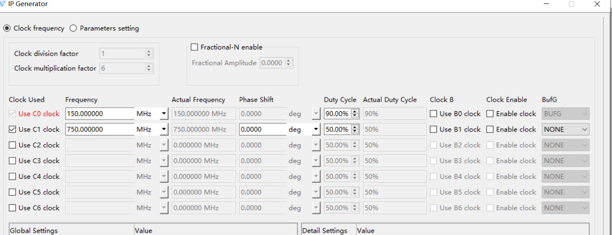
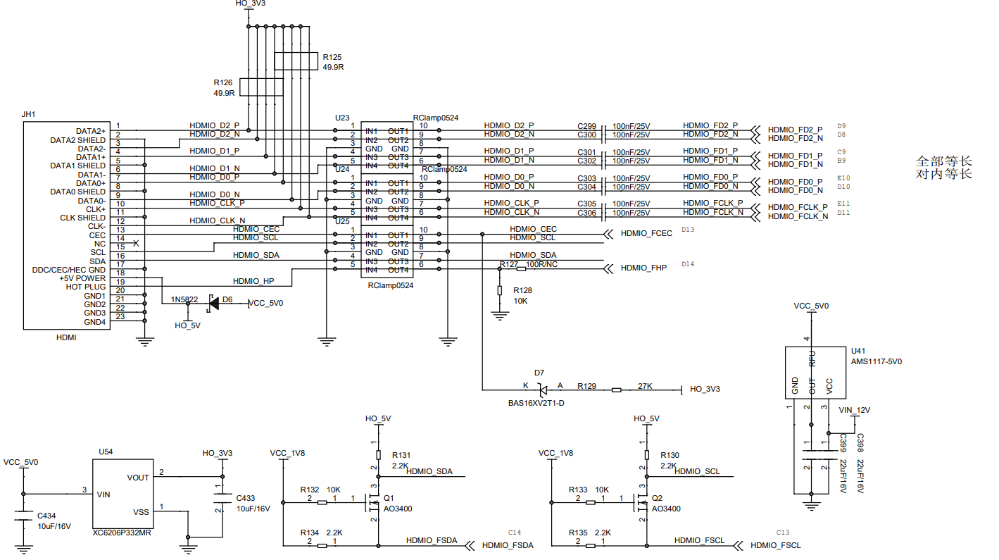
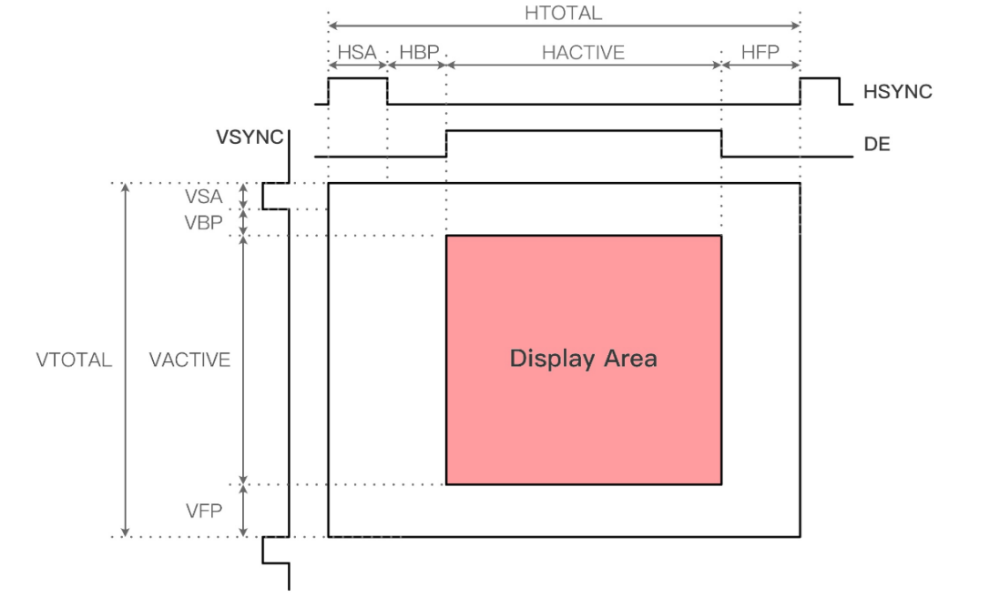
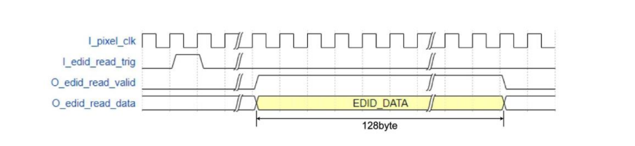
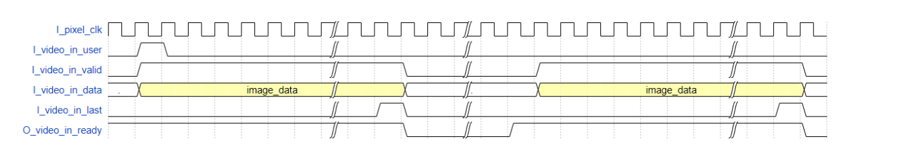
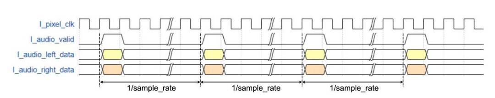

# 基于Anlogic的HDMI使用教程

## 1. HDMI概述总览

- HDMI（High Definition Multimedia Interface）是一种全数字化影像和声音发送接口，可以发送未压缩的音频及视频信号。
- 它广泛应用于机顶盒、DVD播放机、个人电脑、投影仪与电视等设备，通过同一条线材传输音频和视频信号，大大简化了系统线路的安装难度。

- 安路科技为旗下FPGA设计基于LVDS和Serdes的HDMI Transmitter方案，方便用户快速实现HDMI视频输出功能。

### 不同版本HDMI的带宽及支持的最大分辨率

不同HDMI版本因其最大TMDS（Transition Minimized Differential Signaling）时钟频率不同，从而支持的最大视频分辨率和刷新率也有所差异。以下是常见HDMI版本的带宽和典型分辨率支持情况：

| HDMI 版本 | 最大TMDS时钟频率 | 最大带宽 | 典型分辨率支持 (刷新率) |模式选择|
| :--- | :--- | :--- | :--- |:--- |
| **HDMI 1.4** | 340 MHz | 10.2 Gbps | 3840x2160 @ 30Hz, 4096x2160 @ 24Hz |Lvds实现|
| **HDMI 2.0** | 600 MHz | 18 Gbps | 3840x2160 @ 60Hz, 1080p @ 240Hz |Serdes实现|
| **HDMI 2.1** | 1200 MHz | 48 Gbps | 7680x4320 (8K) @ 60Hz, 3840x2160 (4K) @ 120Hz |

*注：以上数据为常见标准，实际支持情况还需考虑色深、色彩空间等因素。*

## 参考手册

[APUG058_HDMI_Transmitter_Over_Lvds](../../pdf/HDMI/APUG058_HDMI_Transmitter_Over_Lvds.pdf)
[APUG093_HDMI2.0_Transmitter](../../pdf/HDMI/APUG093_HDMI2.0_Transmitter.pdf)

## 普通LVDS实现方式

- 通过普通LVDS IO资源实现HDMI输出。
- 该方法主要适用于任何系列器件。

### IP介绍

安路科技提供的HDMI Transmitter IP核是一个完整的解决方案，负责将并行视频数据、音频数据编码并转换为符合HDMI标准的串行TMDS信号。其核心功能如下：

*   **设计框架**：IP内部集成了视频接口、音频接口、EDID读取接口、TMDS编码器和并串转换器。用户逻辑只需提供标准的视频和音频时序，IP核即可完成HDMI数据流的打包和编码。
*   **核心功能**：
    *   最高支持1920*1080@60@12bit显示分辨率。
    *   支持两路音频输入。
    *   支持RGB444和YUV444色彩空间。
        *   传输是RGB888和YUV444的图像格式
    *   支持内部视频测试源，便于调试。
    *   支持通过IIC接口读取显示设备的EDID信息。

### 时钟设置

- HDMI Transmitter 工作需要两个时钟：**像素时钟 (pixel_clk)** 和 **串行发送时钟 (serial_clk)**。
- 这两个时钟必须由FPGA内部的PLL生成，并且它们之间存在严格的频率关系。

*   **时钟架构**：
    *   用户逻辑、视频接口、音频接口均工作在 `pixel_clk` 时钟域。
    *   HDMI IP核内部的并串转换部分工作在 `serial_clk` 时钟域。
    *   
*   **频率计算**：
    *   **像素时钟 (pixel_clk)**：取决于需要输出的视频分辨率。其频率计算公式为：
        `F_pixel = Htotal × Vtotal × FrameRate`
        其中 `Htotal` 是一行像素的总长度（包括有效像素和消隐区），`Vtotal` 是一帧图像的总行数（包括有效行和消隐区），`FrameRate` 是帧率。
    *   **串行时钟 (serial_clk)**：其频率是像素时钟频率的五倍。
        `F_serial = 5 × F_pixel`
*   **示例 (108060)**：
    *   对于1080p60分辨率，标准时序为 `Htotal = 2200`， `Vtotal = 1125`。
    *   `F_pixel = 2200 × 1125 × 60 = 148,500,000 Hz = **148.5 MHz**`
    *   `F_serial = 5 × 148.5 MHz = **742.5 MHz**`



### 引脚配置

- 在使用普通LVDS资源实现HDMI输出时，需要对FPGA的引脚进行正确配置。
- HDMI接口包含一个时钟通道和三个数据通道，每个通道都需要一对差分引脚。
- **在安路的TD软件中，只需为差分对的P（正极）端设置引脚约束，N（负极）端软件会自动根据P端分配。**

*   **差分电平标准**：必须将引脚的电平标准设置为LVDS（如 `LVDS18` 或 `LVDS25`），具体电压需根据FPGA bank的供电电压决定。
*   **引脚分配示例 (TD软件约束语法)**：
    *   `O_hdmi_clk_p`   -> HDMI时钟通道P端
    *   `O_hdmi_tx_p[2]` -> HDMI数据通道2 P端
    *   `O_hdmi_tx_p[1]` -> HDMI数据通道1 P端
    *   `O_hdmi_tx_p[0]` -> HDMI数据通道0 P端

    以下是一个典型的HDMI输出工程的引脚约束示例，仅需为P端分配引脚：

    ```
    set_pin_assignment  { I_sysclk_p      }    { LOCATION = G22; IOSTANDARD = LVCMOS33;      }

    set_pin_assignment  { O_hdmi_tx_p[0]  }    { LOCATION = E10; IOSTANDARD = LVDS18;        }
    set_pin_assignment  { O_hdmi_tx_p[1]  }    { LOCATION = C9;  IOSTANDARD = LVDS18;        }
    set_pin_assignment  { O_hdmi_tx_p[2]  }    { LOCATION = D9;  IOSTANDARD = LVDS18;        }
    set_pin_assignment  { O_hdmi_clk_p    }    { LOCATION = E11; IOSTANDARD = LVDS18;        }
    ```

### 硬件上电阻网络搭配

由于FPGA的LVDS输出电平（如1.8V）与HDMI标准电平（TMDS，通常为3.3V共模，500mV摆幅）存在差异，且为了阻抗匹配，通常在FPGA与HDMI接口之间需要设计一个电阻网络。

*   **目的**：
    1.  **电平转换**：将FPGA的LVDS电压转换为HDMI接口所需的TMDS电平。
    2.  **阻抗匹配**：通过电阻网络实现与HDMI线缆100Ω差分阻抗的匹配，减少信号反射。
*   **典型结构**：常见的做法是使用三路（数据0/1/2）加一路（时钟）的电阻网络。具体电阻值需要根据FPGA的LVDS输出特性和目标HDMI电平进行计算。



### 参数修改方式

- HDMI TX IP核提供了丰富的参数，以适应不同的视频格式和配置需求。
- 这些参数通常在实例化IP核的顶层模块中进行设置。
- 如果要修改不同分辨率 ，修改以下内容

*   **视频时序参数**：这些参数直接对应于视频的同步时序。
    *   `HTOTAL`、`HACTIVE`、`HFP`、`HSYNC`、`HBP`：定义水平方向的同步、前沿、后沿和有效长度。
    *   `VTOTAL`、`VACTIVE`、`VFP`、`VSYNC`、`VBP`：定义垂直方向的同步、前沿、后沿和有效行数。
    *   *时序图*：

    

*   **视频格式参数**：
    *   `VIDEO_VIC`：视频识别码，用于告知接收端视频的格式和帧率（例如，16表示1080p60）。
    *   `VIDEO_TPG`：测试图像生成器使能。设置为"Enable"时，IP内部生成测试图像，忽略外部输入；设置为"Disable"时，使用外部输入的视频数据。
    *   `VIDEO_FORMAT`：视频色彩空间。可设置为"RGB444"或"YUV444"。
*   **音频参数**：
    *   `AUDIO_CTS`、`AUDIO_N`：用于音频时钟再生的重要参数，需根据像素时钟和音频采样率进行计算。
    *   `AUDIO_SAMPLE_RATE`：音频采样率，如"48K"、"44.1K"等。
*   **其他参数**：
    *   `IIC_SCL_DIV`：用于配置IIC接口的时钟分频系数，以确保IIC通信速率符合规范。


### 参考时序
与IP核交互时，需要遵循特定的接口时序。

####   **EDID读取时序**：

- 通过一个触发脉冲 `I_edid_read_trig` 发起读操作，然后在 `O_edid_read_valid` 有效期间读取128字节的EDID数据。




####   **视频数据输入时序**：

- IP核支持两种视频输入接口，用户可根据需求选择
- 
    1.  **Stream接口**：使用 `I_video_in_user`, `I_video_in_valid`, `I_video_in_last` 等信号，符合常见的AXI4-Stream协议。
        

    - I_video_in_user 信号是帧起始信号，为一个单时钟周期信号，在第一行第一个有效数据拉高。
    - I_video_in_valid 是数据有效信号，
    - I_video_in_last 是行结束信号，在一行数据的结尾拉高。
    - O_video_in_ready 是接收端准备信号，为高表示可以写入数据，在 I_video_in_last 为高之后会拉低。

    2.  **RGB接口**：使用 `I_video_in_vs`, `I_video_in_hs`, `I_video_in_de` 等信号，更接近传统的VGA时序。用户测传数据即可。
 
  

####   **音频数据输入时序**：

- 音频数据通过 `I_audio_valid`, `I_audio_left_data`, `I_audio_right_data` 接口输入，数据速率需与音频采样率严格匹配。
 
    


## Serdes实现方式

> **本章节待完善。您后续可以在此处补充使用高速Serdes资源实现HDMI（如HDMI 2.0/2.1）的设计方法，包括时钟设置、引脚约束、硬件设计注意事项等。**

### 时钟设置

### 引脚设置

### 硬件上设计参考


### 参数修改方式

### 参考时序


# 技术支持

- 安路科技官网: https://www.anlogic.com
- 技术支持邮箱: folsie.zhao@wtmec.com

---

**版本信息:**

| 版本 | 日期 | 说明 |
|------|------|------|
| 1.0 | 2026.02.26 | 初版 HDMI  |

**免责声明:**

- 本文档仅供参考，实际设计时请以安路科技官方发布的最新数据手册和设计指南为准。