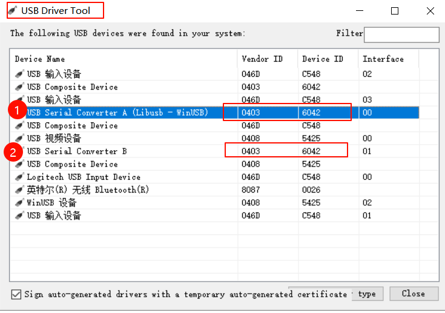
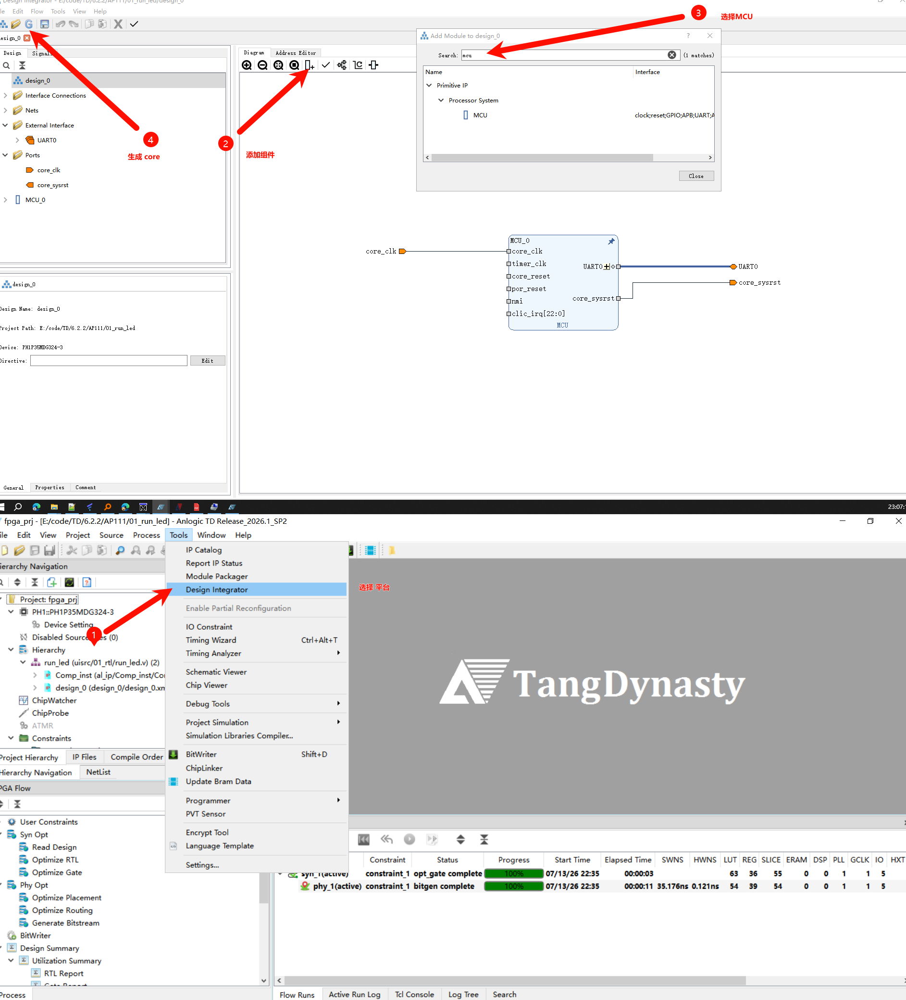
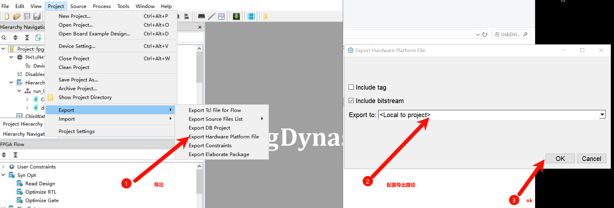
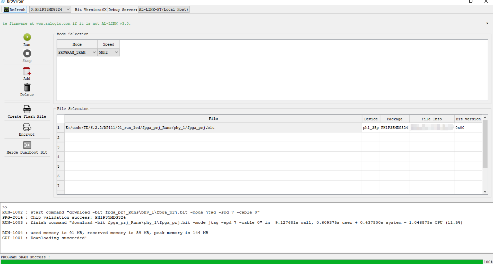
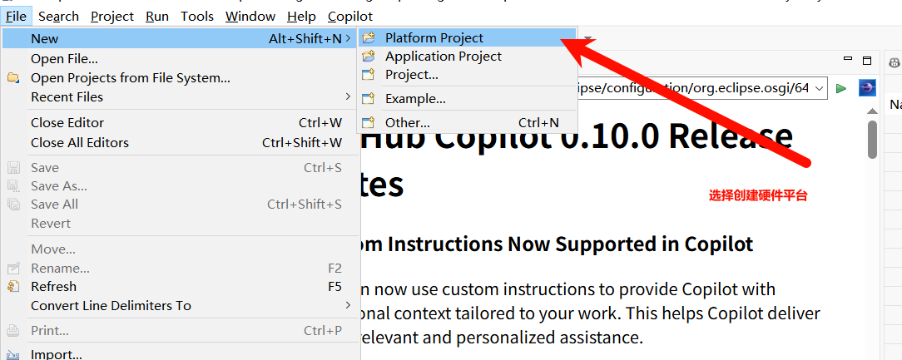
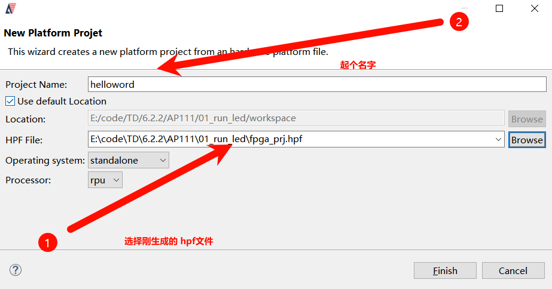
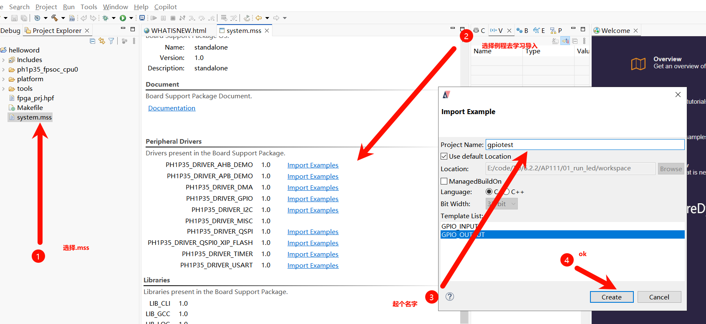
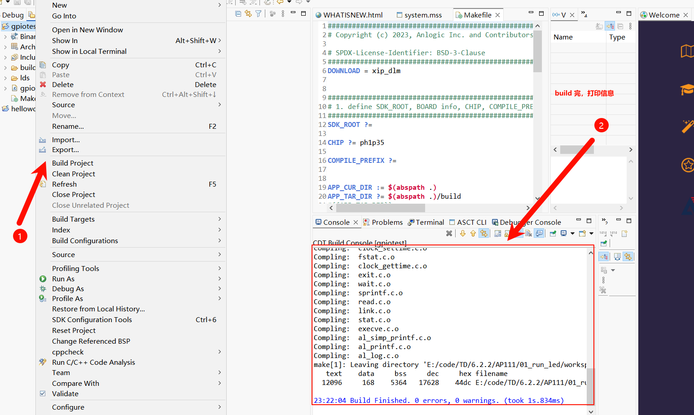
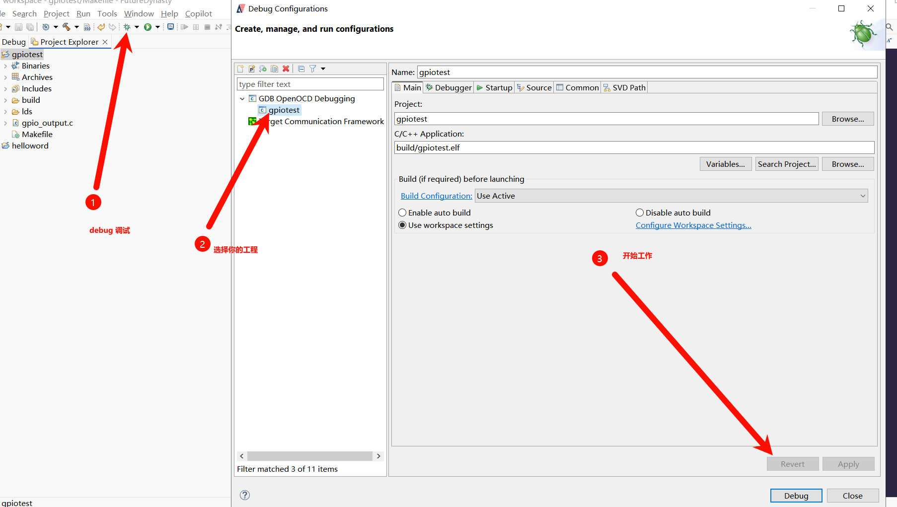
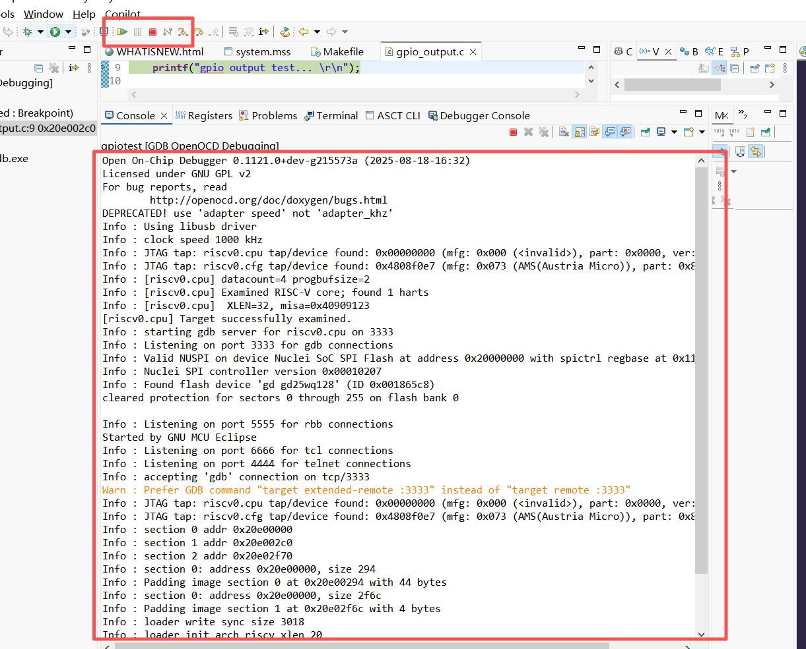

# MCU RISC-V 软件开发与调试流程

本文以 TD 中的 MCU IP 和 RISC-V `rpu` 为例，说明硬件平台生成、应用工程创建与在线调试的基本流程。

## 一、准备 USB 驱动

先连接下载器并确认驱动正确。USB Driver Tool 中应能识别到 `USB Serial Converter A (Libusb - WinUSB)` 和 `USB Serial Converter B`，再进行后续下载和调试。

[下载 USB 驱动安装包](../../pic/PH_MCU/usbdrive.zip)

## 二、FPGA 硬件平台

### 1. 生成 MCU IP

在 TD 的 Design Integrator 中添加 `MCU` 模块，完成时钟、复位和 UART 等必要接口连接后，生成 Core。

### 2. 导出硬件平台文件

硬件实现和 bitstream 生成完成后，选择 **Project → Export → Export Hardware Platform File**。导出时勾选 **Include bitstream**，生成供软件平台使用的 HPF 文件。

### 3. 下载 FPGA 程序

打开 BitWriter，加入生成的 `.bit` 文件并执行下载。日志显示 `Downloading succeeded!` 或 `PROGRAM_SRAM success!` 后，再进入软件调试。

## 三、RISC-V 软件开发与调试

### 1. 创建硬件平台工程

在软件 IDE 中选择 **File → New → Platform Project**，新建平台工程。

### 2. 选择 HPF 与处理器

指定前一步导出的 HPF 文件，操作系统选择 `standalone`，处理器选择 `rpu`，完成平台工程创建。

### 3. 导入应用示例

打开平台工程中的 `system.mss`，在所需外设驱动旁选择 **Import Examples**，选择示例、命名应用工程后创建。

### 4. 构建应用工程

右键应用工程选择 **Build Project**。控制台显示 `Build Finished. 0 errors, 0 warnings.`，表示应用已成功生成。

### 5. 配置并启动调试

打开调试配置，选择当前应用工程及其 `build/*.elf` 文件，在 **GDB OpenOCD Debugging** 配置下点击 **Debug** 启动在线调试。

### 6. 确认调试连接

调试控制台出现 RISC-V 目标识别、OpenOCD 启动和程序下载信息，即表示连接成功；结合应用串口打印确认程序运行结果。

