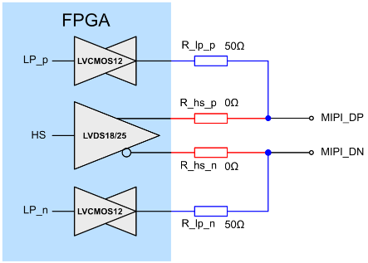
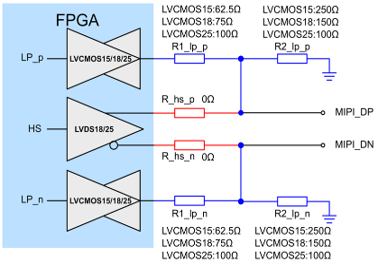
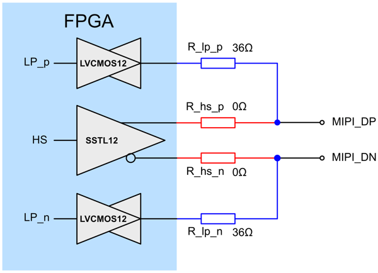
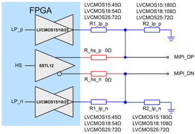
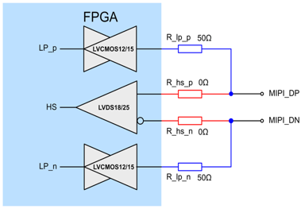

# 基于Anlogic的MIPI使用教程

<!-- TOC -->

- [基于Anlogic的MIPI使用教程](#基于anlogic的mipi使用教程)
  - [1. 概述总览](#1-概述总览)
  - [TX\_CSI](#tx_csi)
  - [TX\_DSI](#tx_dsi)
  - [RX\_CSI](#rx_csi)
  - [RX\_DSI](#rx_dsi)
  - [电阻网络硬件设计](#电阻网络硬件设计)
    - [TX  ：  HS：LVDS18/25  \&\&  LP：LVCMOS12](#tx----hslvds1825----lplvcmos12)
    - [TX：    HS：LVDS18/25  \&\&  LP：LVCMOS15/18/25](#tx----hslvds1825----lplvcmos151825)
    - [TX：    HS：SSTL12  \&\&  LP：LVCMOS12](#tx----hssstl12----lplvcmos12)
    - [TX：    HS：SSTL12  \&\&  LP：LVCMOS151825](#tx----hssstl12----lplvcmos151825)
    - [RX：    HS：LVDS18/25  \&\&  LP：LVCMOS12/15](#rx----hslvds1825----lplvcmos1215)
- [技术支持](#技术支持)

<!-- /TOC -->

## 1. 概述总览

- 总体来说，所有 Anlogic FPGA 系列均可实现 MIPI 传输功能。

- 不同系列器件采用的 MIPI D-PHY 物理层实现方式不同，因此：

	- 支持能力不同

	- 可实现速率不同

	- 对 CSI / DSI 协议支持完整性不同

- 根据实现方式不同，主要分为：

	- 原生 MIPI PHY

	- MIPI IO 电平

	- 电阻网络模拟 D-PHY

- 其中：

	- EF5 系列：集成 原生 MIPI PHY，性能和兼容性最佳

	- EF2 系列：支持 MIPI IO 电平，次优

- 其它系列：通过 电阻网络模拟 D-PHY，功能和可靠性受限

| 器件系列        		| TX_CSI | TX_DSI | RX_CSI | RX_DSI | 速率上限         | 备注说明                      |
| -------------------- 	| ------ | ------ | ------ | ------ | ------------ | ------------------------- |
| **EF2**              	| ✅      | ✅     | ✅      | ✅     | 800 Mbps     | IOBE型IO支持原生MIPI电平，整体兼容性最好 |
| **EG4 / EF3 / EF4**  	| ✅      | ⚠️     | ✅      | ❌     | 800 Mbps     |                       |
| **PH1A60**           	| ✅      | ⚠️     | ✅      | ⚠️     | 1Gbps      |                          |
| **PH1A90 / PH1A180** 	| ✅      | ⚠️     | ✅      | ⚠️     | 2.5Gbps     |                          |
| **PH1A100**          	| ✅      | ⚠️     | ✅      | ⚠️     | 1Gbps      |                          |
| **PH1A400**          	| ✅      | ⚠️     | ✅      | ⚠️     | 1.5Gbps      |                          |
| **PH1P35 / PH1P50**  	| ✅      | ⚠️     | ✅      | ⚠️     | 2.5Gbps      | 建议使用硬核                        |
| **PH1P100**          	| ✅      | ⚠️     | ✅      | ⚠️     | 1Gbps       |                          |
| **DR1M90 / DR1V90**  	| ✅      | ⚠️     | ✅      | ⚠️     | 1Gbps      |                          |
| **PH2A**             	| ✅      | ⚠️     | ✅      | ⚠️     | 1.5Gbps       |            |
| **SF1**              	| ✅      | ⚠️     | ✅      | ⚠️     | 2.2Gbps      | 建议使用硬核                 |
| **SF2**              	| ✅      | ⚠️     | ✅      | ⚠️     | 2.5Gbps        |                |
| **EF5**              	| ✅      | ✅      | ✅      | ✅      | 800 Mbps |         |

	

## TX_CSI

 
| 器件系列   		| 物理层类型   		| 电平类型                          	| 功能限制 	| 速率上限	| 外部电路  		|
| ----------------	| ---------- 		| ----------------------------- 		| ---- 		| --------	| ----------- 		|
| EF2             	| MIPI IO电平  		| 只有IOBE型IO支持MIPI电平       		|   		| 800 Mbps	| 无需外部电路，IO直连 |
| EG4 / EF3 / EF4 	| 电阻网络     		| HS: LVDS18/25	 LP: LVCMOS12 		|   		| 800 Mbps	|          		|
| EG4 / EF3 / EF4 	| 电阻网络     		| HS: LVDS18/25	 LP: LVCMOS15/18/25 	|   		| 800 Mbps	|          		|
| PH1A60          	| 电阻网络     		| HS: LVDS18/25	 LP: LVCMOS12 		|   		| 1 Gbps	|          		|
| PH1A60          	| 电阻网络     		| HS: LVDS18/25	 LP: LVCMOS15/18/25	|   		| 1 Gbps	|          		|
| PH1A90 / PH1A180	| 电阻网络     		| HS: LVDS18/25	 LP: LVCMOS12 		|   		| 1 Gbps	|          		|
| PH1A90 / PH1A180	| 电阻网络     		| HS: LVDS18/25	 LP: LVCMOS15/18/25 	|   		| 1 Gbps	|          		|
| PH1A90 / PH1A180	| 电阻网络     		| HS: SSTL12	 LP: LVCMOS12 		|   		| 1 Gbps	|          		|
| PH1A90 / PH1A180	| 电阻网络     		| HS: SSTL12	 LP: LVCMOS15/18/25 	|   		| 1 Gbps	|          		|
| PH1A100         	| 电阻网络     		| HS: LVDS18/25	 LP: LVCMOS15/18/25	|   		| 1 Gbps	|          		|
| PH1A400         	| 电阻网络     		| HS: LVDS18/25	 LP: LVCMOS12 		|   		| 1 Gbps	|          		|
| PH1A400         	| 电阻网络     		| HS: LVDS18/25	 LP: LVCMOS15/18/25	|   		| 1 Gbps	|          		|
| PH1A400         	| 电阻网络     		| HS: SSTL12	 LP: LVCMOS12 		|   		| 1.5Gbps	|          		|
| PH1A400         	| 电阻网络     		| HS: SSTL12	 LP: LVCMOS15/18/25	|   		| 1.5Gbps	|          		|
| PH1P35 / PH1P50 	| 电阻网络     		| HS: LVDS18 	 LP: LVCMOS12 		|   		| 1Gbps		|          		|
| PH1P35 / PH1P50 	| 电阻网络     		| HS: LVDS18 	 LP: LVCMOS15/18/25	|   		| 1Gbps		|          		|
| PH1P35 / PH1P50 	| MIPIIO硬核   		| MIPI PHY 								|   		| 2.5Gbps	| 无需外部电路，IO直连       		|
| PH1P100         	| 电阻网络     		| HS: LVDS18	 LP: LVCMOS12 		|   		| 1Gbps		|          		|
| PH1P100         	| 电阻网络     		| HS: LVDS18	 LP: LVCMOS15/18/25 	|   		| 1Gbps		|          		|
| DR1M90 / DR1V90 	| 电阻网络     		| HS: LVDS18/25	 LP: LVCMOS12 		|   		| 1Gbps		|          		|
| DR1M90 / DR1V90 	| 电阻网络     		| HS: LVDS18/25	 LP: LVCMOS15/18/25	|   		| 1Gbps		|          		|
| PH2A            	| MIPIIO电平   		| HPIO支持MIPI电平						|   		| 1.5Gbps	| 无需外部电路，IO直连          		|
| SF1             	| 电阻网络     		| HS: LVDS18/25	 LP: LVCMOS12 		|   		| 800Mbps	|          		|
| SF1             	| 电阻网络     		| HS: LVDS18/25	 LP: LVCMOS15/18/25	|   		| 800Mbps	|          		|
| SF2             	| DSI+DPHY硬核 		| DSI+DPHY硬核					 		|   		| 2.5Gbps	| 无需外部电路，IO直连         		|
| EF5             	| 电阻网络     		| HS: LVDS18/25	 LP: LVCMOS12 		|   		| 800Mbps	|          		|
| EF5             	| 电阻网络     		| HS: LVDS18/25	 LP: LVCMOS15/18/25	|   		| 800Mbps	|          		|

## TX_DSI

- 凡是电阻网络去跑 当 LP接口设置 LVCMOS15/18/25 电平时，存在下面问题：
	- PN之间有对地电阻，在进行LP反向传输的时候LP信号有可能异常，无法支持DSI协议中的LP反向数据传输
	- CSI无影响

| 器件系列   		| 物理层类型   		| 电平类型                          	| 功能限制 	| 速率上限	| 外部电路  		|
| ----------------	| ---------- 		| ----------------------------- 		| ---- 		| --------	| ----------- 		|
| EF2             	| MIPI IO电平  		| 只有IOBE型IO支持MIPI电平       		| 			| 800 Mbps	| 无需外部电路，IO直连 |
| EG4 / EF3 / EF4 	| 电阻网络     		| HS: LVDS18/25	 LP: LVCMOS12 		| 			| 800 Mbps	|          		|
| EG4 / EF3 / EF4 	| 电阻网络     		| HS: LVDS18/25	 LP: LVCMOS15/18/25 	| 			| 800 Mbps	|          		|
| PH1A60          	| 电阻网络     		| HS: LVDS18/25	 LP: LVCMOS12 		| 			| 1 Gbps	|          		|
| PH1A60          	| 电阻网络     		| HS: LVDS18/25	 LP: LVCMOS15/18/25	| 			| 1 Gbps	|          		|
| PH1A90 / PH1A180	| 电阻网络     		| HS: LVDS18/25	 LP: LVCMOS12 		| 			| 1 Gbps	|          		|
| PH1A90 / PH1A180	| 电阻网络     		| HS: LVDS18/25	 LP: LVCMOS15/18/25 	| 			| 1 Gbps	|          		|
| PH1A90 / PH1A180	| 电阻网络     		| HS: SSTL12	 LP: LVCMOS12 		| 			| 1 Gbps	|          		|
| PH1A90 / PH1A180	| 电阻网络     		| HS: SSTL12	 LP: LVCMOS15/18/25 	| 			| 1 Gbps	|          		|
| PH1A100         	| 电阻网络     		| HS: LVDS18/25	 LP: LVCMOS15/18/25	| 			| 1 Gbps	|          		|
| PH1A400         	| 电阻网络     		| HS: LVDS18/25	 LP: LVCMOS12 		| 			| 1 Gbps	|          		|
| PH1A400         	| 电阻网络     		| HS: LVDS18/25	 LP: LVCMOS15/18/25	| 			| 1 Gbps	|          		|
| PH1A400         	| 电阻网络     		| HS: SSTL12	 LP: LVCMOS12 		| 			| 1.5Gbps	|          		|
| PH1A400         	| 电阻网络     		| HS: SSTL12	 LP: LVCMOS15/18/25	| 			| 1.5Gbps	|          		|
| PH1P35 / PH1P50 	| 电阻网络     		| HS: LVDS18 	 LP: LVCMOS12 		| 			| 1Gbps		|          		|
| PH1P35 / PH1P50 	| 电阻网络     		| HS: LVDS18 	 LP: LVCMOS15/18/25	| 			| 1Gbps		|          		|
| PH1P35 / PH1P50 	| MIPIIO硬核   		| MIPI PHY 								| 			| 2.5Gbps	| 无需外部电路，IO直连       		|
| PH1P100         	| 电阻网络     		| HS: LVDS18	 LP: LVCMOS12 		| 			| 1Gbps		|          		|
| PH1P100         	| 电阻网络     		| HS: LVDS18	 LP: LVCMOS15/18/25 	| 			| 1Gbps		|          		|
| DR1M90 / DR1V90 	| 电阻网络     		| HS: LVDS18/25	 LP: LVCMOS12 		| 			| 1Gbps		|          		|
| DR1M90 / DR1V90 	| 电阻网络     		| HS: LVDS18/25	 LP: LVCMOS15/18/25	| 			| 1Gbps		|          		|
| PH2A            	| MIPIIO电平   		| HPIO支持MIPI电平						| 			| 1.5Gbps	| 无需外部电路，IO直连          		|
| SF1             	| 电阻网络     		| HS: LVDS18/25	 LP: LVCMOS12 		| 			| 800Mbps	|          		|
| SF1             	| 电阻网络     		| HS: LVDS18/25	 LP: LVCMOS15/18/25	| 			| 800Mbps	|          		|
| SF1             	| DSI+DPHY硬核  	| DSI+DPHY硬核							| 			| 2.2Gbps	| 无需外部电路，IO直连         		|
| SF2             	| DSI+DPHY硬核 		| DSI+DPHY硬核							| 			| 2.5Gbps	| 无需外部电路，IO直连         		|
| EF5             	| 电阻网络     		| HS: LVDS18/25	 LP: LVCMOS12 		| 			| 800Mbps	|          		|
| EF5             	| 电阻网络     		| HS: LVDS18/25	 LP: LVCMOS15/18/25	| 			| 800Mbps	|          		|

## RX_CSI

- 100欧端接无法动态开关，PN之间有100欧负载，LP信号在LP01/LP10时无法正常拉高或者拉低，LP数据接收异常，无法支持DSI协议中的LP数据传输，CSI协议无影响

| 器件系列   		| 物理层类型   		| 电平类型                          	| 功能限制 	| 速率上限	| 外部电路  		|
| ----------------	| ---------- 		| ----------------------------- 		| ---- 		| --------	| ----------- 		|
| EF2             	| MIPI IO电平  		| 只有IOBE型IO支持MIPI电平       		|   		| 800 Mbps	| 无需外部电路，IO直连 |
| EG4 / EF3 / EF4 	| 电阻网络     		| HS: LVDS18/25	 LP: LVCMOS12/15 	|   		| 800 Mbps	|          		|
| PH1A60          	| 电阻网络     		| HS: LVDS18/25	 LP: LVCMOS12/15  	|   		| 500 Mbps	|          		|
| PH1A90 / PH1A180	| 电阻网络HRIO   	| HS: LVDS18/25	 LP: LVCMOS12/15 	|   		| 500 Mbps	|          		|
| PH1A90 / PH1A180	| 电阻网络HPIO   	| HS: LVDS18	 LP: LVCMOS12/15 	|   		| 800 Mbps	|          		|
| PH1A100         	| 电阻网络     		| HS: LVDS18/25	 LP: LVCMOS15 		|   		| 500 Mbps	|          		|
| PH1A400         	| 电阻网络HRIO 		| HS: LVDS18/25	 LP: LVCMOS12/15 	|   		| 500 Mbps	|          		|
| PH1A400         	| 电阻网络HPIO 		| HS: LVDS18	 LP: LVCMOS12/15		|   		| 800 Mbps	|          		|
| PH1P35 / PH1P50 	| 电阻网络HRIO  	| HS: LVDS18/25	 LP: LVCMOS12/15 	|   		| 800 Mbps	|          		|
| PH1P35 / PH1P50 	| MIPIIO硬核   		| MIPI PHY 								|   		| 2.5Gbps	| 无需外部电路，IO直连       		|
| PH1P100         	| 电阻网络     		| HS: LVDS18/25	 LP: LVCMOS12/15 	|   		| 800 Mbps	|          		|
| DR1M90 / DR1V90 	| 电阻网络     		| HS: LVDS18/25	 LP: LVCMOS12/15		|   		| 500 Mbps	|          		|
| DR1M90 / DR1V90 	| MIPIIO硬核   		| MIPIIO硬核							|   		| 2.5Gbps	| 仅LANE0支持LP反向传输         		|
| PH2A            	| 电阻网络HDIO   	| HS: LVDS18/25	 LP: LVCMOS12/15		|   		| 500 Mbps	| 无需外部电路，IO直连          		|
| PH2A            	| 电阻网络HPIO   	| HPIO支持MIPI电平						|   		| 1Gbps		| PH2A的MIPI电平RX方向不支持LP的TX，lane0需要额外的两个LVCMOS IO实现LP反向传输          		|
| SF1             	| 电阻网络     		| HS: LVDS18/25	 LP: LVCMOS12/15 	|   		| 800Mbps	|          		|
| SF2             	| 电阻网络     		| HS: LVDS18/25	 LP: LVCMOS12/15 	|   		| 800Mbps	|          		|
| SF2             	| DSI+DPHY硬核 		| DSI+DPHY硬核					 		|   		| 2.5Gbps	| 无需外部电路，IO直连         		|
| EF5             	| 电阻网络     		| HS: LVDS18/25	 LP: LVCMOS12/15 	|   		| 800Mbps	|          		|

## RX_DSI

- 接收端 + DSI（对 LP01/LP10 时序和回读要求严格）

| 器件系列             | 物理层类型 | 电平类型                     		| 功能限制        		| 速率上限     	| 外部电路 |
| ----------------	| ---------- 	| --------------------------------	| ------------------------------------	| -------- | ---- |
| EF2             	| MIPI IO电平  	| 只有IOBE型IO支持MIPI电平     	 	| 	                 	|	800 Mbps 	| 无需外部电路，IO直连    |
| PH1A90 / PH1A180	| MIPIIO硬核  	| MIPIIO硬核					 	| 仅LANE0支持LP反向传输	|	2.5Gbps 	| 无需外部电路，IO直连  |
| PH1A100         	| 电阻网络      | HS: LVDS18/25 LP: LVCMOS12/15 	| 				 		|	800 Mbps 	|     |
| PH1A400         	| 电阻网络      | HS: LVDS18/25 LP: LVCMOS12/15 	| 				 		|	800 Mbps 	|     |
| PH1P35 / PH1P50 	| 电阻网络HRIO  | HS: LVDS18/25	 LP: LVCMOS12/15 |   					|	800 Mbps	|          		|
| PH1P35 / PH1P50 	| MIPIIO硬核   	| MIPI PHY 							|   					|	2.5Gbps		| 无需外部电路，IO直连       		|
| PH1P100          	| 电阻网络      | HS: LVDS18/25 LP: LVCMOS12/15 	| 	   					|	800 Mbps 	|     |
| DR1M90 / DR1V90 	| MIPIIO硬核   	| MIPIIO硬核						| 仅LANE0支持LP反向传输	|	2.5Gbps		|          		|
| PH2A            	| 电阻网络HPIO  | HPIO支持MIPI电平					|   					|	1Gbps		| PH2A的MIPI电平RX方向不支持LP的TX，lane0需要额外的两个LVCMOS IO实现LP反向传输          		|
| SF1              	| DSI+DPHY硬核  | DSI+DPHY硬核 						| 						|	2.2Gbps	 	| 无需外部电路，IO直连      |
| SF2              	| DSI+DPHY硬核  | DSI+DPHY硬核 						| 						|	2.5Gbps   	| 无需外部电路，IO直连   |
| EF5             	| 电阻网络     	| HS: LVDS18/25	 LP: LVCMOS12/15	|   					|	800Mbps		|          		|

## 电阻网络硬件设计

### TX  ：  HS：LVDS18/25  &&  LP：LVCMOS12

   - 
   
   
### TX：    HS：LVDS18/25  &&  LP：LVCMOS15/18/25

   - 
   
   

### TX：    HS：SSTL12  &&  LP：LVCMOS12

   - 
   
   

### TX：    HS：SSTL12  &&  LP：LVCMOS151825

   - 

### RX：    HS：LVDS18/25  &&  LP：LVCMOS12/15

   - 

# 技术支持

- 安路科技官网: https://www.anlogic.com
- 技术支持邮箱: folsie.zhao@wtmec.com

---

**版本信息:**

| 版本 | 日期 | 说明 |
|------|------|------|
| 1.0 | 2026.02.26 | 初版  补充完整 MIPI 选型体系与工程结论 |

**免责声明:**

- 本文档仅供参考，实际设计时请以安路科技官方发布的最新数据手册和设计指南为准。

