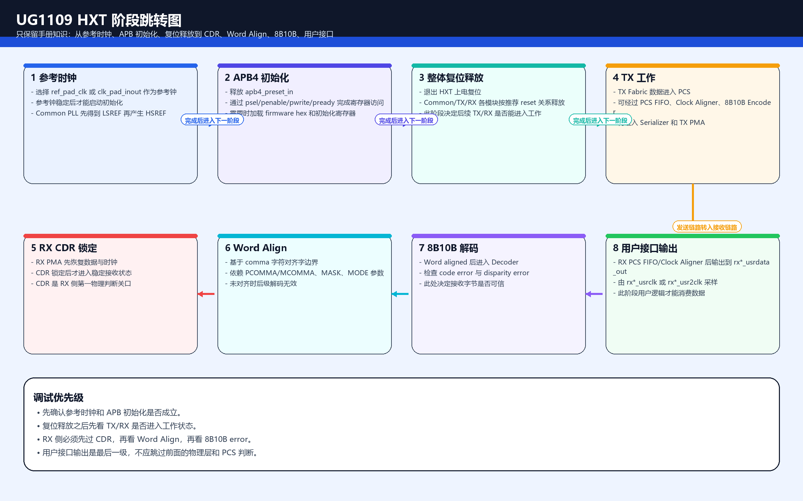
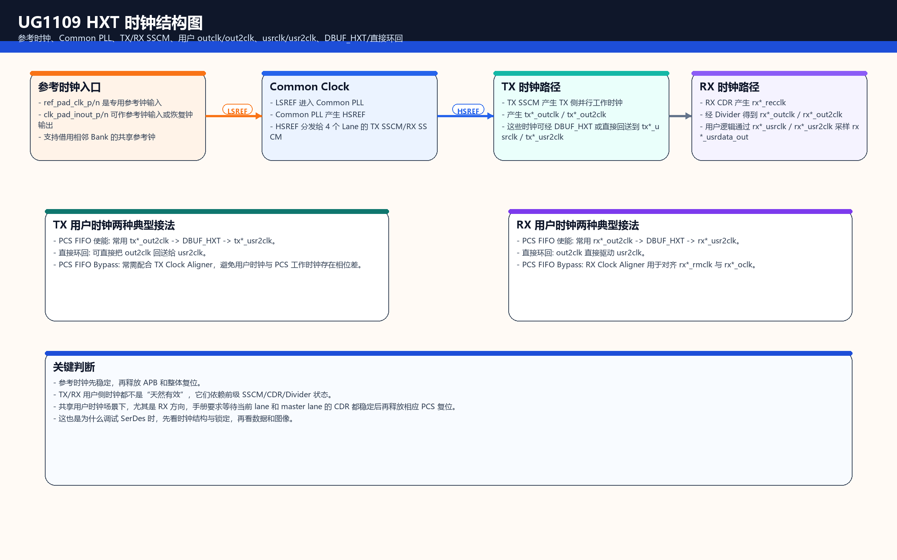
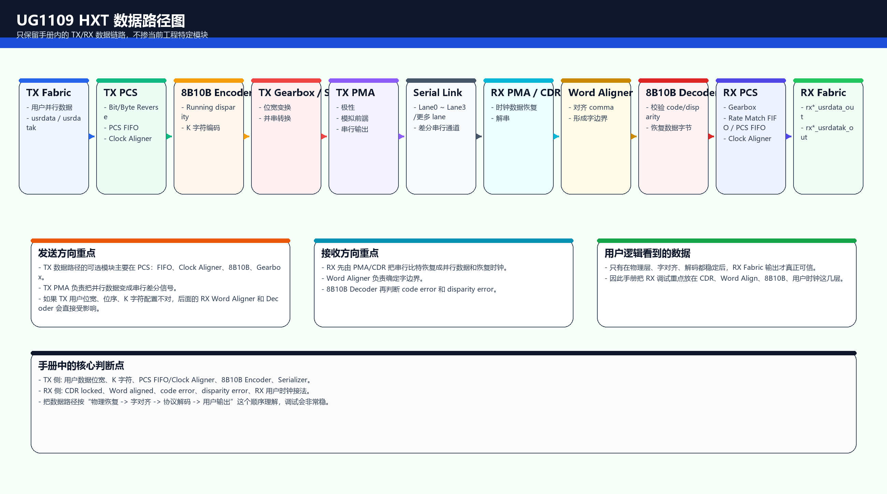
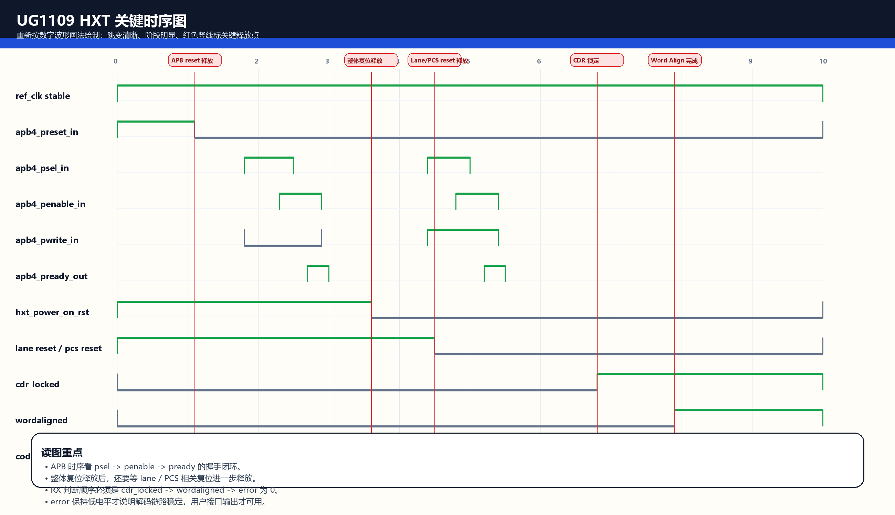

本文只整理 `UG1109_安路科技PH2A系列FPGA HXT高速串行收发器用户手册` 中与 HXT 工作机制相关的知识，不展开当前工程实现，不做工程端口映射。

## 1. HXT 应该先怎么理解

HXT 可以先拆成 4 个观察层次：

1. `配置层`：通过 `APB4` 和初始化文件把 PMA/PCS 所需参数装进去。
2. `时钟层`：参考时钟进入 `Common PLL`，再派生给 TX、RX、用户接口与对齐模块。
3. `发送层`：用户侧并行数据进入 `TX PCS`，经过编码、位宽整理、串化后送出。
4. `接收层`：串行数据进入 `RX PMA/CDR`，恢复时钟后做字对齐、解码，再输出给用户逻辑。

真正调试时，最关键的不是一次看完所有信号，而是抓住每个阶段的“准入条件”和“完成标志”。

## 2. HXT 工作阶段与核心跳转

按照 UG1109 的组织方式，HXT 的核心阶段可以整理成下面 8 步。

### 2.1 参考时钟就绪

- 入口：板级参考时钟已经送到 HXT。
- 关键对象：参考时钟输入端口、`Common PLL`、时钟路由结构。
- 作用：为 TX/RX 物理层、用户侧时钟、对齐相关逻辑提供基础时钟来源。
- 重点判断：没有稳定参考时钟，后面的 `CDR lock`、`word align` 都不会可靠。

对应手册位置：

- `2.2 参考时钟`
- `表 2-3`
- `表 2-4`
- `图 2-4`
- `图 2-5`

### 2.2 APB4 初始化

- 入口：`apb4_preset_in` 释放后，开始对 PCS/PMA 寄存器进行访问。
- 关键对象：`PADDR / PSEL / PENABLE / PWRITE / PWDATA / PRDATA / PREADY`
- 作用：装载初始化参数，建立 PMA 与 PCS 工作条件。
- 重点判断：`apb4_pready_out` 是一次 APB 访问完成的直接握手信号。

对应手册位置：

- `2.1 APB4 接口`
- `图 2-2 APB4 读时序`
- `图 2-3 APB4 写时序`
- `5.2 APB4寄存器访问`

### 2.3 整体复位释放

- 入口：初始化已具备前提，开始释放 HXT 的整体复位。
- 关键对象：`hxt_power_on_rst_i`、Common/TX/RX 方向复位信号。
- 作用：把 Common、TX、RX 工作模块从上电保持状态切到工作状态。
- 重点判断：复位释放顺序不对，会直接导致后级锁定失败。

对应手册位置：

- `2.4 初始化和复位`
- `图 2-13 HXT 初始化流程`
- `图 2-14 上电后整体复位时序`
- `表 2-25`
- `表 2-26`
- `表 2-27`
- `表 2-28`

### 2.4 TX 发送通路建立

- 入口：TX 用户时钟和用户接口已可用。
- 关键对象：`p0_tx_usrclk*`、`p0_tx_usrdata_in`、`p0_tx_usrdatak_in`
- 作用：将用户并行数据送入 PCS，经编码、位宽适配与串化后发出。
- 重点判断：TX 方向更关心“时钟是否匹配、位宽是否匹配、编码配置是否一致”。

对应手册位置：

- `3.1.1 TX 数据路径`
- `3.1.2 TX 时钟域`
- `3.3 TX 用户逻辑时钟`
- `3.4 TX 用户逻辑接口`
- `3.5 TX PCS FIFO`
- `3.6 TX Clock Aligner`
- `3.8 8B10B Encoder`

### 2.5 RX CDR 锁定

- 入口：RX 已看到合法串行输入。
- 关键对象：`CDR`、恢复时钟、锁定状态信号。
- 作用：从输入数据流中恢复采样时钟，建立后续字边界判断基础。
- 重点判断：`cdr lock` 是 RX 真正进入可解码状态之前的第一道门槛。

对应手册位置：

- `4.1.1 RX 数据路径`
- `4.1.2 RX 时钟域`
- `4.5 RX CDR`
- `图 4-11`
- `图 4-13`
- `表 4-5`

### 2.6 Word Aligner 对齐完成

- 入口：CDR 已锁定，串行比特流已可稳定采样。
- 关键对象：`COMMA` 检测、`word align`、自动/手动对齐控制。
- 作用：把串行流重新切分到正确的字边界。
- 重点判断：`wordaligned` 是 RX 从“看见数据”到“按字解释数据”的关键跳转。

对应手册位置：

- `4.11 Word Aligner`
- `表 4-15`
- `表 4-16`
- `图 4-16`
- `图 4-20`
- `图 4-21`

### 2.7 8B10B 解码与错误检测

- 入口：字边界已经稳定。
- 关键对象：8B10B 解码器、`code error`、`disparity error`
- 作用：把线路编码还原成用户字节与 K 字符信息。
- 重点判断：若 `wordaligned` 已成立但错误计数仍持续出现，优先怀疑编码配置、极性、位序或链路质量。

对应手册位置：

- `4.12 8B10B Decoder`
- `5.4 8B10B 编码表`

### 2.8 用户接口输出有效

- 入口：RX 解码链路已经稳定。
- 关键对象：`rx*_usrdata_out`、`rx*_usrdatak_out`、RX 用户时钟。
- 作用：把 RX PCS 的并行数据输出给用户逻辑消费。
- 重点判断：这一阶段不只看数据，还要同时看其所在时钟域是否正确。

对应手册位置：

- `4.16 RX PCS FIFO`
- `4.17 RX Clock Aligner`
- `4.18 RX 用户接口`
- `4.19 RX 用户时钟`
- `图 4-29`
- `图 4-30`
- `图 4-31`

## 3. 信号按类型分类

为了便于查看，手册中的核心信号更适合按“职责”而不是按章节记忆。

### 3.1 复位与初始化类

- `hxt_power_on_rst_i`
- APB4 复位相关输入
- Common/TX/RX lane 级复位

这一类信号决定“模块能不能开始工作”。

### 3.2 APB4 配置类

- `apb4_paddr_in`
- `apb4_psel_in`
- `apb4_penable_in`
- `apb4_pwrite_in`
- `apb4_pwdata_in`
- `apb4_prdata_out`
- `apb4_pready_out`

这一类信号决定“参数有没有被成功写入或读出”。

### 3.3 参考时钟与公共时钟类

- 参考时钟输入
- `Common PLL` 相关时钟
- TX/RX 派生工作时钟

这一类信号决定“物理层和用户层各自依赖哪一个时钟源”。

### 3.4 TX 用户接口类

- `p0_tx_usrclk`
- `p0_tx_usrclk2`
- `p0_tx_usrdata_in`
- `p0_tx_usrdatak_in`

这一类信号决定“用户数据怎样进入 HXT”。

### 3.5 TX PCS/PMA 内部功能类

- 8B10B encoder 相关控制
- PCS FIFO 相关端口
- Clock Aligner 相关控制

这一类信号决定“数据如何在发送链路中整理并送往串行口”。

### 3.6 RX PMA/CDR 类

- 串行输入
- `cdr lock` 状态
- 恢复时钟相关状态

这一类信号决定“接收侧是否已经进入可采样状态”。

### 3.7 RX PCS / Word Align 类

- `word align` 控制
- `wordaligned` 状态
- `COMMA` 相关检测

这一类信号决定“接收侧是否已经找对字边界”。

### 3.8 8B10B 错误检测类

- `code error`
- `disparity error`

这一类信号决定“当前线路码是否能被正确解释”。

### 3.9 RX 用户输出类

- `rx*_usrdata_out`
- `rx*_usrdatak_out`
- RX 用户时钟输出

这一类信号决定“用户逻辑最终实际能拿到什么数据”。

## 4. 时钟结构怎么看

UG1109 里的时钟结构，不建议死记端口名，建议抓下面这条主线：

`参考时钟 -> Common PLL / HXT时钟分发 -> TX/RX内部工作时钟 -> 用户侧 usrclk/usrclk2`

其中有 3 个重点。

### 4.1 参考时钟是根

参考时钟先决定 HXT 的时钟质量下限。  
如果参考时钟品质、频率选择或路由方式有问题，后级所有锁定和对齐判断都会受影响。

### 4.2 TX 和 RX 不只是“共用一个时钟”

TX 更偏向“按给定用户时钟把并行数据稳定送出去”；  
RX 更偏向“先从数据里恢复时钟，再把恢复结果变成用户可消费的并行节拍”。

### 4.3 用户接口时钟是边界信号

`usrclk / usrclk2` 是 HXT 与用户逻辑之间最需要小心的边界。  
很多问题表面看像“数据错”，实际根因却是“采样时钟域不对”。

## 5. 数据路径怎么看

HXT 的数据路径可以简化成下面一条链：

`TX Fabric -> TX PCS -> 8B10B Encoder -> Gearbox/Serializer -> TX PMA -> Serial Link -> RX PMA/CDR -> Word Aligner -> 8B10B Decoder -> RX PCS -> RX Fabric`

理解时要抓 4 个转换动作：

1. `并行到编码`：用户字节进入 PCS 后，先变成线路可发送格式。
2. `编码到串行`：编码后的数据经过位宽整理和串化后上链路。
3. `串行到对齐`：RX 先恢复时钟，再判断字边界。
4. `对齐到用户并行`：字边界稳定后解码，再吐给用户侧。

## 6. 时序图该重点看什么

UG1109 里的时序图很多，但对调试最有价值的是下面 5 个判断点：

1. `APB4 reset release` 后，读写访问什么时候真正被接受。
2. `hxt_power_on_rst_i` 什么时候释放。
3. lane/TX/RX/PCS 方向复位什么时候再继续释放。
4. `cdr_locked` 什么时候拉起。
5. `wordaligned` 什么时候稳定，以及错误信号是否同时清零。

如果只记一句话，就是：

`先有时钟，再有配置；先放复位，再等 lock；先等对齐，再看解码正确性。`

## 7. 参数和表格从哪里查

下面这张“查表索引”更适合在看手册时直接定位。

### 7.1 APB4 接口与访问时序

- `表 2-1`
- `图 2-2`
- `图 2-3`
- `表 5-1`
- `表 5-2`

### 7.2 参考时钟与时钟路由

- `表 2-3`
- `表 2-4`
- `图 2-4`
- `图 2-5`

### 7.3 初始化与复位

- `表 2-22`
- `表 2-23`
- `图 2-12`
- `图 2-13`
- `图 2-14`
- `图 2-15`
- `表 2-25`
- `表 2-26`
- `表 2-27`
- `表 2-28`

### 7.4 TX 侧用户接口、位宽与时钟

- `表 3-3`
- `表 3-4`
- `表 3-5`
- `表 3-6`
- `表 3-7`
- `表 3-8`
- `表 3-10`
- `表 3-11`
- `图 3-2`
- `图 3-3`
- `图 3-6`
- `图 3-11`
- `图 3-12`
- `图 3-13`

### 7.5 RX 侧 CDR、对齐、解码与用户接口

- `表 4-5`
- `表 4-15`
- `表 4-16`
- `表 4-25`
- `表 4-26`
- `表 4-28`
- `表 4-29`
- `表 4-30`
- `表 4-32`
- `表 4-33`
- `表 4-34`
- `图 4-2`
- `图 4-3`
- `图 4-11`
- `图 4-13`
- `图 4-16`
- `图 4-20`
- `图 4-21`
- `图 4-29`
- `图 4-30`
- `图 4-31`

### 7.6 8B10B 编码规则

- `5.4 8B10B 编码表`

## 8. 调试时最值得盯住的少量信号

如果现场时间很紧，可以先只盯下面这些判断信号：

- `参考时钟是否稳定`
- `apb4_pready_out`
- `hxt_power_on_rst_i`
- `cdr lock`
- `wordaligned`
- `code error`
- `disparity error`
- `rx*_usrdata_out / rx*_usrdatak_out`

它们分别对应：

- 能不能开始
- 配没配置进去
- 有没有真正释放工作模块
- RX 是否进入恢复状态
- RX 是否找到正确字边界
- 解码是否可信
- 用户逻辑最终是否拿到可用数据

## 9. 一句话总结

UG1109 里的 HXT，本质上就是一条“以时钟为骨架、以复位和配置为开关、以 CDR 和 Word Align 为 RX 核心门槛、以 8B10B 正确性为链路有效性证明”的高速串行链路。

所以阅读顺序最推荐按下面这条线走：

`参考时钟 -> APB4配置 -> 复位释放 -> TX路径 -> RX CDR -> Word Align -> 8B10B解码 -> 用户接口输出`
