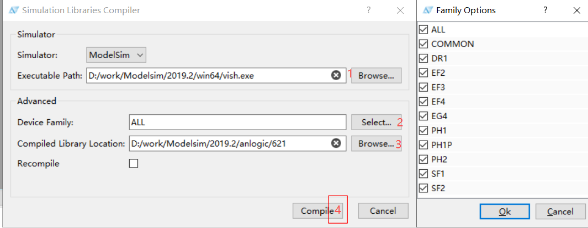
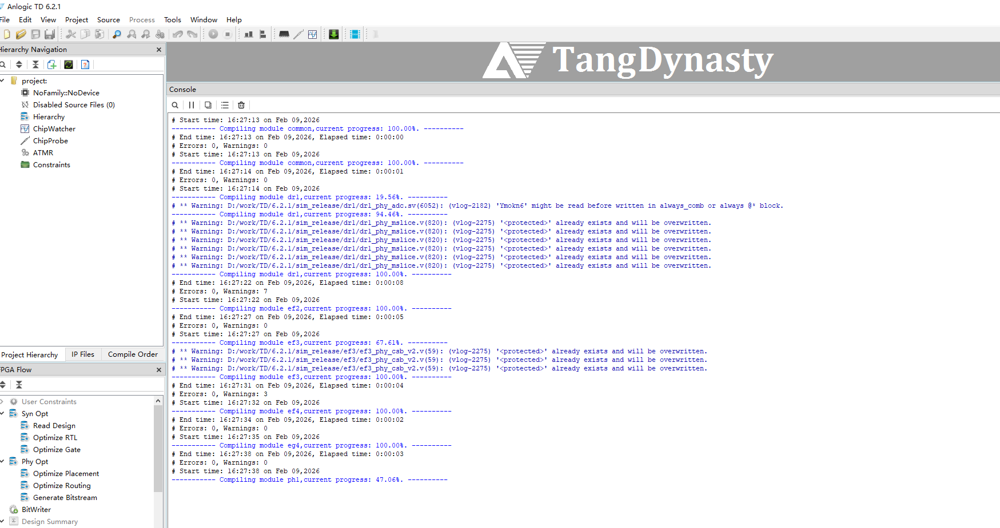
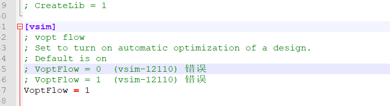
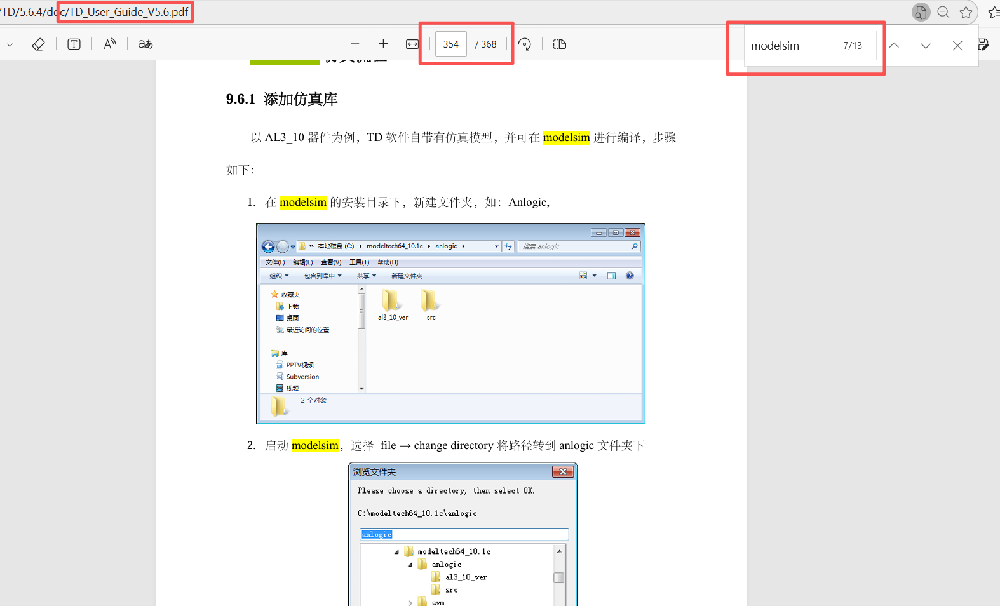
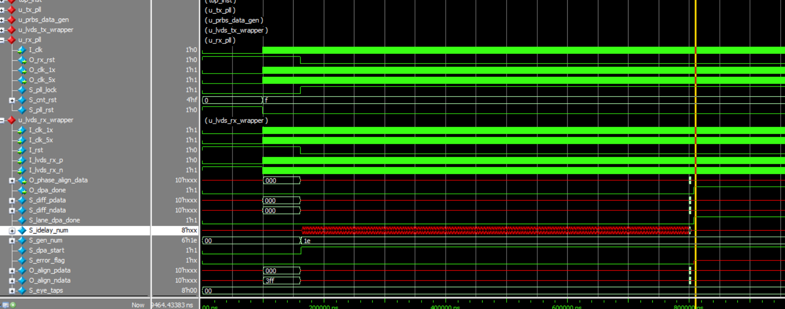
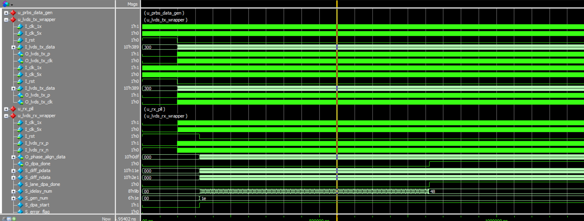
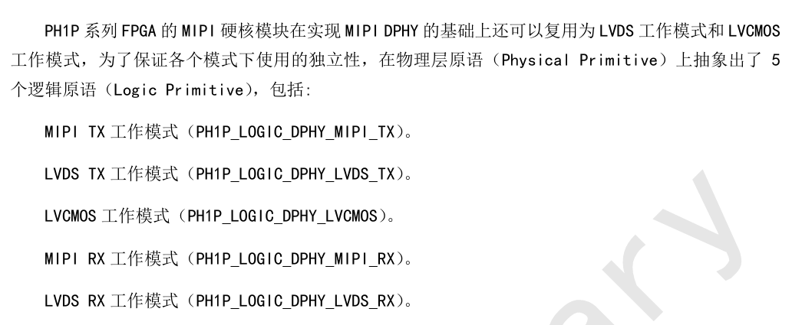
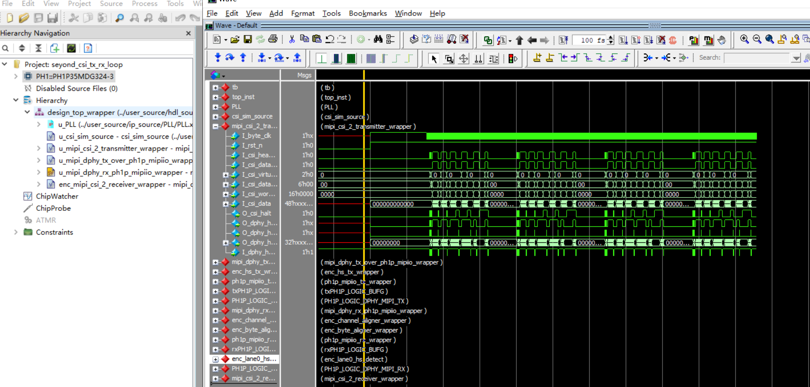

# 基于Modelsim的仿真流程

## 1. 概述

1. IP仿真本质是调用各厂商原语库, 核心原理一致.
2. 安路软件版本较多, 建议各版本vmap映射库单独存文件夹, 便于管理和调用.
3. 使用安路器件原语时, testbench需调用全局复位文件:

	- PH1_PHY_GSR 用于PH1A系列器件库
	- PH1P_PHY_GSR 用于PH1P系列器件库
	- PH2_PHY_GSR 用于PH2系列器件库
	- glbl 用于EF2, EF3, EF4, EG, SF1器件库

	-	PH1_PHY_GSR PH1_PHY_GSR();
	-	PH1P_PHY_GSR PH1P_PHY_GSR();
	-	PH2_PHY_GSR PH2_PHY_GSR();
	-	glbl glbl();	
	

## 2. 器件库编译与映射

- Modelsim版本建议选择2020.4:

### TD软件版本: 举例 6.2.1

- 打开TD软件, 选择 Tools > Simulations Libraries Compiler, 选择需要的器件库:

   - 

编译后, TCL console会打印编译过程:

   - 

- 大逻辑器件系列编译约需7-8分钟.
- 每个系列编译后需确认ERRORS和Warnings信息.
- ModelSim 2019.2编译SF2会报ERROR, 需选择合适版本.根据手册大多数器件都支持的是2020.4

- 编译失败停止时:

   - 

原因是modelsim.ini的vsim设置问题:

   - 

Altera, Xilinx, Anlogic, Lattice的设置可能冲突, 需检查ModelSim参数设置.

### TD软件版本: 举例 5.6.4 

- 无集成一键编译选项, 需手动编译.对应的UG手册有手把手教学.网上亦有很多教程.

   - 

- 各软件原语库可能不同, 所谓软件升级，其实主要更新这些内容, .


## 3. 库映射

在.do文件中设置映射. 示例:
```
vmap  anlogic621common  	D:/work/Modelsim/2020.4/anlogic/621/common
vmap  anlogic621dr1   		D:/work/Modelsim/2020.4/anlogic/621/dr1
vmap  anlogic621ef2   		D:/work/Modelsim/2020.4/anlogic/621/ef2
vmap  anlogic621ef3   		D:/work/Modelsim/2020.4/anlogic/621/ef3
vmap  anlogic621ef4   		D:/work/Modelsim/2020.4/anlogic/621/ef4
vmap  anlogic621eg4   		D:/work/Modelsim/2020.4/anlogic/621/eg4
vmap  anlogic621ph1   		D:/work/Modelsim/2020.4/anlogic/621/ph1
vmap  anlogic621ph1p  		D:/work/Modelsim/2020.4/anlogic/621/ph1p
vmap  anlogic621ph2   		D:/work/Modelsim/2020.4/anlogic/621/ph2
vmap  anlogic621sf2   		D:/work/Modelsim/2020.4/anlogic/621/sf2
```
调用vsim时, 添加用到的器件库:

vsim -voptargs="+acc"  -L anlogic621common   -L anlogic621ph1    -lib work  work.tb

## 4. 模板
```
set  PATH  C:/prj/test

vmap  anlogic621common  	D:/work/Modelsim/2019.2/anlogic/621/common
vmap  anlogic621dr1   		D:/work/Modelsim/2019.2/anlogic/621/dr1

vlib work
vmap work work

vlog "$PATH/test/src/top.v "
vlog "$PATH/test/src/module1.v "
vlog "$PATH/test/src/module2.v "
vlog "$PATH/test/src/module3.v "
vlog "$PATH/test/al_ip/ip1.v "
vlog "$PATH/test/al_ip/ip2.v "
vlog "$PATH/test/al_ip/ip3.v "
vlog "$PATH/sim/tb.v"

vsim -voptargs="+acc"  -L anlogic621common   -L anlogic621ph1   -lib work  work.tb

do wave.do
view wave
run 400ms
```
## 5. PLL, RAM, DSP仿真

新软件生成的IP文件夹嵌套较多, ModelSim报错时根据实际情况添加对应文件.

- 


## LVDS

- 接口上rx tx都是只定义p就行 ，引脚约束的时候 p端声明lvds25
- 参考工程里面 DPA自动补偿P/N偏差，才把P/N分开定义的
- LVDS的接口本质上就是对 PH1P_LOGIC_DYNAMIC_HR_IDELAY 和 PH1P_LOGIC_HR_ISERDES 进行仿真

- 重新编译工程 要添加如下对应的文件下路径和文件
```
vlog "$PATH/hdl_source/*.v "
vlog "$PATH/hdl_source/test/*.v "
vlog "$PATH/hdl_source/enc_file/*.v "
vlog "$PATH/ip_source/R_pll/*.v "
vlog "$PATH/ip_source/RX_PLL/*.v "
vlog "$PATH/ip_source/RX_PLL/RTL/*.v "
vlog "$PATH/ip_source/TX_PLL/*.v "
vlog "$PATH/ip_source/TX_PLL/RTL/*.v "
vlog "$PATH/sim_source/cwc/RTL/*.sv "
vlog "$PATH/sim_source/cwc/*.sv "
```

- 原厂的 LVDS 的工程是基于 6.1.1 开发的 里面很多设置移植到6.2.1上有很多不对的地方 
	
- 


- PLL 接口得调整
- reg 得自己加 initial 

- 

## 6. MIPI仿真

- MIPI= Dphy + CSI-2/DSI-2
- 不同的系列MIPI底层不一样，本质上也是调用原语，
- 不用系列的原语不一样，，接口信号太多也不是我等逻辑工程师应该关注的，
- 原厂目前没有将此接口封成IP开放给客户，所以找各家的FAE要工程吧


- 

- 可以看出 底层有两种电平风格 一种直接是mipi电平 一种是lvds转mipi


- 原厂有个CSI-2的回环仿真工程，初步研究可以发现是将原语包了几层 将hs数据拉出来给用户 ，也挺难用
- 


## xx


## 7. DDR3, DDR4仿真

待更新

## 8. PCIE仿真

待更新

## 9. SerDes仿真

待更新
