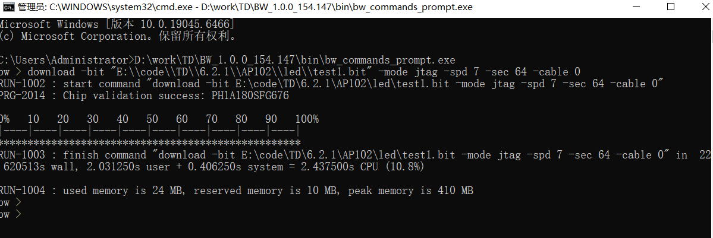

## 一. 序言

本指南提供完整的TCL下载脚本使用说明，旨在简化工厂工人的固件下载操作流程。通过自动化脚本，无需手动输入复杂命令，实现一键式下载操作，提高工作效率，减少操作错误。

### 1.1 主要特点

- **一键生成**：双击批处理文件生成下载脚本
- **双模式支持**：支持JTAG和Flash两种下载模式
- **文件切换**：快速切换test1.bit和test2.bit
- **智能检查**：自动检测文件是否存在
- **日志记录**：详细记录操作过程，便于问题追踪
- **错误处理**：完善的错误提示和处理机制

### 1.2 适用场景

- 工厂批量生产环境
- 固件频繁更新场景
- 新手操作员使用
- 自动化测试流程

### 1.3 下载模式说明

本脚本支持两种下载模式：

1. **JTAG下载模式**：适合开发调试阶段，下载速度快（spd 7）
2. **Flash下载模式**：适合生产固化阶段，下载到Flash（spd 6，使用x_rdbk模式）

---

##  [二.安装驱动](https://www.example.com/driver-install-guide)

---




## 三. 手动下载操作步骤

### 3.1 打开CMD界面

1. 按键盘上的 **Win + R** 键，打开"运行"对话框
2. 在对话框中输入 **cmd**
3. 按回车键或点击"确定"按钮

### 3.2 进入烧录界面

在CMD界面中，输入以下命令并回车：

```
D:\work\TD\BW_1.0.0_154.147\bin\bw_commands_prompt.exe
```

**说明**：此命令会启动TD软件的命令行烧录工具，进入烧录界面。
**说明**：完整TD工具和单下载工具都有bw_commands_prompt.exe 
**说明**：进入程序会出现  每行起始会出现 bw> 

### 3.3 执行下载命令

在烧录界面中，输入以下命令格式并回车：

```
download -bit "E:\\code\\TD\\6.2.1\\AP102\\led\\test2.bit" -mode jtag -spd 6 -sec 64 -cable 0
```


#### 命令参数说明：

- `download`：下载命令关键字
- `-bit`：指定bit文件路径
  - `"E:\\code\\TD\\6.2.1\\AP102\\led\\test2.bitt"`：bit文件的绝对路径
  - 注意：路径需要使用双引号包裹
- `-mode`：下载模式
  - `jtag`：JTAG下载模式
  - `x_rdbk`：Flash下载模式
- `-spd`：下载速度
  - `6`：速度等级，可根据需要调整（通常为6或7）
- `-sec`：扇区参数
  - `64`：扇区大小参数
- `-cable 0`：指定下载器编号
  - `0`：表示使用第一个下载器

#### 命令示例：

**JTAG模式下载test1.bit：**
```
download -bit "E:\\code\\TD\\6.2.1\\AP102\\led\\test1.bit" -mode jtag -spd 7 -sec 64 -cable 0
```

**Flash模式下载test2.bit：**
```
download -bit "E:\\code\\TD\\6.2.1\\AP102\\led\\test2.bit" -mode x_rdbk -spd 6 -sec 64 -cable 0
```

### 3.4 等待下载完成

1. 执行下载命令后，系统会开始下载程序
2. 等待下载进度完成（通常需要几秒到几十秒）
3. 下载成功后，CMD界面会显示：

```
finish command "download -bit "E:\\code\\TD\\6.2.1\\AP102\\led\\test1.bit" -mode jtag -spd 7 -sec 64 -cable 0" in XX.XXXs wall, X.XXXs user + X.XXXs system = X.XXXs CPU (X.X%)
```

4. 看到 `finish command` 提示表示下载完成

### 3.5 完整操作流程总结


- 步骤1: Win + R → 输入 cmd → 回车

- 步骤2: 输入 D:\work\TD\BW_1.0.0_154.147\bin\bw_commands_prompt.exe → 回车

- 步骤3: 输入download -bit "E:\\code\\TD\\6.2.1\\AP102\\led\\test1.bit" -mode jtag -spd 7 -sec 64 -cable 0 → 回车

- 步骤4: 等待出现 "finish command" 提示 → 下载完成


## 四. 批处理文件配置


## 五. 使用步骤

### 5.1 手动操作模式

按照第三章的步骤，在CMD中手动执行命令下载。

### 5.2 自动操作模式（推荐）

#### 5.2.1 配置脚本

1. 右键点击 `direct_download.bat`，选择"编辑"
2. 修改"顶层配置区域"中的参数
3. 保存文件

#### 5.2.2 执行下载

1. 双击 `direct_download.bat`
2. 查看显示的配置信息
3. 等待下载完成
4. 查看执行结果

### 5.3 预期输出结果

#### 手动操作成功输出示例：
```
bw> download -bit "E:\\code\\TD\\6.2.1\\AP102\\led\\test2.bit" -mode jtag -spd 6 -sec 64 -cable 0
RUN-1002 : start command "download -bit "E:\\code\\TD\\6.2.1\\AP102\\led\\test1.bit" -mode jtag -spd 7 -sec 64 -cable 0"
PRG-2014 : Chip validation success: PH1P35MDG324
RUN-1003 : finish command "download -bit "E:\\code\\TD\\6.2.1\\AP102\\led\\test1.bit" -mode jtag -spd 7 -sec 64 -cable 0" in 43.495044s wall, 2.187500s user + 0.750000s system = 2.937500s CPU (6.8%)
RUN-1004 : used memory is 24 MB, reserved memory is 11 MB, peak memory is 410 MB
bw>
```

---


## 六. 常见问题排查

### 6.1 环境问题

#### 问题1：显示"下载工具不存在"

**可能原因**：
- bw_commands_prompt.exe路径配置错误
- 工具未安装在指定位置

**解决方法**：
1. 确认D:\work\TD\BW_1.0.0_154.147\bin\bw_commands_prompt.exe是否存在
2. 检查DOWNLOAD_TOOL参数配置
3. 使用绝对路径

#### 问题2：显示"bit流文件不存在"

**可能原因**：
- bit文件不在指定路径
- 文件名拼写错误

**解决方法**：
1. 检查BIT_FILE参数配置
2. 确认test1.bit或test2.bit文件在正确位置
3. 检查路径拼写和大小写

### 6.2 执行问题

#### 问题3：CMD中输入命令后无反应

**可能原因**：
- 命令格式错误
- 路径未使用双引号

**解决方法**：
1. 确保路径使用双引号包裹
2. 检查命令格式是否正确
3. 确保所有参数之间有空格

#### 问题4：下载失败，显示错误

**可能原因**：
- 硬件连接问题
- 芯片未上电
- 驱动问题

**解决方法**：
1. 检查AL-LINK下载器连接
2. 确认目标板上电
3. 检查驱动安装状态
4. 查看具体错误信息

### 6.3 配置问题

#### 问题5：想要快速切换bit文件

**解决方法**：
1. 编辑direct_download.bat
2. 修改BIT_FILE参数
3. 从test1.bit改为test2.bit（或反之）
4. 保存后重新运行

#### 问题6：不同模式如何切换

**解决方法**：
1. 编辑direct_download.bat
2. 修改DOWNLOAD_MODE=jtag或x_rdbk
3. 系统会自动设置对应的速度参数
4. 保存后重新运行

---

## 七. 快速参考

### 7.1 手动操作命令

```
# 步骤1：Win + R，输入cmd

# 步骤2：进入烧录界面
D:\work\TD\BW_1.0.0_154.147\bin\bw_commands_prompt.exe

# 步骤3：执行下载
download -bit "E:\code\TD\6.2.1\AP102\led\test2.bit" -mode jtag -spd 6 -sec 64 -cable 0

# 步骤4：等待出现 "finish command"
```

### 7.2 命令参数对照表

| 参数 | JTAG模式 | Flash模式 | 说明 |
|------|----------|-----------|------|
| -mode | jtag | x_rdbk | 下载模式 |
| -spd | 7 | 6 | 速度参数 |
| -sec | 64 | 64 | 扇区参数 |
| -cable | 0 | 0 | 下载器编号 |

### 7.3 bit文件路径示例

```
# test1.bit
E:\code\TD\6.2.1\AP102\led\test1.bit

# test2.bit
E:\code\TD\6.2.1\AP102\led\test2.bit
```

---

## 八. 附录

### 8.1 命令格式完整说明

```
download -bit "<文件绝对路径>" -mode <模式> -spd <速度> -sec <扇区> -cable <编号>
```

参数详解：
- `download`：下载命令关键字
- `-bit "<路径>"`：bit文件绝对路径，必须用双引号包裹
- `-mode <模式>`：下载模式（jtag或x_rdbk）
- `-spd <速度>`：速度参数（6或7）
- `-sec <扇区>`：扇区大小参数（通常为64）
- `-cable <编号>`：下载器编号（通常为0）

### 8.2 错误信息说明

| 错误信息 | 含义 | 解决方法 |
|---------|------|---------|
| Chip validation failed | 芯片验证失败 | 检查硬件连接和上电 |
| Downloading failed | 下载失败 | 检查文件和驱动 |
| File not found | 文件不存在 | 确认bit文件路径 |
| Cable not found | 下载器未找到 | 检查下载器和驱动 |
| finish command | 下载完成 | 成功提示 |

### 8.3 成功下载标志

当看到以下信息时，表示下载成功：

```
finish command "download -bit "..." -mode ... -spd ... -sec ... -cable ..." in XX.XXXs wall, X.XXXs user + X.XXXs system = X.XXXs CPU (X.X%)
```

### 8.4 支持与反馈

- 技术支持：联系设备供应商
- 驱动安装：[驱动安装教程](https://www.example.com/driver-install-guide)
- 文档更新：2026-02-04
- 版本：4.0

---

**文档结束**

**文档版本**: 4.0
**最后更新**: 2026-02-04
**维护者**: 技术支持团队