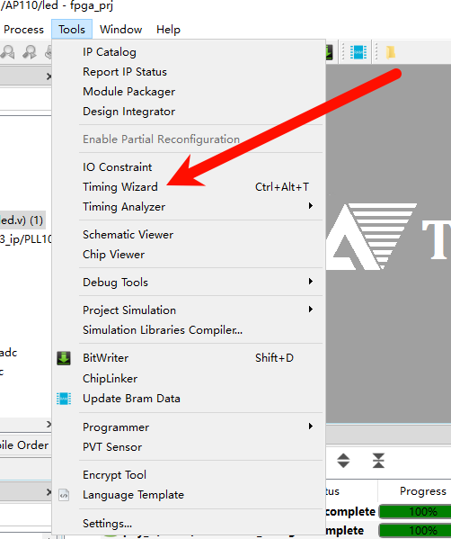
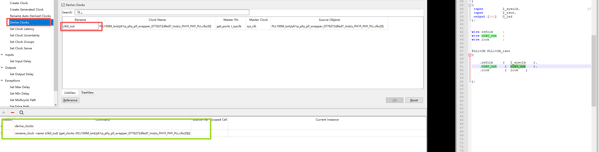

#  

## 1. 概述

## 外部时钟

### 单端

- 最简单的 get port 就行

create_clock -name sys_clk -period 20.000 -waveform {0.000 10.000} [get_ports I_sysclk]

### 差分

## 2. PLL输出到逻辑

- TD软件不同版本pll输出嵌套的层数不一样，类似于X家的直接赋值调用 pll_clk_out ,软件会报 critical warning
- pll_clk_out不生命和声明错 ，都会有 critical warning
- 生成正确的流程如下：
	- 打开 Tools 中的 wizard 

   - 

	- 打开 derive ，并勾选 Derive Clocks 的选项 ，在 Rename 处上填上代码中的时钟连线 ，
	- 点击 ok后 在下方工具会自动生成对应的 command 指令，右键 copy 到 sdc文件中 再重新编译即可

   - 
   
 

## PLL输出到外部

## 时钟隔离 

## 引脚建立保持时间设置 

 
